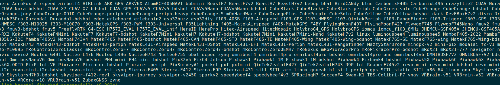
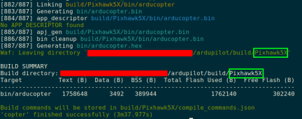
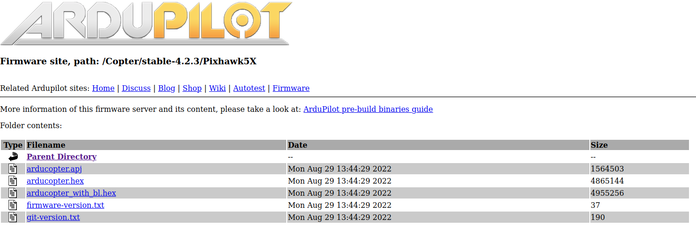

# Install Ardupilot firmware on drone
## 1 Obtain Ardupilot firmware
### 1.1 build Ardupilot firmware from source code
1. use Waf to build an ardupliot firmware for the chosen board. Tutorials to use Waf https://github.com/ArduPilot/ardupilot/blob/master/BUILD.md.
    - clean previous built firmware
    ```shell
         cd ardupliot
         ./waf distclean
    ``` 
    - The available list can be found by 
    ```shell
        cd ardupliot
        ./waf list_boards
    ```
    <figure>
        
    </figure>

    - video tutorial for next two steps https://youtu.be/lNSvAPZOM_o.
    - choose firmware - it is Pixhawk5X for us
    ```shell
        cd ardupliot 
        ./waf configure --board Pixhawk5X
    ```
    <figure>
        
    </figure>
    
    - build it
    ```shell
        cd ardupliot
        ./waf copter
    ```
    <figure>
        
    </figure>

    - find the built ardupliot file at /ardupliot/build/board_name/bin, like
    <figure>
        
    </figure>    
    
### 1.2 Download Arduploit firemware directly from online sources
1. we can download an Arduploit firmware at https://firmware.ardupilot.org/ choosing
    + drone type
    + board of autoploit
    + **features that are needed**
<figure>
    
</figure>

2. we can find version 4.3. and its corresponding files for Pixhwask5
<figure>
    
</figure>

## 2 burn Ardupilot to drone
