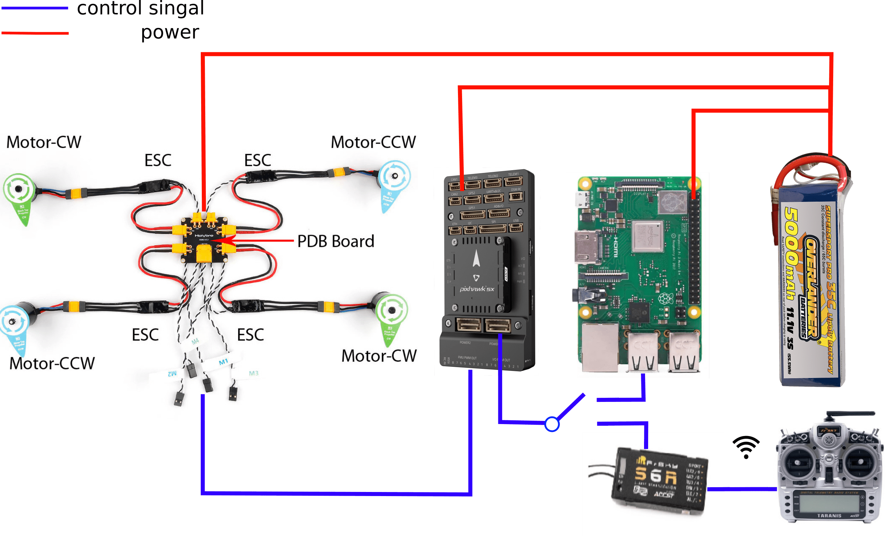
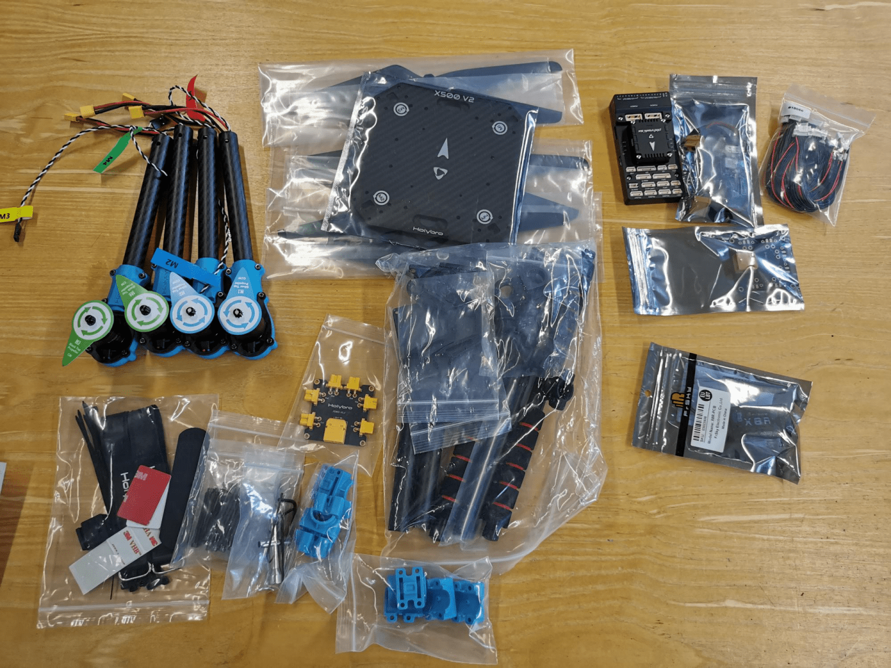
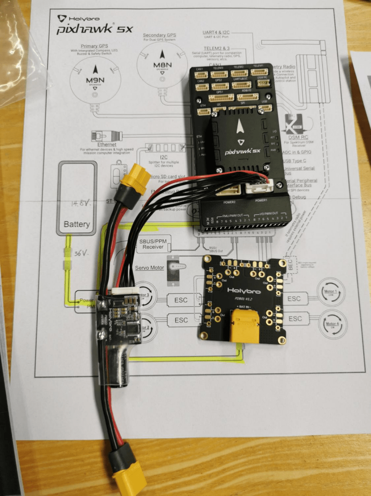
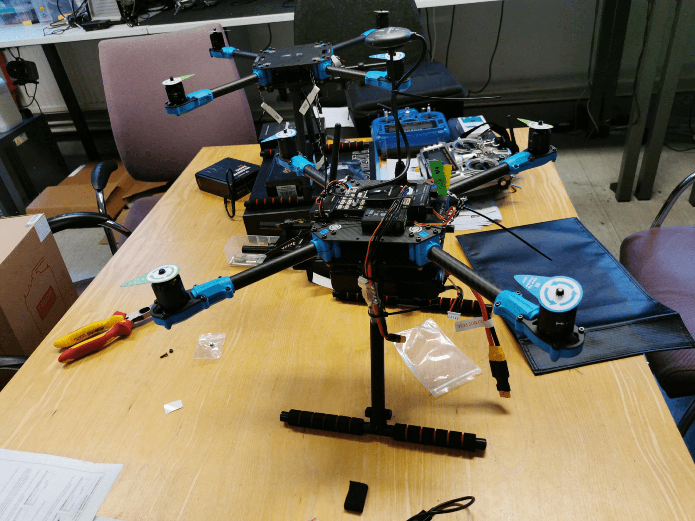

# Aesembly drone kits
This note shows main steps to build a drone from kits (hardware).

Toturial in details can be found [https://docs.px4.io/main/en/frames_multicopter/holybro_x500V2_pixhawk5x.html](https://docs.px4.io/main/en/frames_multicopter/holybro_x500V2_pixhawk5x.html).

## 1. Drone kits and commercial elements
1. Drone frame Kits: [Holybro X500 V2 Kit](http://www.holybro.com/product/x500-v2-kit/) cluding
    - X500 V2 Frame Kit
    - Motors – Holybro 2216 KV920 Motor
    - ESCs – BLHeli S ESC 20A 
    - Self locking propellers 1045 (cheaper options T1045 Self locking Props)
    - Power Distribution Board – XT60 plug for battery & XT30 plug for ESCs & peripherals
2. Autopliot and framework
    - Pixhawk 4 mini and Pixhawk 5
    - PX4 version (1.12)
3. Onboard computer and OS
    - Raspberry PI 4b+
4. Remote controller and receivor
    - FrSky Taranis X9D
    - FRsky X8R
## 2. Overview of main elements 
<figure>
    
</figure> 

## 3. Steps
### 3.1 Build chassis
<figure>
    
</figure> 

### 3.2 Connect power module
<figure>
    
</figure> 

### 3.3 Drone is ready.
<figure>
    
</figure> 

### 3.4 Setup onboard computer
See 5_Experiment_OnboardComputer_Setup.md.