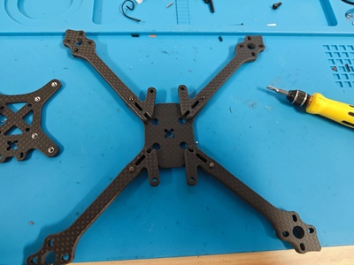
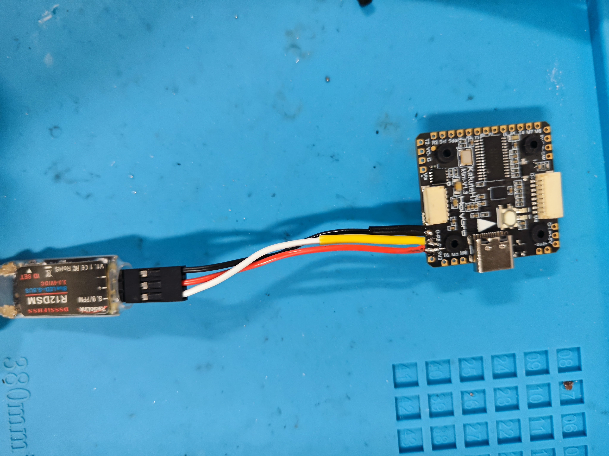

## 1 Develop kits
1. Drone frame:
    - Chassis TransTEC Lightning X Lite
    - Motor FPV 致盈EX2306 PLUS [site in Taobao](https://item.taobao.com/item.htm?spm=a1z10.5-c-s.w4002-22611654657.27.52b858176s1EdF&id=634695941707)
2. ESC:
    - [Tekko32 F4 Metal 4in1 65A ESC (65A)](https://holybro.com/collections/fpv-esc/products/tekko32-f4-metal-4in1-65a-esc-65a)
    - [HAKRC 3260A ESC BLHeli-32 ](https://item.taobao.com/item.htm?spm=a1z10.5-c-s.w4002-22611654657.32.193244beujIlvo&id=624599427940)
3. Autopilot and framework
    - Kakute H7 v1.3 [site in Taobo](https://item.taobao.com/item.htm?spm=a1z0d.6639537/tb.1997196601.28.56917484ySIhA5&id=684452325988)     
    - Ardupilot 4.3
4. Onboard computer and OS
    - Navidia NX
    - Ubuntu 20.04
5. Transmitter
    - RadioLink AT9S Pro
    - RadioLink R12DSM [Site in Tabo](https://item.taobao.com/item.htm?spm=a1z10.3-c-s.w4002-22611654662.9.59a41dc7RXezIK&id=561805355565)

6. Useful notes
    - CUAV on Copters [https://doc.cuav.net/tutorial/copter/](https://doc.cuav.net/tutorial/copter/)
    - ArduPilot Copter [https://ardupilot.org/copter/index.html](https://ardupilot.org/copter/index.html)
    - [How to methodically tune (almost) any multicopter using ArduCopter 4.4.x](https://discuss.ardupilot.org/t/how-to-methodically-tune-almost-any-multicopter-using-arducopter-4-4-x/110842), please read this together with this tutorial.
    - [Analytical Multicopter Flight Controller PID Optimization](https://discuss.ardupilot.org/t/analytical-multicopter-flight-controller-pid-optimization/109759).

## 2. Assembly and configuration steps for manual flights
### 2.1 Build chassis
First, take parts from Lightning X Lite and prepare alex keys.
<figure>
    
</figure>

We build the base like the picture below. Then, we add the upper part and use M3 screws to fix them together. 

|                        |                          |
| ----------------------------------- | ----------------------------------- |
|  |  |

It is the time to place them on the chassis

### 2.2 Link ESC with power and actuation modules
Lets take Tekko32 for example.

First, we its order for motors.
<figure>
    
</figure>

Then we place four motors in the correct order. We weld them like this 

|                        |                          |
| ----------------------------------- | ----------------------------------- |
|  |  |

After that, we weld a power wire with XT60 and a 35v 470uf capacitance to the power input of Tekko32.

<figure>
    
</figure>

### 2.3 Connect autopilot to ESC 
### Kakute H7 to Tekko32
Following the instruction shown below
<figure>
    
</figure>
we weld them like 
<figure>
    
</figure>

#### Kakute H7 to HAKRC
<figure>
    
</figure>

### 2.4 Connect transmitter and receiver
It can been that [RadioLink R12DSM](https://item.taobao.com/item.htm?spm=a1z10.3-c-s.w4002-22611654662.9.59a41dc7RXezIK&id=561805355565) supports S.BUS and PPM protocols.

Also, check pins of Kakute at [Holybro Kakute H7 V1](https://ardupilot.org/copter/docs/common-holybro-kakuteh7.html).

Therefore, the three ports of R12DSM should be connected to Kakute in the following way:
- "+" of R12DSM ----> 5V of Kakute
- "-" of R12DSM ----> GND of Kakute
- "S.B/PPM" of R12DSM ----> RX6 of Kakute

<figure>
    
</figure>

