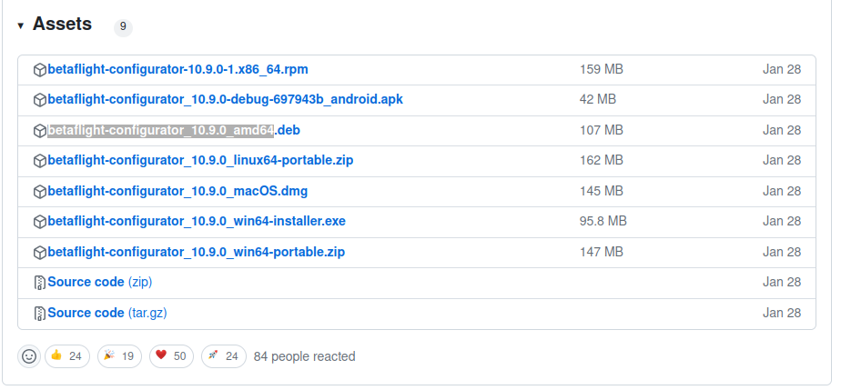
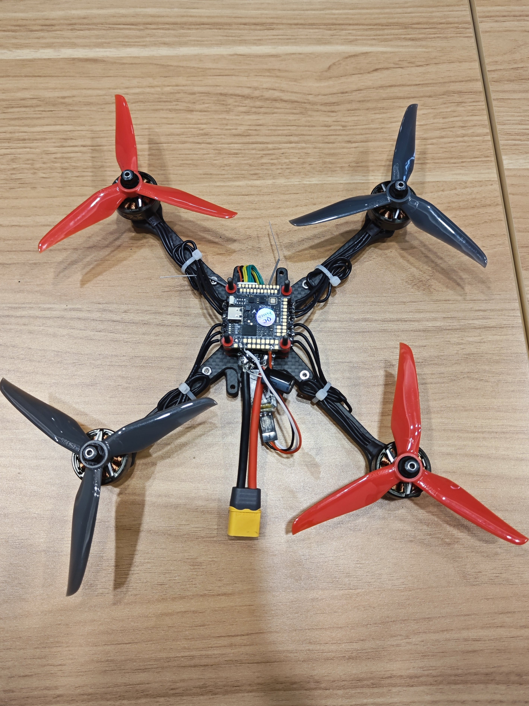

# 1 Develop kits
1. Drone frame:
    - Chassis TransTEC Lightning X Lite
    - Motor FPV 致盈EX2306 PLUS [site in Taobao](https://item.taobao.com/item.htm?spm=a1z10.5-c-s.w4002-22611654657.27.52b858176s1EdF&id=634695941707)
2. ESC: Aocoda 60A 4 in 1 [site in Taobao](https://item.taobao.com/item.htm?spm=a1z0d.6639537/tb.1997196601.4.55627484xw5sv5&id=682898024012)

3. Autopilot and framework
    - Aocoda RC H743 [site in Taobo](https://item.taobao.com/item.htm?spm=a1z0d.6639537/tb.1997196601.4.55627484xUOMZu&id=679995875558)     
    - BetaFlight 4.4.0
4. Onboard computer and OS
    - Navidia NX
    - Ubuntu 20.04
5. Transmitter
    - RadioLink AT9S Pro
    - RadioLink R12DSM [Site in Tabo](https://item.taobao.com/item.htm?spm=a1z10.3-c-s.w4002-22611654662.9.59a41dc7RXezIK&id=561805355565)
6. Workstation
    - Ubuntu 20.04

# 2 Assembly MAVs
## 2.1 Build chassis
First, take parts from Lightning X Lite and prepare alex keys.
<figure>
    
</figure>

We build the base like the picture below. Then, we add the upper part and use M3 screws to fix them together. 

|                        |                          |
| ----------------------------------- | ----------------------------------- |
|  |  |


It is the time to place them on the chassis

### 2.2 Link ESC with power and actuation modules
Lets take Tekko32 for example.

First, we its order for motors.
<figure>
    
</figure>

We weld a power wire with XT60 and a 35v 470uf capacitance to the power input of Acoda ESC. Then, we weld four motors in the correct order. We weld them like this 

|                        |                          |
| ----------------------------------- | ----------------------------------- |
|  |  |


### 2.3 Connect autopilot to ESC 

We can find the pins of ESC and autopilot at the [Aocoda 60A 4 in 1](https://item.taobao.com/item.htm?spm=a1z0d.6639537/tb.1997196601.4.55627484xw5sv5&id=682898024012) and [Aocoda RC H743](https://item.taobao.com/item.htm?spm=a1z0d.6639537/tb.1997196601.4.55627484xUOMZu&id=679995875558).  

<figure>
    
</figure>

More specifically, they share the same structure and we can connect them directly like this
<figure>
    
</figure>


## 2.4 Connect receiver to autopilot
It can been from [Site in Tabo](https://item.taobao.com/item.htm?spm=a1z10.3-c-s.w4002-22611654662.9.59a41dc7RXezIK&id=561805355565) that R12DSM supports S.BUS and PPM protocols working with 4.8v-6v.

Also, check pins of Aocoda and find RX1 is for receivers. Note that R12DSM needs to be connected 5v instead of 4.5v (example in the image).


Therefore, the three ports of R12DSM should be connected to Kakute in the following way:
- "+" of R12DSM ----> 5V of Aocoda
- "-" of R12DSM ----> GND of Aocoda
- "S.B/PPM" of R12DSM ----> RX1 of Aocoda

# 3 Build and flash customised BetaFlight firmware
<figure>
    
</figure>

[BetaFlight](https://betaflight.com/) is flight controller firmware for flying multi-rotor craft and fixed wing craft. Because of its cutting edge performances, BetaFlight is one of the largest flight firmwares in the FPV drone racing and freestyle community. 

## 3.1 Install BetaFlight Configurator
BetaFlight Configurator is a tool for us to flash and calibrate firmwares.

Setup Guide shows steps to install BetaFlight Configurator.

1. Download deb for Ubuntu 20.04.
<figure>
    
</figure>

2. Install deb pkg by running
```shell
    sudo dpkg -i  betaflight-configurator_10.9.0_amd64.deb  
```
3. Run BetaFlight Configurator and see the following interface
<figure>
    
</figure>


## 3.2 build BetaFlight for Aocoda H743
#### 3.2.1 Build Betaflight firmware from source
Steps to build firmware H743 for example
1. install official firmware, i.e. .hex
2. save the result of ```diff all``` into config.txt
3. use make to build firmware .hex
```shell
    cd Betaflight
    make TARGET=STM32H743
```
4. check output message from make 
```shell
    text	   data	    bss	    dec	    hex	filename
    466697	   6364	  90236	 563297	  89861	./obj/main/betaflight_STM32H743.elf
```
5. get the built firmware
    it is located at *BetaFlight/obj/XXX.hex*.

## 3.3A flash BetaFlight to Aocoda H743
1. connect autopilot board to a work station through a USB port. It is supposed to see the LED flashing after connection.

2. run BetaFlight Configurator

3. backup pre-built BetaFlight config files (you can skip this step if you can access Aoco_H7_Config_Manufacturer.txt in /firmware/Aocoda)
    - click button connect on the top right
    - click CLI tap
    - type ```diff all``` in the terminal which a lot of pars will be shown 
    - copy and save those par in a txt file, call it preconfig.txt
<figure>
    
</figure>

4. write customized firmware
    - **enable DFU mode of the autopilot board**
    - enable "no reboot sequence"
    - enable "Full clip erase" if your previous installation failed and you cannot connect your autopilot
    - click "Load Firmware" and choose the downloaded firmware betaflight_4.4.0_STM32H743.hex or the firmware you built.
    - click "Flash Firmware" and the process is done when 'programming:successful' can is shown.
    <figure>
        
    </figure>

5. load pre-built config
    - wait for 20s for the autopilot board to refresh, and disconnect and reconnect the USB cable if it does not response.
    - click button connect on the top right
    - choose ''Apply custom defaults''
    - click CLI tap 
    - load file and choose preconfig.txt, i.e. the txt file in the 3rd step or Aoco_H7_Config_Manufacturer.txt in /firmware/Aocoda. Do not worry if you see some errors in the terminal.
    <figure>
    
    </figure>
    
    - type save in the terminal and it will automatically reboot. Then after connecting again, we should be able to see a 3D quadrotor model. This 3D model will show the same attitude of the autopilot when we rotate it, which means the firmware can obtain sensor information through ports on Aoco.
    <figure>
    
    </figure>

## 3.3B flash BetaFlight to KakuteH7Mini
1. Enable DFU mode of KakuteH7Mini and connect it to a base station with Betaflight Configurater running.
2.  Download and flash official firmware by choosing KakuteH7Mini as the target board with
    - "no reboot sequence" enabled
    - "full chip erase" enabled
    <figure>
    
    </figure>
    Then, click Flash Firmware.
2. Find the built firmware *BetaFlight/obj/XXX.hex*, chick local firmware and choose it.
3. Flash own firmware with
    - "no reboot sequence" enabled
    <figure>
    
    </figure>
4. Reboot and choose ''Apply custom defaults''

## 4 Configure and calibrate BetaFlight
**REMOVE propellers before doing anything else**

### 4.1 Configure transmitter and receiver

#### 4.1.1 Bind receiver and transmitter
Please see [Transmitter](2_6_Transmitter.md) searching for RadioLink AT9S Pro and RadioLink R12DSM

#### 4.1.2 Configure receiver using BetaFlight Configurator
1. Define ports as Serial (via UART)
2. Choose protocol
    - SBUS and switch the RadioLink R12DSM into S-BUS model when the LED flashes blue.
    - PPM not tested
3. Enable Telemetry port.
    <figure>
    
    </figure>

4.  It is suggested to use our transmitter test thrust, roll, pitch, yaw controls by seeing the 3D model's animation. You can modify the sequence of AETR1234 in Channel Map according to your needs. AETR1234 means 

    <figure>
    
    </figure>
5. Adjust sticks' sensitivities with the buttons in green circles such that central positions of sticks should correspond to around 1507. **Note** use the buttons in green circles to make the range of each channel to be 1505-2000, especially for the thrust channel as Betaflight does not allow arming if the thrust channel is above 1050 by default.

### 4.2 Configure motors
NOTE: REMOVE propellers if you did not do that.

1. Check frame type and motor order.

    Choose QUAD X as our chassis is TransTEC Lightning X Lite. Other chassis may lead to different choices here.

    The ESC board has marks, i.e. 1,2,3,4, help place motors in order. It is suggested to choose the same layout as shown here. Please remember the direction of the quadrotor on the autopilot is illustrated by an arrow in white.
    <figure>
        
    </figure>

2. Test motors' spinning
    
    Now, it is time to test if we can spin motors. To do that, the first thing is to connect a battery to the ESC board while keeping the connect between the work station and the autopilot board.

    Then, it is necessary to set the ESC/Motor Output dropdown to the correct protocol. Usually DShot300 or DShot600 should be chosen for most ESCs available nowadays. Here is the explanation given by BetaFlight Configurator;
    - DShot300 is better for FCs with slower processors, like F411 boards. DShot600 is better for faster processors, like anything from the F7 family. F405 may work too, but it can cause too high of a CPI load when a lot of peripherals are in use
    - The DShot speed also depends on the gyro (and thus also the PID loop) speed. If you have a gyro that runs at 8kHz (MPU6000), you can use DShot600. If you have a gyro that runs at 3.2KHz (BMI270), you should use DShot300. Using higher DShot speeds on slower gyros shoudn't cause any issues, but it also won't give you any benefits.

    On the right side, we click "I understand the risk", then we can test motors' spinning individually by using sidebars with 1,2,3,4 or together using Master. if The motors, ESC, and the autopilot board are connected correctly, we should be able to see motors are spinning according to our commands.

3. Change motors' spinning direction.

    After successfully spinning motors, we need to check the motors' direction if they are in the correct way that is shown on the left.

    As we can see, motor 1 and 4 are in clockwise direction, while motor 2 and 3 are in counterclockwise direction.  If one or two motors are not spinning in the correct way, then we can click button Motor direction and change the direction of them.
    <figure>
        
    </figure>

    Choose motor by index first, and then if the direction is wrong, we just need to click "Reverse".

### 4.3 Configure flight modes

There are several modes:
- Arm mode. It used as a kill switch as it can enable and disable motor output.
- Angle mode. The input to the autopilot board is angle, that is usually chosen for manual flights.
- Angle_rate_hold. This mode can receive angle commands and bodyrate commands, which is used for auto flights.

1. Set Arm mode.
    - Click Add Range
    - Choose Auto and switch SwF of transmitter on and off, then it will automatically set the channel of SwF, maybe AUX 1, for mode Arm.
    - There is a yellow bar for every mode. In fact, the area covered by that corresponds to the transmitter' channel's status. 

    Take Arm for instance, when the channel is in the yellow bar's area, the drone is armed, while the channel is outside, the drone is disarmed.
    <figure>
        
    </figure>

2. Set Angle mode and Angle_rate_hold mode
    Make them use the same channel of SwG, then adjust the yew bar for two stages where one stage of SwG corresponds to mode Angle, and the other lies in mode Angle_rate_hold.
    <figure>
        
    </figure>

    Read the following resources:
    1. Modes Tab from BetaFlight, [https://betaflight.com/docs/wiki/configurator/modes-tab](https://betaflight.com/docs/wiki/configurator/modes-tab)
    2. Betaflight 4.3 Modes Tab, [https://youtu.be/kDAotpevszs?si=QKJp7 5aN2eq35jE8](https://youtu.be/kDAotpevszs?si=QKJp75aN2eq35jE8)

Other modes can be found at [Modes](https://betaflight.com/docs/development/Modes):
1. If we link two modes, then enabling one will trigger the other.
2. ACRO mode takes commands as body rates from pilots. This mode is usually used in FPV. In fact, you cannot find this mode and it is a default mode: the drone switches to ACRO mode if we arm the drone while no mode, like Angle mode, is chosen.


### 4.4 Configure power & battery
1. check if BetaFlight Configurator find the correct number of cells.


2. Choose battery source
Two options are available here
    - Onboard ADC means the voltage and current are measured by the autopilot's ADC. 
    - ESC means they are measured by ESC telemetry. To use ESC telemetry for voltage measurement, the ESC board needs have a pin named after telemetry that is connected to the autopilot. A pin named after current is needed for current measurement.

    We choose Onboard ADC when batteries of 2s-6s are used, then ESC is a better choice when batteries of more than 6s are chosen.

    <figure>
            
    </figure>


3. Amperage Meter (Current)
    This depends on ESC instead of autopilots.

    The parameter Scale in Amperage Meter should be given by manufacturer. As for our Aocoda 3060A 4 in 1 [site in Taobao](https://item.taobao.com/item.htm?spm=a1z0d.6639537/tb.1997196601.4.55627484xw5sv5&id=682898024012), the scale is set to be 160. It is 120 for KakuteH7Mini [site at Holybro](https://holybro.com/products/kakute-h7-mini-stacks).   
    <figure>
        
    </figure>

4. Voltage Meter (Voltage)
Here is what we should do first
    - connect a battery to the drone
    - connect a voltage meter to the battery to read the voltage
    <figure>
        
    </figure>


Click the button Calibration, entre the voltage value read from the meter anc lick button Calibrate.
    <figure>
        
    </figure>

After hearing the music, we can click the button Save.


### 4.4 Calibrate sensors

Aocoda has embedded an accelerometer and a gyroscope. 

First let us calibrate the accelerometer. Place the drone on the flat surface, and then click the button Calibrate Accelerometer. 

It finishes when the message "Accelerometer calibration finished" is displayed on the top left. Note do not move the drone during the calibration.

<figure>
        
</figure>

### 4.5 First flights and PID tuning


<figure>
        
</figure>

Currently, all pid gains are set in firmware. Therefore, tuning gains requires to modify the corresponding values in code.

##TODO
