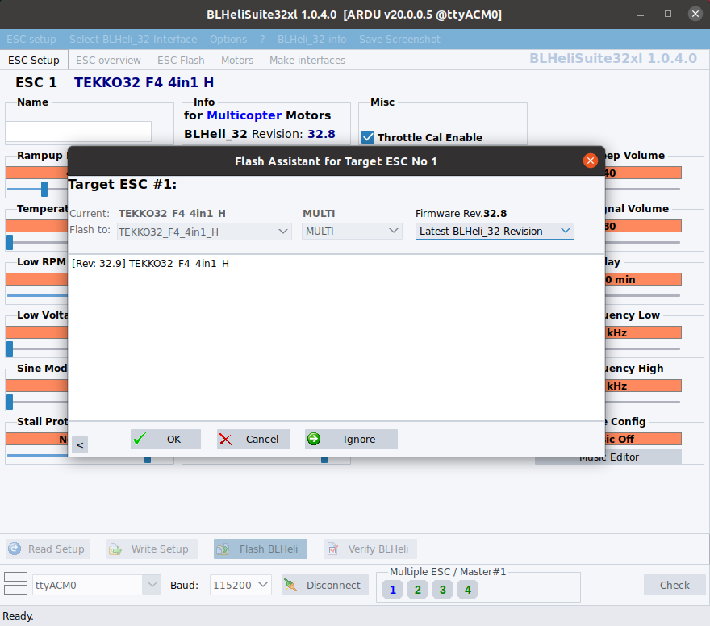
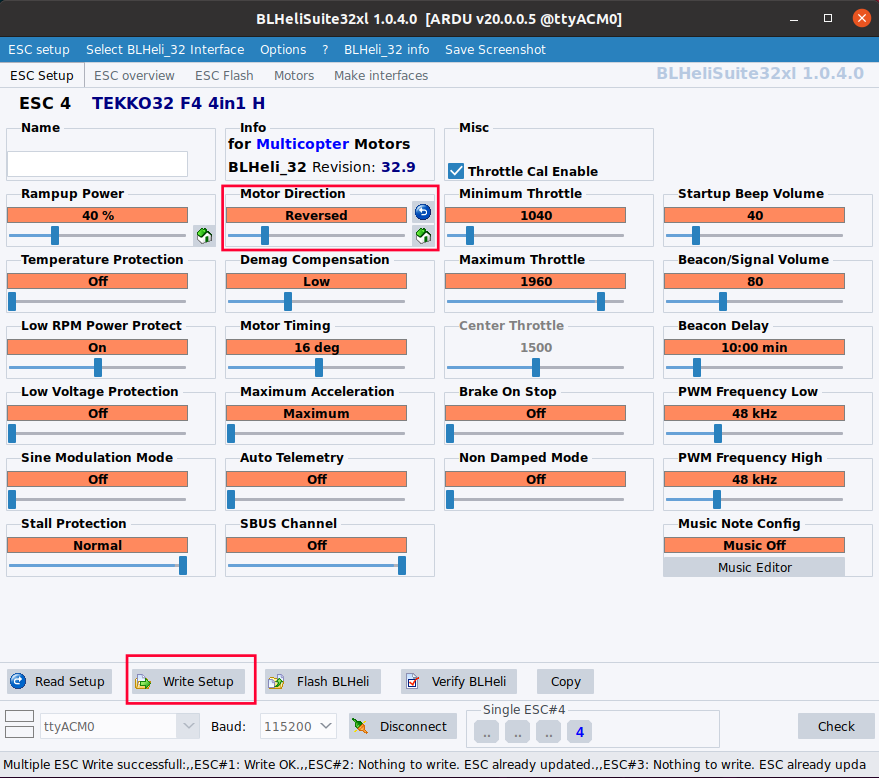
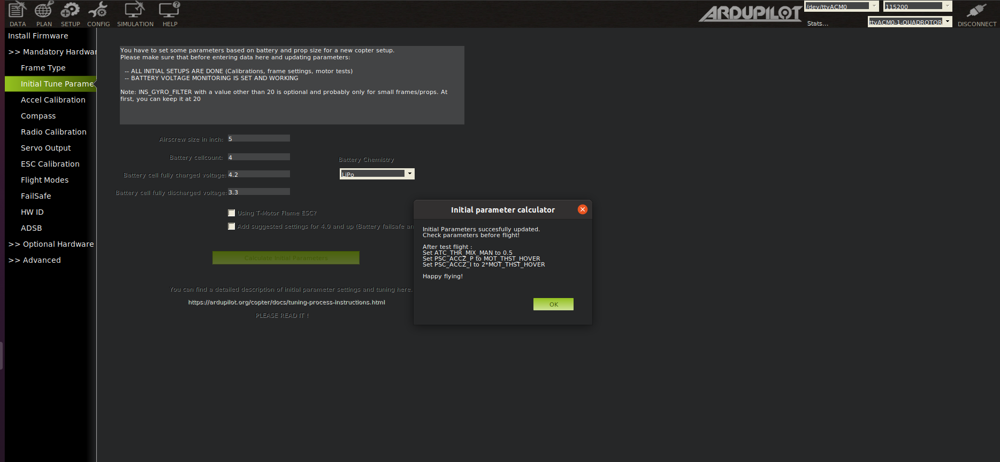
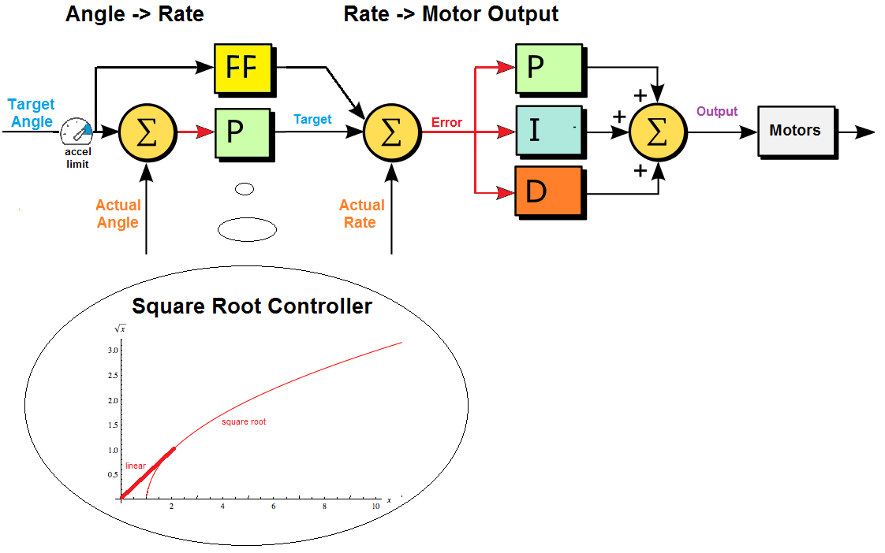

## 3 Firmware Ardupilot and Kakute H7 v1.3
### 3.1 Check pre-builtin firmware
Different pre-built firmware lead to different installation ways.

It is suggested to ask the manufacturer about the pre-built firmware and its version.

Our Kakute H7 v1.3 has a pre-built firmware of BetaFlight. Then the version can be found with the help of BetaFlight Configurator that can auto detect the pre-built board and firmware.

Run BetaFlight Configurator, in Disconnected status, we click Firmware Flasher on the left sidebar, then it will auto detect the board and the firmware version
<figure>
    
</figure>

Also, we can switch to Connected status by clicking connect on the top right. Click CLI on the left side bar, typing dump on the terminal on the right will give more information 
<figure>
    
</figure>

### 3.2 Install driver and bootloader
Tutorials are given by Ardupilot at [Loading Firmware onto boards without existing ArduPilot firmware¶](https://ardupilot.org/copter/docs/common-loading-firmware-onto-chibios-only-boards.html). Read this before going further.

### 3.3 Download Ardupilot firmware for KakuteH7
Since Kakuteh7's prebuilt firmware is not Ardupilot, installation files should include bootloaders. 

Following steps shown in [Loading Firmware onto boards without existing ArduPilot firmware](https://ardupilot.org/planner/docs/common-loading-firmware-onto-chibios-only-boards.html):

1. Go to webpage [https://firmware.ardupilot.org/Copter/stable-4.4.0/KakuteH7/](https://firmware.ardupilot.org/Copter/stable-4.4.0/KakuteH7/)

2. Download arducopter_with_bl.hex.

### 3.4 Write Firmware into FC
There are two ways to write Ardupilot firmware into Kakuteh7: STM32CubeProgrammer or BetaFlight Configurator.

**Connect FC in DFU mode**

Kakute must be connected in DFU mode. To do that, press the button of Kakute, and then connect it to the work station through a USB port.

Check if Kakute is in DFU mode, we type
```shell
    sudo dfu-util --list
```
if we can see something like Internal Flash, shown below, it means Kakute is in DFU mode. 
<figure>
    
</figure>

**Use STM32CubeProgrammer**
1. Download STM32CubeProgrammer software for Linux from [its official site](https://www.st.com/en/development-tools/stm32cubeprog.html?dl=r%2FDZ7hJ7r7LZnJS4M%2Bj%2FYg%3D%3D%2CrqQw3Z8zMJTVH%2FiHwZRxG3hJGQZEmlN4OzbGJFeuEufO47XaPWyM38drgWLJg%2F%2FukxP6agHPDG343C5L3VFsTTk12wTB%2FrA3oq9%2FGySQjLM3nRGLsi7eIQH9DlYY5OUSVtr25RNJsWoeocZdEfwKn9T7waqy41WKTicuSubVQdd1fd%2B0ydjzklycTlZd3z5c2CLMiyXRW6Dp3sndw6IxOB14m2l2wbA6%2FKQhfiyTPQe7NHIEkvcHbRwAyYBAJ22lSYc%2FzN8rHJSJh9EFm6ND6vltYTICAqp%2BihBh%2BHCVrrPfkE3nf9OUm%2BaBrMd9breQH71gc8%2B31MtN75QSPpBOAHqhdAD1VdxVDoGwk9GEUJVc8oE6F5dxFST1GI2xA6eC)
1. Install and run STM32CubeProgrammer
2. Choose USB as connection way and choose USB1, according to your station, as Port. Click flash button next port if nothing shows there.

<figure>
    
</figure>

3. Click Open file and choose downloaded arducopter_with_bl.hex.
4. Click button Download and it begins wiring Ardupilot into Kakuteh7.
<figure>
    
</figure>

5. Click button Disconnect and unplug the USB cable. 

**Use BetaFlight Configurator (To check)** 


## 4 Configure Ardupilot
Please read [Mandatory Hardware Configuration](https://ardupilot.org/copter/docs/configuring-hardware.html) first.

### 4.1 Choose Frame Class and Type Configuration
Connecting the autopilot with a working station through a USB port. Run Mission Planner.

Go to Setup-->Mandatory Hardware-->Frame Type. 
- Choose Quad in tap Frame Class (Quad stands for Quadrotor)
    <figure>
    
</figure>
- Since our chassis and ESC are for BetaFlight type, we need to go to Configuration->Full parameter list, and set FRAME_TYPE to be 12.

All supported types are available [here](https://ardupilot.org/copter/docs/connect-escs-and-motors.html)
    <figure>
        
    </figure>

### 4.2 Configure receiver and transmitter
1. Bind receiver and transmitter
    Please see [Transmitter](2_6_Transmitter.md) searching for RadioLink AT9S Pro and RadioLink R12DSM.

    For the receiver's protocol, it is suggested to use SBUS. It can be done by pressed the button for 2s and we should see the LED flashes blue.


2. Configure Ardupilot to use transmitter
    Ardupilot will automatically detect Radio inputs. There is nothing to be configured.

    When calibrate the transmitter, it is important to set two switches: one to kill, i.e. stop motors, and the other is to change flight modes. They must be on different sides to be user friendly.

    <figure>
        
    </figure>


### 4.3 Configure motors and ESCs
#### 4.3.1 motors order and direction
Connect a battery to the drone and also connect the drone to the work station running Mission Planner through a USB port.

1. Test motor order
This is to check if the motors are connected to the ESC board correctly, motor 1 is corrected to the ESC's pin for motor 1.

We can see from [Connect ESCs and Motors](https://ardupilot.org/copter/docs/connect-escs-and-motors.html) that the motors' ordering and direction for BetaFlightX. 
<figure>
        
</figure>


Then, open Initial Setup->Optional Hardware->Motor Test.
<figure>
        
</figure>


Control motors in sequence to see if the correct motors spin:
- motor A - motor 2 in the front right,
- motor B - motor 1 on the back right, 
- motor C - motor 3 on the back left,
- motor D - motor 4 on the front left spin.

It is essential to notice that ArduPilot keeps this tradition naming motor A, B, C, D in a different way than 1, 2, 3, 4 in Motor Test.

If one motors responds in a wrong way, we need to check if it is connected to ESC at the correct pins.

2. Test motor direction

Motors directions also must be checked tests. As we can see from the image above that
- motor A, or motor 2, must spin in CCW,
- motor B, or motor 1, must spin in CW,
- motor C, or motor 3, must spin in CCW,
- motor D, or motor 4, must spin in CW.

Dont worry if they are not in the correct direction. There are two ways to to inverse the direction of a motor.

##### Change motor direction by switching two wires
Image motor 3 is connected to the ESC with 3 wires. We find its direction needs to be inverted.
<figure>
        
</figure>

We can inverse the direction by switching any two of the three wires. One example is shown below.
<figure>
        
</figure>

##### Change motor direction with BLHeLiSuite32

Since our ESC is BLHeli32, we can use BLHeLiSuite32 to decide motors' direction.

Config Ardupilot to enable using to change the motors' directions following the steps in [Pass-Through Support](https://ardupilot.org/copter/docs/common-blheli32-passthru.html).


Adjust the motors' directions following the Youtube video [How To Update BLHeli 32 & Change Motor Directions](https://youtu.be/pjPI1xvcntw?si=SvltkIvUdiLomp0G).

It is suggested to update BLHeli32 firmware first and then begin modify parameters.
<figure>
        
</figure>

Steps:
- Connect a battery to the drone and a USB cable to a computer. 
- We click connect and check buttons. Then, we can find the versions of BLHeili that are 32.8 as shown below
    <figure>
            
    </figure>
- We update the BLHeili versions. Lets click Flash BLHeili and we can see that it is possible to update to 32.9. Click OK.
    <figure>
            
    </figure>
- Wait for 4 ESCs to be updated
    <figure>
            
    </figure>
- Click Disconnect button. Disconnect the battery and the USB cable.

- Reconnect the battery and the USB cable. Click Connect and Check button to see if all ESCs are updated.

- However spinning motors to check their directions does not work. More investigation is needed here. We need to go back to MissionPlanner to use Motor Tests to spin motors.

- For instance, motor 1 needs to reverse its direction. We can modify Section Motor Direction from Normal to Reversed, then we click button Write Setup.
    <figure>
            
    </figure>
- Click Disconnect button. Disconnect the battery and the USB cable. Reconnect the battery and the USB cable.  Use MissionPlanner's Motor Test to check if their directions are correct now.

After that, disconnect the battery.

#### 4.3.2 ESCs protocols and calibration
1. we need to choose protocols for our ESC by setting parameter MOT_PWM_TYPE. More details can be found at [Electronic Speed Controller (ESC) Calibration](https://ardupilot.org/copter/docs/esc-calibration.html?highlight=mot_pwm_type).

2. As our ESCs supports multiple protocols, we can choose DShot600 as it suits most UAVs. How to choose protocols can be found at [DShot ESCs](https://ardupilot.org/copter/docs/common-dshot-escs.html?highlight=mot_pwm_type).

3. Therefore, we set MOT_PWM_TYPE as 6 that is for DShot600.

<figure>
        
</figure>

4. Whether ESCs need calibration depends on what protocols are. Check Section About ESC Calibration at [Electronic Speed Controller (ESC) Calibration](https://ardupilot.org/copter/docs/esc-calibration.html).

Since our ESCs use DShot600, there is no need to calibrate them. We can skip this step.

For others, there are several ways for ESC calibration at [Electronic Speed Controller (ESC) Calibration](https://ardupilot.org/copter/docs/esc-calibration.html?highlight=mot_pwm_type). But Semi Automatic ESC-by-ESC Calibration is suggested, as it easier and time-efficient. 


Source:
- [Ardupilot wiki: BLHeli32 and BLHeli_S ESCs](https://ardupilot.org/copter/docs/common-blheli32-passthru.html)
- [Ardupilot community: My Method for Iteratively Configuring Motor Ordering and Direction](https://discuss.ardupilot.org/t/my-method-for-iteratively-configuring-motor-ordering-and-direction/67644)
- [Youtube: How To Update BLHeli 32 & Change Motor Directions](https://youtu.be/pjPI1xvcntw?si=3Kq7bqo38yqXqJUn)


### 4.4 Calibrate battery
##TODO

### 4.5 Calibrate sensors: accelerometer and gyroscope
If you prefer using QGroundControl, you can read [Sensor Setup using QGroundControl for Ardupilot](https://docs.qgroundcontrol.com/master/en/SetupView/s.ensors_ardupilot.html).

If you prefer Mission Planner, you can watch this video [ArduPilot FPV Drone Setup (MICRO FPV ARDUCOPTER!)](https://youtu.be/1dmB8oZFucA?si=_w-zzgJoHhbr73cZ).
#### No compass
Note that there is no compass for Kakute
Note that Kakute does not have an internal compass. We can see from [Kakute' introduction at Holybro](https://holybro.com/products/kakute-h7) that
    <figure>
        
    </figure>

IMU is MPU6000 and we can look for MPU6000 information from its datasheet at [MPU6000 at TDK](https://product.tdk.com/en/search/sensor/mortion-inertial/imu/info?part_no=MPU-6000). 
    <figure>
        
    </figure>

Therefore, we need to set ```COMPASS_ENABLE``` to be 0 which means the compass is disabled.

#### Calibrate accelerometer
Go to SETUP->Mandatory Hardware->Accelerometer Calibration 
    <figure>
        
    </figure>

Click button Calibrate Accel, then we place the drone into different pose: flat, left, right etc. We need to first place the drone to the requested pose, and click button Next.

Then, it is also suggested to Calibrate Level. We put the drone on a flat surface, then click that button.

#### Calibrate gyroscope
However, it seems MissionPlanner does not offer a gyroscope calibration and it is no necessary? Double check is needed here.

Now the solution is to run QGroundControl. Go to Vehicle Setup->Sensors->Gyroscope.

Place the vehicle on a surface and leave it still and click OK to begin.
    <figure>
        
    </figure>

### 4.6 Arm drone now!
Two things are to be done before arming the drone for the first time.

First, insert a SD card to the Kakute to record logs. Then in Mission Planner, we need to set parameters such that flight logs are recorded during tasks.


Second, check failure safe and kill switch: 
1. check the flight mode is STABILIZE
2. turn off kill switch
3. place the left stick on right-down position for 5 seconds and we should see propellers spin.

If arming failed, please check the following resources:
1. [PreArm: Logging not started , PreArm: Logging Failed , Bad Logging : copter 3.6.9](https://discuss.ardupilot.org/t/prearm-logging-not-started-prearm-logging-failed-bad-logging-copter-3-6-9/43753)
2. [Prearm: Logging Failed error](https://discuss.ardupilot.org/t/prearm-logging-failed-error/98750)
3. [Prearm logging failed and no logs with the version 4.0.3](https://discuss.ardupilot.org/t/prearm-logging-failed-and-no-logs-with-the-version-4-0-3/58475/8)
4. [Logging failed, preventing arming](https://discuss.ardupilot.org/t/logging-failed-preventing-arming/34060/6)
5. [“Compass not healthy” preventing arming even though compasses are disabled (using SLAM instead)](https://discuss.ardupilot.org/t/compass-not-healthy-preventing-arming-even-though-compasses-are-disabled-using-slam-instead/45011/2)


## 5 Tune gains for manual flight
Read [Analytical Multicopter Flight Controller PID Optimization](https://discuss.ardupilot.org/t/analytical-multicopter-flight-controller-pid-optimization/109759) first.

### 5.1 Use initial tune parameters
Guides can be found at [ArduCopter, Tuning](https://ardupilot.org/copter/docs/common-tuning.html).

Parameters for motors, battery, and PID gains are needed to be tuned roughly before the first flight. Details can be found at [Setting the Aircraft Up for Tuning](https://ardupilot.org/copter/docs/setting-up-for-tuning.html#setting-up-for-tuning).

To avoid complex tuning, MissionPlanner gives a tool to set parameters based on the drone. We ca find a tool at SETUP->Mandatory Hardware->Initial Parameter Setup, we can automatically obtain the needed parameters after inputting the size of propellers, the number of cells, and voltages of battery.

<figure>
        
</figure>

<figure>
        
</figure>

If the quadrotor can takeoff, not perfectly, then we can continue tuning.


### 5.2 Interface and guides for tuning attitude and rate
There is a cascade control in Ardupilot framework. During manual flights, usually STABILIZE mode, we input target attitudes to the attitude controller. It computes the target bodyrates, then the motor torques are computed and sent to motors.

The schematic view is given as below. 
<figure>
        
</figure>
source = Copter Attitude Control, https://ardupilot.org/dev/docs/apmcopter-programming-attitude-control-2.html.

For a cascade controller, we begin with the gains of inner loop. In other words, we first tune the PID gains for bodyrates, which are 
- ATC_RAT_PIT_P
- ATC_RAT_PIT_I
- ATC_RAT_PIT_D
- ATC_RAT_RLL_P
- ATC_RAT_RLL_I
- ATC_RAT_RLL_D

Then, we tune gains for attitude
- ATC_ANG_PIT_P
- ATC_ANG_RLL_P
- ATC_ANG_YAW_P

PID parameters are in Tab Extended Tuning

<figure>
        
</figure>

CUAV provides an explanation of this interface in Chinese.
<figure>
        
</figure>

source: [CUAV, 扩展调参（pid)](https://doc.cuav.net/tutorial/copter/extension-tuning.html)

Use the parameters in the table given by TMac
<figure>
        
</figure>

source: Arducopter Tuning (AUTOTUNE, PIDs & FILTERS, FLIGHT TESTS!), [https://youtu.be/AF6aA2z6rhw?si=U-aBvI92rl0DwJIR](https://youtu.be/AF6aA2z6rhw?si=U-aBvI92rl0DwJIR).


### 5.3 Analyse logs with to tune PID gains
#### 5.3.1 Setup for recording Logs 
Logs are essential for us to monitor a drone's status and to tune gains and parameters.

It is Dataflash, or we call log, that can record flight information. It can be saved on a SD card and downloaded using Mavlink.

Read [Downloading and Analyzing Data Logs in Mission Planner](https://ardupilot.org/copter/docs/common-downloading-and-analyzing-data-logs-in-mission-planner.html) to undestand how to setup logs.

Two important parameters are 
- *LOG_BACKEND_TYPE* that decides saving logs on a SD card or  into board dataflash memory.
- *LOG_BITMASK* chooses what flight data to be recorded, like IMU, GPS, etc.

The [table 1](https://discuss.ardupilot.org/t/how-to-methodically-tune-almost-any-multicopter-using-arducopter-4-4-x/110842/45?u=robind) and [table 2](https://discuss.ardupilot.org/t/how-to-methodically-tune-almost-any-multicopter-using-arducopter-4-4-x/110842/52?u=robind) of [Analytical Multicopter Flight Controller PID Optimization](https://discuss.ardupilot.org/t/analytical-multicopter-flight-controller-pid-optimization/109759) explain Log message and LOG_BITMASK value.
#### 5.3.2 Log analysis
We can use Mission planner to download a log and see *Downloading logs via MAVLink* of [Downloading and Analyzing Data Logs in Mission Planner](https://ardupilot.org/copter/docs/common-downloading-and-analyzing-data-logs-in-mission-planner.html).

Flight data are saved in the form of messages in logs, please refer to [Onboard Message Log Messages](https://ardupilot.org/copter/docs/logmessages.html#logmessages) to find which message is for which data. For instance, message ACC records IMU accelerometer data.

[UAV log viewer](https://plot.ardupilot.org/#/) is a tool for Ardupilot to analyse its logs, which allows us to find ref and actual values of attitude and bodyrates.

In *Plot Individual Field*, we choose *ATT* to plot reference and actual values of roll, pitch and yaw angles. *RATE* allows us to checking bodyrate tracking.

One example of checking roll tracking is given here.
<figure>
        
</figure>

Fly drones and record their data into logs, then tune attitude and rate controllers based on logs.

Here is one example of tuning just for 2 times
<figure>
        
</figure>


### 5.4 Advanced tuning (optional)