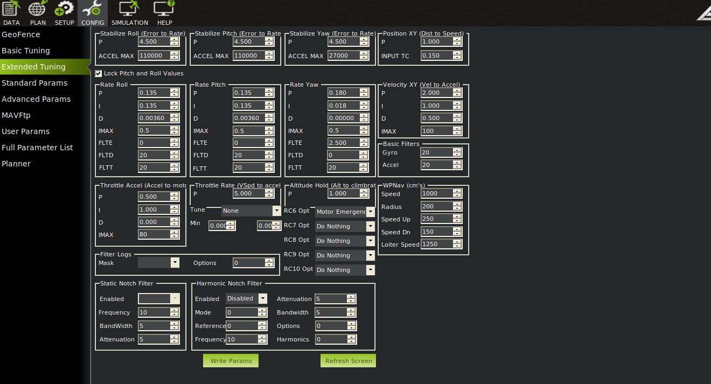

# Install and configureate BetaFlight Ardupilot
## 0 Develop kits
1. Drone frame:
    - Chassis TransTEC Lightning X Lite
    - Motor FPV 致盈EX2306 PLUS [site in Taobao](https://item.taobao.com/item.htm?spm=a1z10.5-c-s.w4002-22611654657.27.52b858176s1EdF&id=634695941707)
2. ESC:
    - [Tekko32 F4 Metal 4in1 65A ESC (65A)](https://holybro.com/collections/fpv-esc/products/tekko32-f4-metal-4in1-65a-esc-65a)
    - [HAKRC 3260A ESC BLHeli-32 ](https://item.taobao.com/item.htm?spm=a1z10.5-c-s.w4002-22611654657.32.193244beujIlvo&id=624599427940)
3. Autopilot and framework
    - Kakute H7 v1.3 [site in Taobo](https://item.taobao.com/item.htm?spm=a1z0d.6639537/tb.1997196601.28.56917484ySIhA5&id=684452325988)     
    - Ardupilot 4.3
4. Onboard computer and OS
    - Raspberry Pi
    - Ubuntu 20.04
5. Transmitter
    - RadioLink AT9S Pro
    - RadioLink R12DSM [Site in Tabo](https://item.taobao.com/item.htm?spm=a1z10.3-c-s.w4002-22611654662.9.59a41dc7RXezIK&id=561805355565)


## 1 Install and flash Ardupilot
### 1.1 Check pre-builin firmware
Different pre-built firmware lead to different installation ways.

It is suggested to ask the manufacturer about the pre-built firmware and its version.

Our Kakute H7 v1.3 has a pre-built firmware of BetaFlight. Then the version can be found with the help of BetaFlight Configurator that can auto detect the pre-built board and firmware.

Run BetaFlight Configurator, in Disconected status, we click Firmware Flasher on the left sidebar, then it will auto detect the board and the firmware version
<figure>
    
</figure>

Also, we can switch to Connected status by cliking connect on the top right. Click CLI on the left side bar, typing dump on the terminal on the right will give more information 
<figure>
    
</figure>

### 1.2 Install driver and bootloader
Tutorials are given by Ardupilot at [Loading Firmware onto boards without existing ArduPilot firmware¶](https://ardupilot.org/copter/docs/common-loading-firmware-onto-chibios-only-boards.html). Read this before going further.

### 1.3 Obtain Ardupilot firmware for KakuteH7
#### Download Ardupilot firmware
Since Kakuteh7's prebuilt firmware is not Ardupilot, installation files should include bootloaders. 

Following steps shown in [Loading Firmware onto boards without existing ArduPilot firmware](https://ardupilot.org/planner/docs/common-loading-firmware-onto-chibios-only-boards.html):

1. Go to webpage [https://firmware.ardupilot.org/Copter/stable-4.4.0/KakuteH7/](https://firmware.ardupilot.org/Copter/stable-4.4.0/KakuteH7/)

2. Download arducopter_with_bl.hex.

Or, we can build an Ardupilot firmware ourself.
#### Build Ardupilot firmware from source code
1. use Waf to build an ardupliot firmware for the chosen board. Tutorials to use Waf https://github.com/ArduPilot/ardupilot/blob/master/BUILD.md.
    - clean previous built firmware
    ```shell
         cd ardupliot
         ./waf distclean
    ``` 
    - The available list can be found by 
    ```shell
        cd ardupliot
        ./waf list_boards
    ```
    <figure>
        
    </figure>

    - video tutorial for next two steps https://youtu.be/lNSvAPZOM_o.
    - choose firmware - it is Pixhawk5X for us
    ```shell
        cd ardupliot 
        ./waf configure --board Pixhawk5X
    ```
    <figure>
        
    </figure>
    
    - build it
    ```shell
        cd ardupliot
        ./waf copter
    ```
    <figure>
        
    </figure>

    - find the built ardupliot file at /ardupliot/build/board_name/bin, like
    <figure>
        
    </figure>    

### 1.4 Write Firemware into FC
There are two ways to write Ardupilot firmware into Kakuteh7: STM32CubeProgrammer or BetaFlight Configurator.

**Connnect FC in DFU mode**

Kakute must be connected in DFU mode. To do that, press the button of Kakute, and then connnect it to the work station through a USB port.

Check if Kakute is in DFU mode, we type
```shell
    sudo dfu-util --list
```
if we can see something like Internal Flash, shown below, it means Kakute is in DFU mode. 
<figure>
    
</figure>

**Use STM32CubeProgrammer**
1. Download STM32CubeProgrammer software for Linux from [its official site](https://www.st.com/en/development-tools/stm32cubeprog.html?dl=r%2FDZ7hJ7r7LZnJS4M%2Bj%2FYg%3D%3D%2CrqQw3Z8zMJTVH%2FiHwZRxG3hJGQZEmlN4OzbGJFeuEufO47XaPWyM38drgWLJg%2F%2FukxP6agHPDG343C5L3VFsTTk12wTB%2FrA3oq9%2FGySQjLM3nRGLsi7eIQH9DlYY5OUSVtr25RNJsWoeocZdEfwKn9T7waqy41WKTicuSubVQdd1fd%2B0ydjzklycTlZd3z5c2CLMiyXRW6Dp3sndw6IxOB14m2l2wbA6%2FKQhfiyTPQe7NHIEkvcHbRwAyYBAJ22lSYc%2FzN8rHJSJh9EFm6ND6vltYTICAqp%2BihBh%2BHCVrrPfkE3nf9OUm%2BaBrMd9breQH71gc8%2B31MtN75QSPpBOAHqhdAD1VdxVDoGwk9GEUJVc8oE6F5dxFST1GI2xA6eC)
1. Install and run STM32CubeProgrammer
2. Choose USB as connection way and choose USB1, according to your station, as Port. Clikc flash buttion next port if nothing shows there.

<figure>
    
</figure>

3. Click Open file and choose downloaded arducopter_with_bl.hex.
4. Click button Download and it begins wiring Ardupilot into Kakuteh7.
<figure>
    
</figure>

5. Click button Disconnect and unplug the USB cable. 

**Use BetaFlight Configurator (To check)** 


## 2 Config Ardupilot
[Mandatory Hardware Configuration](https://ardupilot.org/copter/docs/configuring-hardware.html)

### 2.1 Choose Frame Class and Type Configuration
Connecting the autopilot with a working station through a USB port. Run Mission Planner.

Go to Setup-->Mandatory Hardware-->Frame Type. 
- Choose Quad in tap Frame Class (Quad stands for Quadrotor)
    <figure>
    
</figure>
- Since our chassis and ESC are for BetaFlight type, we need to go to Configeration->Full parameter list, and set FRAME_TYPE to be 12.

All supported types are available [here](https://ardupilot.org/copter/docs/connect-escs-and-motors.html)
    <figure>
        
    </figure>

### 2.2 Configurate receiver and transmitter
1. Bind receiver and transmiter

Plese see [Transmitter](2_6_Transmitter.md) for RadioLink AT9S Pro and RadioLink R12DSM.

For the receiver's protocol, it is suggested to use SBUS. It can be done by prssed the button for 2s and we should see the LED flashs blue.

2. Configurate Ardcupilot

##TODO


### 2.3 Configerate motors

Connect a battery to the drone and also connect the drone to the work station runing Mission Planner through a USB port.

1. Test motor order
This is to check if the motors are connected to the ESC board correctly, motor 1 is corrected to the ESC's pin for motor 1.

We can see from [Connect ESCs and Motors](https://ardupilot.org/copter/docs/connect-escs-and-motors.html) that the motors' ordering and direction for BetaFlightX. 
<figure>
        
</figure>


Then, open Initial Setup->Optinal Hardware->Motor Test.
<figure>
        
</figure>


Control motors in sequence to see if the correct motors spin:
- motor A - motor 2 in the front right,
- motor B - motor 1 on the back right, 
- motor C - motor 3 on the back left,
- motor D - motor 4 on the front left spin.

It is essential to notice that ArduPilot keeps this trandition nameing motor A, B, C, D in a different way than 1, 2, 3, 4 in Motor Test.

If one motors reponds in a wrong way, we need to check if it is connected to ESC at the correct pins.

2. Test motor directoin

Motors directions also must be checked tests. As we can see from the image above that
- motor A, or motor 2, must spin in CCW,
- motor B, or motor 1, must spin in CW,
- motor C, or motor 3, must spin in CCW,
- motor D, or motor 4, must spin in CW.

Dont worry if they are not in the correct direction. It is possible to change their directions with BLHeLiSuite32 as our ESC is BLHeli32.

Config Arduciplot to enable using to change the motors' directions following the steps in [Pass-Through Support](https://ardupilot.org/copter/docs/common-blheli32-passthru.html).


Adjust the motors' directions following the Youtube video [How To Update BLHeli 32 & Change Motor Directions](https://youtu.be/pjPI1xvcntw?si=SvltkIvUdiLomp0G)

It is suggested to update BLHeli32 firmware first and then begin modify parameters.
<figure>
        
</figure>

After that, disconnect the battery.

Source:
- https://ardupilot.org/copter/docs/common-blheli32-passthru.html
- https://discuss.ardupilot.org/t/my-method-for-iteratively-configuring-motor-ordering-and-direction/67644
- [How To Update BLHeli 32 & Change Motor Directions](https://youtu.be/pjPI1xvcntw?si=3Kq7bqo38yqXqJUn)


### 2.4 Calibrate battery
##TODO

## 3 Calibrate sensors
### 3.1 accelemeters and gyroscope
If you prefer using QGroundControl, you can read [Sensor Setup using QGroundControl for Ardupilot](https://docs.qgroundcontrol.com/master/en/SetupView/s.ensors_ardupilot.html).


1. No compass for Kakute

Note that Kakute does not have an internal compass. We can see from [Kakute' introduction at Holybro](https://holybro.com/products/kakute-h7) that
    <figure>
        
    </figure>

IMU is MPU6000 and we can look for MPU6000 information from its datasheet at [MPU6000 at TDK](https://product.tdk.com/en/search/sensor/mortion-inertial/imu/info?part_no=MPU-6000). 
    <figure>
        
    </figure>

We can be 

2. Calibrate acclemeter

3. Calibrate gyroscope


### 3.2 Calibrate ESC
#### 3.2.1 Choose protocol
1. we need to choose protocols for our ESC by setting parameter MOT_PWM_TYPE. More details can be found at [Electronic Speed Controller (ESC) Calibration](https://ardupilot.org/copter/docs/esc-calibration.html?highlight=mot_pwm_type).

2. As our ESC supports multiple protocols, we can choose DShot600 as it suits most UAVs. How to choose protocols can be found at [DShot ESCs](https://ardupilot.org/copter/docs/common-dshot-escs.html?highlight=mot_pwm_type).

3. Therefore, we set MOT_PWM_TYPE as 6 that is for DShot600.

<figure>
        
</figure>

#### 3.2.2 Calibrate ESC

There are several ways for ESC calibration at [Electronic Speed Controller (ESC) Calibration](https://ardupilot.org/copter/docs/esc-calibration.html?highlight=mot_pwm_type).

Here, Semi Automatic ESC-by-ESC Calibration is undertaken, as it easier and time-efficient. 

## 4 Arm drone now!
Two things are to be done before arming the drone for the first time.

First, insert a SD card to the Kakute to record logs. Then in Mission Planner, we need to set parameters such that flight logs are recorded during tasks.


Second, check failure safe and kill switch: 

https://www.youtube.com/watch?v=S7VZ796W8VA&ab_channel=TechatHome

https://www.youtube.com/watch?v=lqb8lpuh6uk&ab_channel=RakishRc

1. pre-arm : logging failed https://discuss.ardupilot.org/t/prearm-logging-not-started-prearm-logging-failed-bad-logging-copter-3-6-9/43753
2. Prearm: Logging Failed error https://discuss.ardupilot.org/t/prearm-logging-failed-error/98750
3. https://discuss.ardupilot.org/t/prearm-logging-failed-and-no-logs-with-the-version-4-0-3/58475/8
4. https://discuss.ardupilot.org/t/logging-failed-preventing-arming/34060/6
5. compass https://discuss.ardupilot.org/t/compass-not-healthy-preventing-arming-even-though-compasses-are-disabled-using-slam-instead/45011/2


## 5 Tune gains for manual flight


Enable log on sd card

### 5.1 Use intial tune parameters
<figure>
        
</figure>


<figure>
        
</figure>

### 5.2 Tune PID gains for drone
PID parameters are in Tab Extened Tuning

<figure>
        
</figure>

## TODO


https://ardupilot.org/copter/docs/setting-up-for-tuning.html#setting-up-for-tuning

https://ardupilot.org/copter/docs/flying-arducopter.html

https://ardupilot.org/copter/docs/initial-tuning-flight.html


https://discuss.ardupilot.org/t/no-data-from-drone-with-mavros/81183

https://discuss.ardupilot.org/t/mavros-is-not-publishing-any-data/88649/4


https://blog.csdn.net/qq_44998513/article/details/133036005

https://docs.px4.io/main/en/flight_controller/kakuteh7.html

https://blog.csdn.net/qq_44998513/article/details/133877790?spm=1001.2014.3001.5502


https://blog.csdn.net/qq_44998513/article/details/133809430?spm=1001.2014.3001.5502


