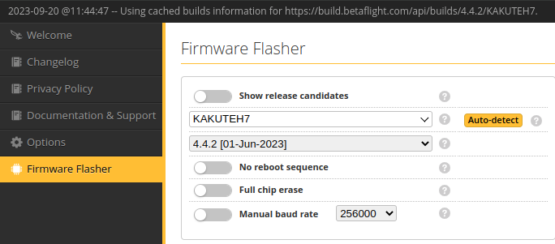
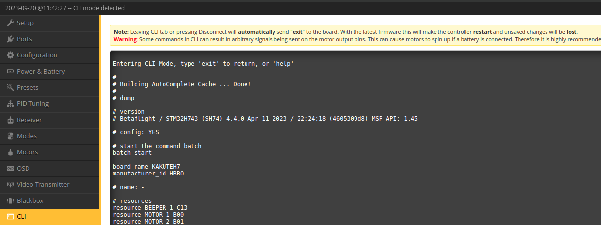
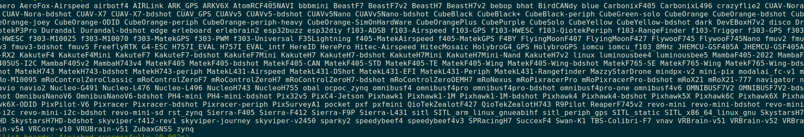
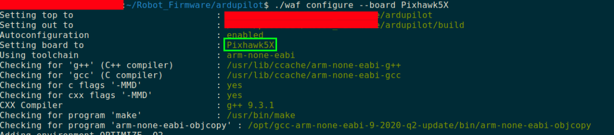
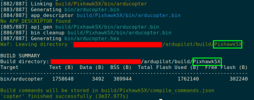
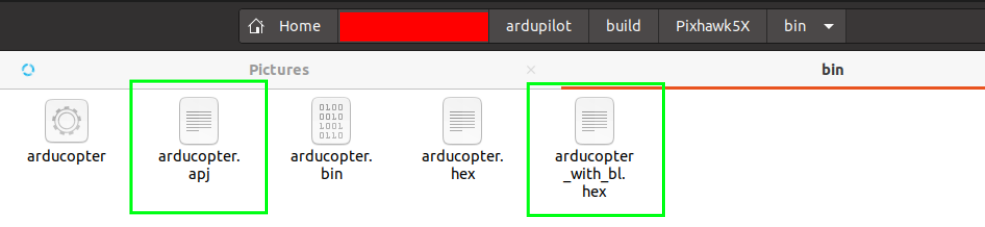
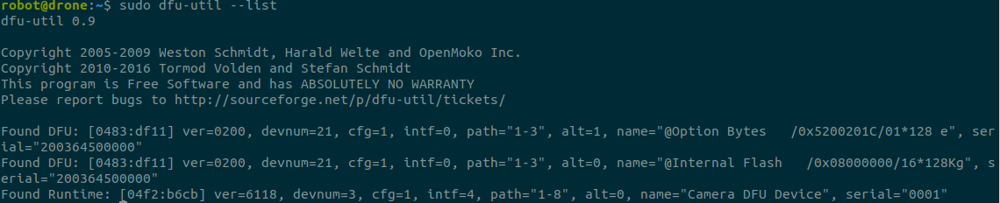
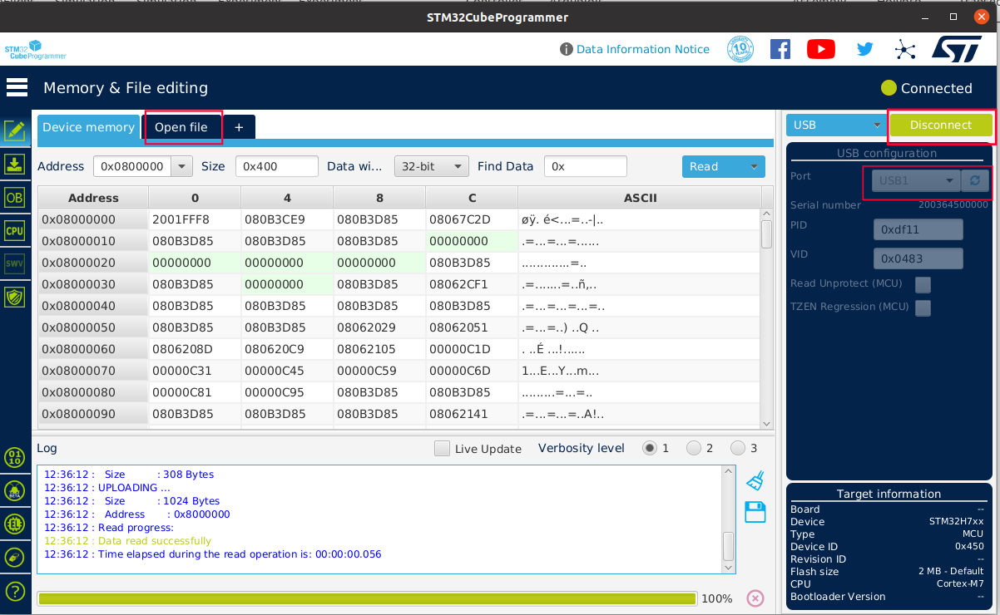
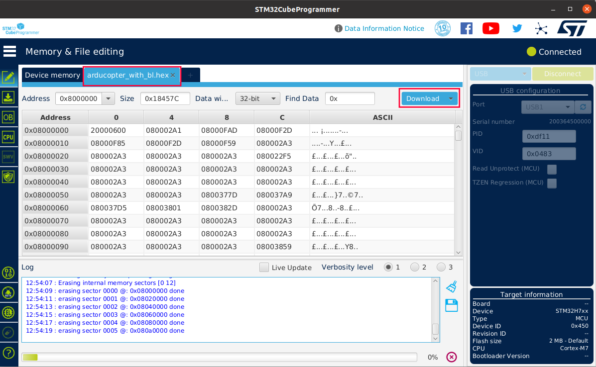

# Install Arduplot for pre-builtin firmware that is Betaflight
## 1 Check pre-builtin firmware
Different pre-built firmware lead to different installation ways.

It is suggested to ask the manufacturer about the pre-built firmware and its version.

Our Kakute H7 v1.3 has a pre-built firmware of BetaFlight. Then the version can be found with the help of BetaFlight Configurator that can auto detect the pre-built board and firmware.

Run BetaFlight Configurator, in Disconnected status, we click Firmware Flasher on the left sidebar, then it will auto detect the board and the firmware version
<figure>
    
</figure>

Also, we can switch to Connected status by clicking connect on the top right. Click CLI on the left side bar, typing dump on the terminal on the right will give more information 
<figure>
    
</figure>

## 2 Prepare Ardupilot firmware and flash it
### 2.1 Install driver and bootloader
Tutorials are given by Ardupilot at [Loading Firmware onto boards without existing ArduPilot firmware¶](https://ardupilot.org/copter/docs/common-loading-firmware-onto-chibios-only-boards.html). Read this before going further.

### 2.2 Obtain Ardupilot firmware for KakuteH7
#### Download Ardupilot firmware
Since Kakuteh7's prebuilt firmware is not Ardupilot, installation files should include bootloaders. 

Following steps shown in [Loading Firmware onto boards without existing ArduPilot firmware](https://ardupilot.org/planner/docs/common-loading-firmware-onto-chibios-only-boards.html):

1. Go to webpage [https://firmware.ardupilot.org/Copter/stable-4.4.0/KakuteH7/](https://firmware.ardupilot.org/Copter/stable-4.4.0/KakuteH7/)

2. Download arducopter_with_bl.hex.

Or, we can build an Ardupilot firmware ourself.
#### Build Ardupilot firmware from source code
1. use Waf to build an Ardupilot firmware for the chosen board. Tutorials to use Waf https://github.com/ArduPilot/ardupilot/blob/master/BUILD.md.
    - clean previous built firmware
    ```shell
         cd ardupliot
         ./waf distclean
    ``` 
    - The available list can be found by 
    ```shell
        cd ardupliot
        ./waf list_boards
    ```
    <figure>
        
    </figure>

    - video tutorial for next two steps https://youtu.be/lNSvAPZOM_o.
    - choose firmware - it is Pixhawk5X for us
    ```shell
        cd ardupliot 
        ./waf configure --board Pixhawk5X
    ```
    <figure>
        
    </figure>
    
    - build it
    ```shell
        cd ardupliot
        ./waf copter
    ```
    <figure>
        
    </figure>

    - find the built ardupliot file at /ardupliot/build/board_name/bin, like
    <figure>
        
    </figure>    

### 2.3 Write Firmware into FC
There are two ways to write Ardupilot firmware into Kakuteh7: STM32CubeProgrammer or BetaFlight Configurator.

**Connect FC in DFU mode**

Kakute must be connected in DFU mode. To do that, press the button of Kakute, and then connect it to the work station through a USB port.

Check if Kakute is in DFU mode, we type
```shell
    sudo dfu-util --list
```
if we can see something like Internal Flash, shown below, it means Kakute is in DFU mode. 
<figure>
    
</figure>

**Use STM32CubeProgrammer**
1. Download STM32CubeProgrammer software for Linux from [its official site](https://www.st.com/en/development-tools/stm32cubeprog.html?dl=r%2FDZ7hJ7r7LZnJS4M%2Bj%2FYg%3D%3D%2CrqQw3Z8zMJTVH%2FiHwZRxG3hJGQZEmlN4OzbGJFeuEufO47XaPWyM38drgWLJg%2F%2FukxP6agHPDG343C5L3VFsTTk12wTB%2FrA3oq9%2FGySQjLM3nRGLsi7eIQH9DlYY5OUSVtr25RNJsWoeocZdEfwKn9T7waqy41WKTicuSubVQdd1fd%2B0ydjzklycTlZd3z5c2CLMiyXRW6Dp3sndw6IxOB14m2l2wbA6%2FKQhfiyTPQe7NHIEkvcHbRwAyYBAJ22lSYc%2FzN8rHJSJh9EFm6ND6vltYTICAqp%2BihBh%2BHCVrrPfkE3nf9OUm%2BaBrMd9breQH71gc8%2B31MtN75QSPpBOAHqhdAD1VdxVDoGwk9GEUJVc8oE6F5dxFST1GI2xA6eC)
1. Install and run STM32CubeProgrammer
2. Choose USB as connection way and choose USB1, according to your station, as Port. Click flash button next port if nothing shows there.

<figure>
    
</figure>

3. Click Open file and choose downloaded arducopter_with_bl.hex.
4. Click button Download and it begins wiring Ardupilot into Kakuteh7.
<figure>
    
</figure>

5. Click button Disconnect and unplug the USB cable. 