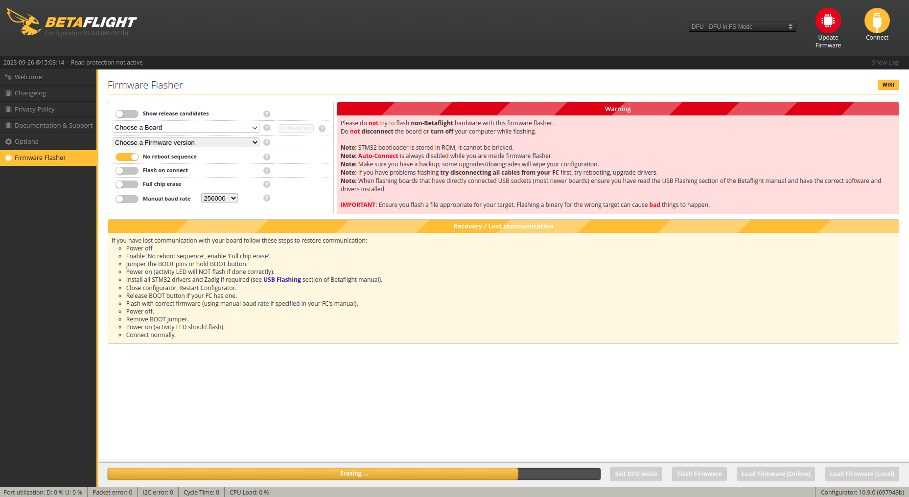
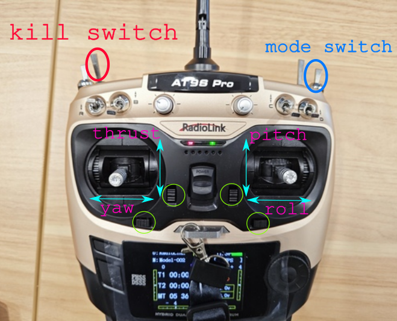
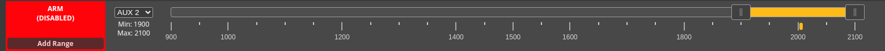
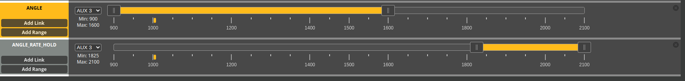
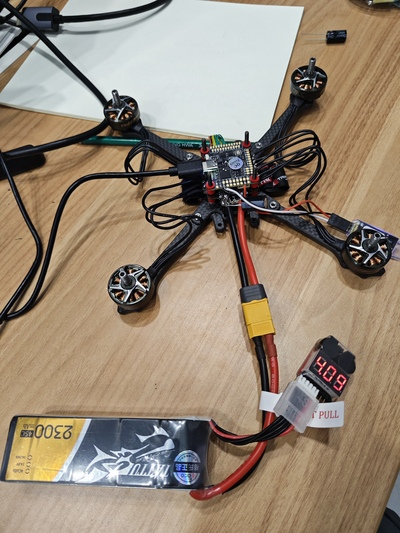
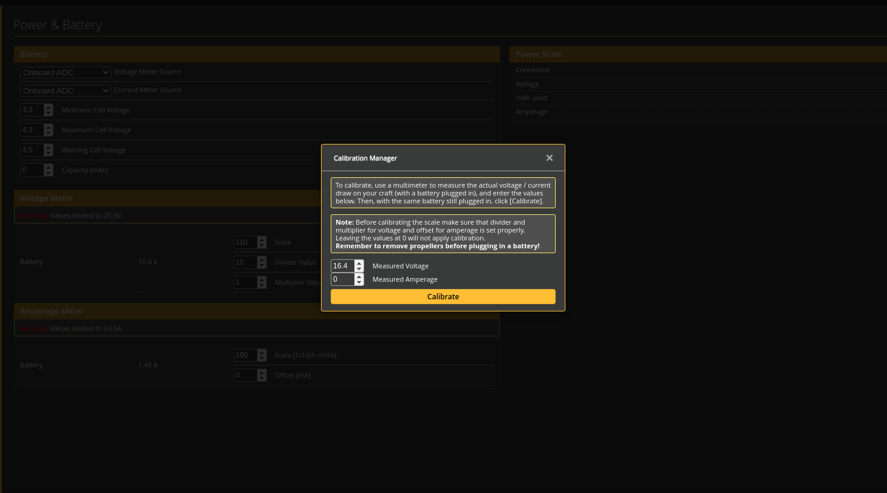
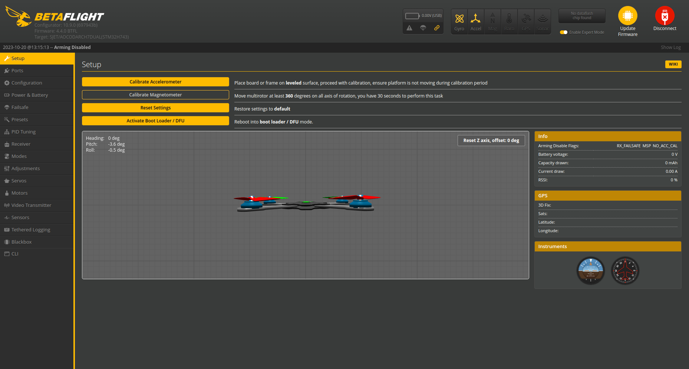

# Install and configure BetaFlight
## 0 Develop kits
1. Drone frame:
    - Chassis TransTEC Lightning X Lite
    - Motor FPV 致盈EX2306 PLUS [site in Taobao](https://item.taobao.com/item.htm?spm=a1z10.5-c-s.w4002-22611654657.27.52b858176s1EdF&id=634695941707)
2. ESC: Aocoda 60A 4 in 1 [site in Taobao](https://item.taobao.com/item.htm?spm=a1z0d.6639537/tb.1997196601.4.55627484xw5sv5&id=682898024012)

3. Autopilot and framework
    - Aocoda RC H743 [site in Taobo](https://item.taobao.com/item.htm?spm=a1z0d.6639537/tb.1997196601.4.55627484xUOMZu&id=679995875558)     
    - BetaFlight 4.4.0
4. Onboard computer and OS
    - Raspberry Pi
    - Ubuntu 20.04
5. Transmitter
    - RadioLink AT9S Pro
    - RadioLink R12DSM [Site in Tabo](https://item.taobao.com/item.htm?spm=a1z10.3-c-s.w4002-22611654662.9.59a41dc7RXezIK&id=561805355565)
6. Work station
    - Ubuntu 20.04

## 1 Install and flash BetaFlight firmware
<figure>
    
</figure>

[BetaFlight](https://betaflight.com/) is flight controller firmware for flying multi-rotor craft and fixed wing craft. Because of its cuttin edge performances, BetaFlight is one of the largest flight firmwares in the FPV drone racing and freestyle community. 

## 1.1 Install BetaFlight Configurator
BetaFlight Configurator is a tool for us to flash and calibrate firmwares.

Setup Guide shows steps to install BetaFlight Configurator.

1. Download deb for Ubuntu 20.04.
<figure>
    
</figure>

2. Install deb pkg by runing
```shell
    sudo dpkg -i  betaflight-configurator_10.9.0_amd64.deb  
```
3. Run BetaFlight Configurator and see the following interface
<figure>
    
</figure>


## 1.2 Obtain BetaFlight for Aocoda H743
It is recommended to contact the manufacturer asking which version of BetaFlight firmware works for their product.


## 1.3 Flash BetaFlight to Aocoda H743
1. connect autopilot board to a work station through a USB port. It is supposed to see the LED flashing after connection.

2. run BetaFlight Configurator

3. write custmerized firmware
    - **enable DFU mode of the autopilot board**
    - enable "no reboot sequence"
    - enable "Full clip earse" if your previous installation failed and you cannot connect your autopilot
    - click "Load Firmware" and choose the obtained firmware XXX.hex. 
    - click "Flash Firmware" and the process is done when 'programming:succesful' can is shown.
    <figure>
        
    </figure>


## 2 Configure BetaFlight
**REMOVE propellers before doing anything else**

### 2.1 Configure transmitter and receiver

#### 2.1.1 Bind receiver and transmiter
Plese see [Transmitter](2_6_Transmitter.md) searching for RadioLink AT9S Pro and RadioLink R12DSM

#### 2.1.2 Configure receiver using BetaFlight Configurator
1. Define ports as Serial (via UART)
2. Choose protocal
    - SBUS and switch the RadioLink R12DSM into S-BUS model when the LED flashs blue.
    - PPM not tested
3. Enable Telemetry port. Note for our NESC members that this port has been modified, it does not work as the default.
    <figure>
    
    </figure>

4.  It is suggested to use our transmitter test thrust, roll, pitch, yaw controls by seeing the 3D model's animation. You can modify the sequence of AETR1234 in Channel Map according to your needs. AETR1234 means 

    <figure>
    
    </figure>
5. Adjust sticks' sensitivities with the buttons in green circles such that central positions of sticks should corresond to around 1507.

### 2.2 Configure motors
NOTE: REMOVE propellers if you did not do that.

1. Check frame type and motor order.

    Choose QUAD X as our chassis is TransTEC Lightning X Lite. Other chassis may lead to different choices here.

    The ESC borad has marks, i.e. 1,2,3,4, help place motors in order. It is suggested to choose the same layout as shown here. Please remember the direction of the quadrotor on the autopilot is illustrated by an arrow in white.
    <figure>
        
    </figure>

2. Test motors' spinning
    
    Now, it is time to test if we can spin motors. To do that, the first thing is to connect a battery to the ESC board while keeping the connect between the work station and the autopilot board.

    Then, it is necessary to set the ESC/Motor Output dropdown to the correct protocol. Usually DShot300 or DShot600 should be chosen for most ESCs available nowadays. Here is the explantion given by BetaFlight Configurator;
    - DShot300 is better for FCs with slower processors, like F411 boards. DShot600 is better for faster processors, like anything from the F7 family. F405 may work too, but it can cause too high of a CPI load when a lot of peripherals are in use
    - The DShot speed also depends on the gyro (and thus also the PID loop) speed. If you have a gyro that runs at 8kHz (MPU6000), you can use DShot600. If you have a gyro that runs at 3.2KHz (BMI270), you should use DShot300. Using higher DShot speeds on slower gyros shoudn't cause any issues, but it also won't give you any benefits.

    On the right side, we click "I understand the risk", then we can test motors' spinning individually by using sidebards with 1,2,3,4 or together using Master. if The motors, ESC, and the autopilot board are connected correctly, we should be able to see motors are spinning according to our commands.

3. Change motors' spinning direction.

    After successfully spinning motors, we need to check the motors' direction if they are in the correct way that is shown on the left.

    As we can see, motor 1 and 4 are in clockwise direction, while motor 2 and 3 are in counterclockwise direction.  If one or two motors are not spinning in the correct way, then we can click button Motor direction and change the direction of them.
    <figure>
        
    </figure>

    Choose motor by index first, and then if the direction is wrong, we just need to click "Reverse".

### 2.3 Configure flight modes

There are serverial modes:
- Arm mode. It used as a kill switch as it can enable and disable motor output.
- Angle mode. The input to the autopilot board is angle, that is usually chosen for manual flights.
- Angle_rate_hold. This mode can receive angle commands and bodyrate commands, which is cused for auto flights.

1. Set Arm mode.
- Click Add Range
- Choose Auto and switch SwF of transmitter on and off, then it will automatically set the channel of SwF, maybe AUX 1, for mode Arm.
- There is a yellow bar for every mode. In fact, the area covered by that corresponds to the transmitter' channel's status. 

Take Arm for instance, when the channel is in the yellow bar's area, the drone is armed, while the channel is outside, the drone is disarmed.
    <figure>
        
    </figure>

2. Set Angle mode and Angle_rate_hold mode
Make them use the same channel of SwG, then adjust the yew bar for two stages where one stage of SwG corresponds to mode Angle, and the other lies in mode Angle_rate_hold.
    <figure>
        
    </figure>

Read the following resources:
1. Modes Tab from BetaFlight, [https://betaflight.com/docs/wiki/configurator/modes-tab](https://betaflight.com/docs/wiki/configurator/modes-tab)
2. Betaflight 4.3 Modes Tab, [https://youtu.be/kDAotpevszs?si=QKJp7 5aN2eq35jE8](https://youtu.be/kDAotpevszs?si=QKJp75aN2eq35jE8)

Other modes can be found at [Modes](https://betaflight.com/docs/development/Modes).

1. If we link two modes, then enabling one will trigger the other.
2. ACRO mode takes commands as body rates from pilots. This mode is usually used in FPV. In fact, you cannot find this mode and it is a default mode: the drone switches to ACRO mode if we arm the drone while no mode, like Angle mode, is chosen.


### 2.4 Configure power & battery
1. check if BetaFlight Configurator find the correct number of cells.


2. Choose battery source
Two options are available here
- Onboard ADC means the voltage and current are measured by the autopilot's ADC. 
- ESC means they are measured by ESC telemetry. To use ESC telemetry for voltage mesurement, the ESC board needs have a pin named after telemetry that is connected to the autopilot. A pin named after current is needed for current measurement.

We choose Onboard ADC when batteries of 2s-6s are used, then ESC is a better choice when batteries of more than 6s are chosen.

3. Amperage Meter (Current)
This depends on ESC instead of autoipilots.

The parameter Scale in Amperage Meter should be given by manusfracter. As for our Aocoda 3060A 4 in 1 [site in Taobao](https://item.taobao.com/item.htm?spm=a1z0d.6639537/tb.1997196601.4.55627484xw5sv5&id=682898024012), the scale is set to be 160.    
    <figure>
        
    </figure>

4. Voltage Meter (Voltage)
Here is what we should do first
    - connect a battery to the drone
    - connect a voltage meter to the battery to read the voltage
    <figure>
        
    </figure>


Click the button Calibration, entre the volrage value read from the meter anc lick button Calibrate.
    <figure>
        
    </figure>

After hearing the music, we can click the button Save.


## 3 Calibrate sensors

Aocoda has embeded an accelerometer and a gyroscope. 

First let us calibrate the accelerometer. Place the drone on the flat surface, and then click the button Calibrate Accelerometer. 

It finishes when the message "Accelerometer calibration finished" is displayed on the top left. Note do not move the drone during the calibration.

<figure>
        
</figure>

## 4 PID tuning
#TODO


Resource
1. [Betaflight 4.3 Power and Battery Tab](https://youtu.be/Je6eFQKbPBw?si=eD12qMDaLkkHF9_j)