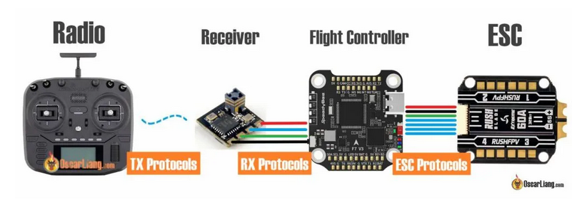

# Big picture of transmitter, receiver and autopilot
<figure>
    
</figure>
source: https://oscarliang.com/rc-protocols/#RX-Protocols

## 1 Configure transmitter
1. create new model such that one model for one receiver
    - press mode to entre basicConfig menu
    - choose Model Sel
    - select a new model for this receiver. It means that if this transmitter already uses model 1 and 2 for another 2 receivers, then we should select other models, like 3. But remember which model is for which receiver.
    - go back to basic menu by pressing End and entre Model Type. choosing multirotor or your type of UAV in option TYPE.

3. set transmitter channel
    -  get 12 channels:
        - press mode to entre basic menu
        - entre System and change "CH-Select" to be "12CH" such that it provide 12 channels for this transmitter
    -  change channel mapping
        - our aims is to use SwF (2-stage, on the left) for kill switch, Swg (3-stages, on the right)for switching flight modes 
        - channels 1,2,3,4 are by default for thrust, yaw, roll and pitch, so we set SwF as channel 6 and SwG as channel 7.
        - press mode to entre basic menu
        - choose AUX-CH, and set SwF for CH6 and SwG for CH7.
           
4. modify/reverse transmitter channel
    - problem: it could be possible that channel mapping is in the opposite way: when we push roll stick, the drone flip backward, while is it supposed to flip forward. 
    - solution:
        - press mode to entre basic menu
        - entre Reverse, go the wrong channel and then switch to REV if it is NOR, or switch to NOR or it is REV.

## 2 Configure receiver
One receiver can possibly support different protocols. For instance, RadioLink R12DSM can support both SBUS and PPM.

Therefore, it is significant to check which can be supported by the chosen autopilot and adjust the receiver to work using that protocol.

## 3 Bind transmitter and receiver        
- Binding RadioLink AT9S Pro and RadioLink R12DSM is shown at [RadioLink at Youtube: How to| Make RadioLink receiver R12DSM bind with transmitters](https://www.youtube.com/watch?v=KpSXgxUHlPw&ab_channel=RadioLink).