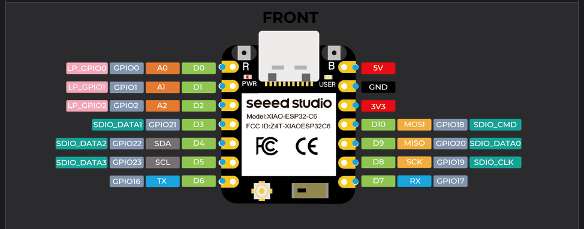
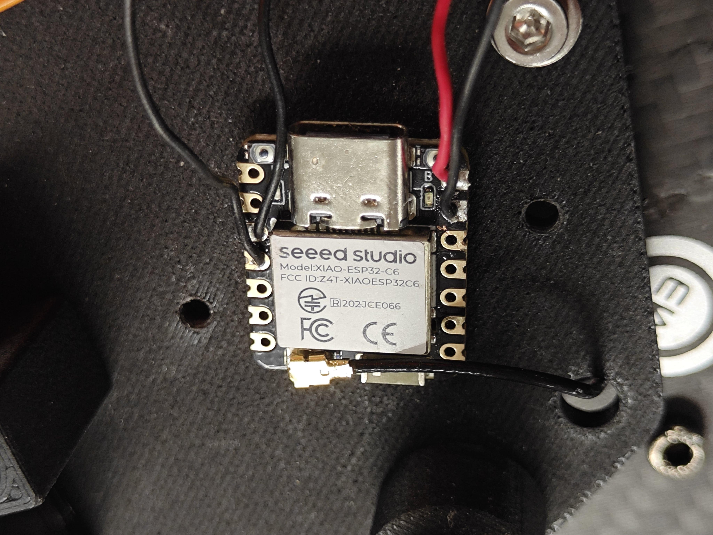
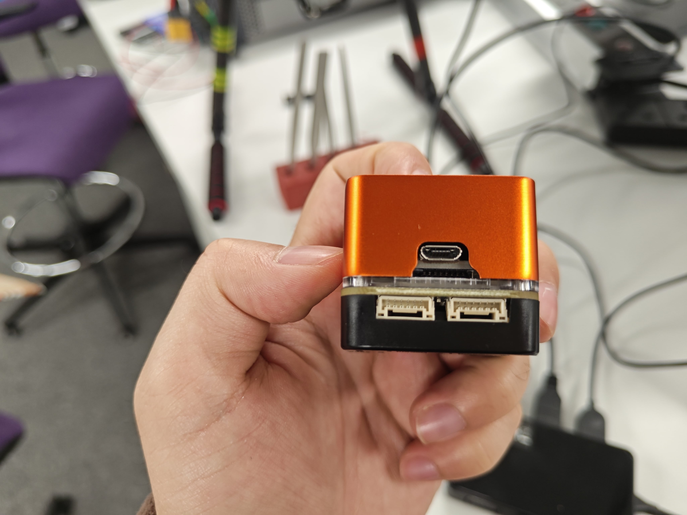
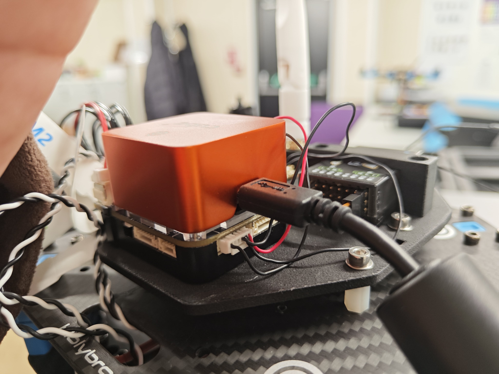
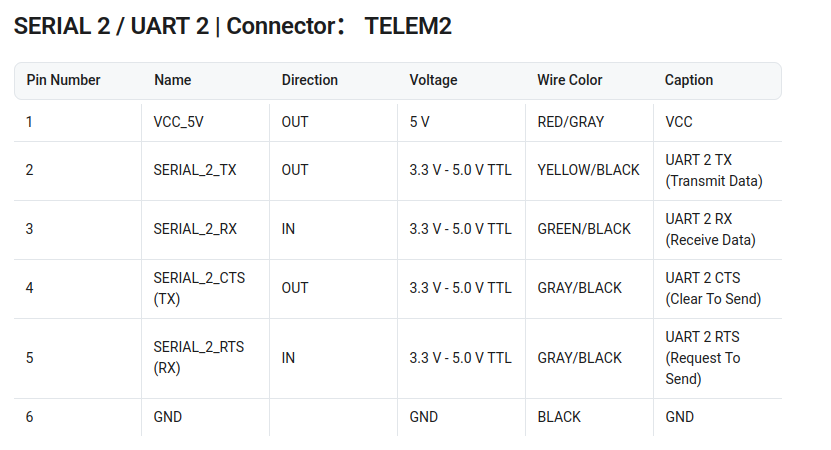
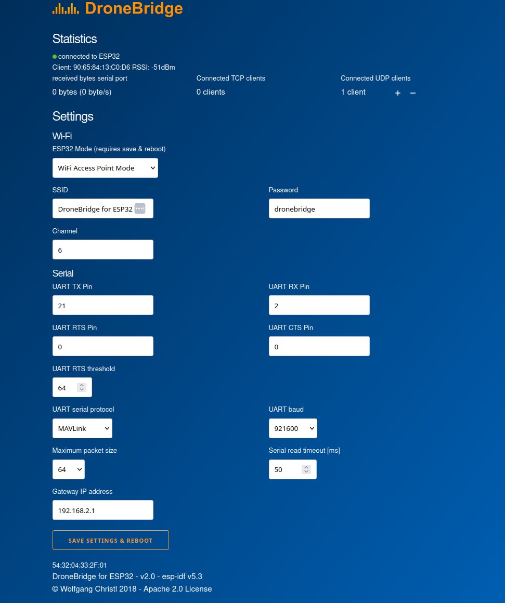
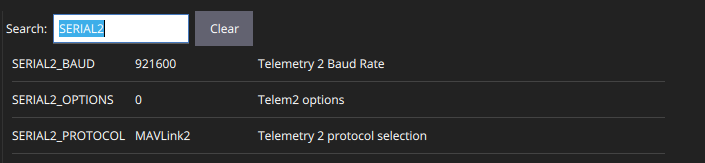

# ESP32 Wifi telemetry
Kit:
- Seeed Studio Xiao ESP32-C6
- Orange Cube+ mini 

An ESP32 module can allow our Ground Station and our controllers to connect to autopilots through Wifi. It can either create a Wifi access point for us to connect or connect to a Wifi network generated by a Wifi router.

The purpose is to enable Ardupilot to receive and broadcast mavlink messages through a Wifi network generated by ESP32. As a consequence, we can run all communication tools like mavros, mavsdk and mavros that use mavlink on a computer, or a base station, to communicate with Ardupilot directly.

In this case, we can be free of installing an onboard computer that runs the pkg mavros to get all ros topics.

## 1 Wire ESP32 to autopilot
Wiring instruction can be found at the Section Wiring [ESP32 WiFi telemetry - DroneBridge](https://ardupilot.org/copter/docs/common-esp32-telemetry.html).

The [pinout](https://wiki.seeedstudio.com/xiao_esp32c6_getting_started/) of ESP32-C6 is shown as 

<figure>
    
</figure>

5 wires are needed for power (5V), GND, one GPIO for RX and one GPIO for TX. GPIO2 and GPIO21 are used here.
<figure>
    
</figure>


We are using the Telem2 port to connect to the ESP32.
<figure>
    
</figure>

Serial Ports of Orange Cube+ mini can be found at [Mini Carrier Board](https://docs.cubepilot.org/user-guides/carrier-boards/mini-carrier-board#serial-2-uart-2-or-connector-telem2). 

<figure>
    
</figure>

With the pinout information at 
[Cube+ mini](https://docs.cubepilot.org/user-guides/carrier-boards/mini-carrier-board), we can identify that GPI02 is connected to TX of Telem2 of Orange Cube, while GPIO21 is connected to RX of Telem2 of Orange Cube. Power and GND are also connected to the corresponding pins of Telem2.

<figure>
    
</figure>

Unitll now, we have connected ESP32 and the Cube Orange mini.

## 2 Configure DroneBridge and Ardupilot

Power the autopilot with a USB cable from a computer, then the ESP32 will be powered through the autopilot as well. Bu default, the EP32 will generate a wifi access point with the name being `DroneBridge for ESP32` and the password being `dronebridge`.

Now, we need to configure DroneBridge and Ardupilot to enable the communication between ESP32 and the Orange Cube+ mini such that we can receive mavlink messages from it and send mavlink messages to it through Wifi.

Put `http://dronebridge.local/` in the browser, we then should see the configuration page for DroneBridge.

The page is shown as
<figure>
    
</figure>

In settings, in ESP32 Mode, we can set `WiFi Access Point Mode` so that a wifi access point, or a network, is created with the name and pws being specified in `SSID` and `Password`. It is also possible to join a Wifi network using DroneBridge.

Since in the Step 1, we have established the connection as 
```
GPI02 <---> TX of Telem2
GPI021 <---> RX of Telem2
```
we should set `Serial UART TX Pin` as `21`, while `Serial UART RX Pin` as `2` to pair `TX-RX`.

After this, we choose the protocol mavlink in Ardupilot to make Ardupilot can send and receive mavlink messages through Telem2 and Wifi created by ESP32.

<figure>
    
</figure>