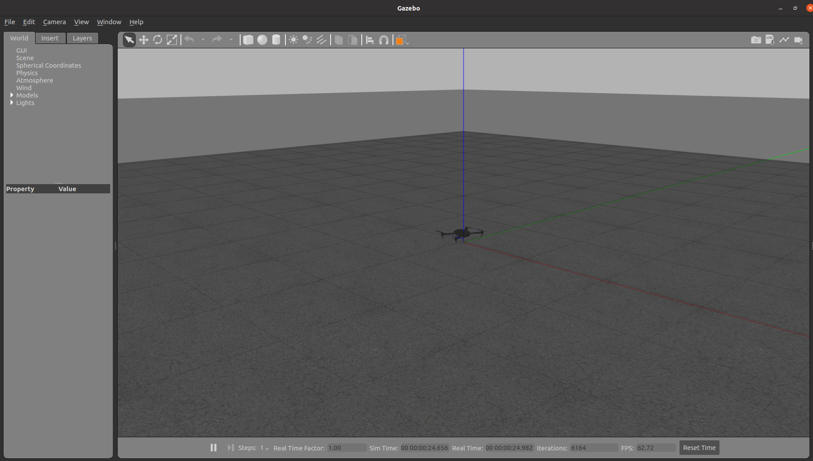

# Simulation setup ROS, PX4, Gazebo and Mavros (mavlink) 
This is to setup simulation environment to simulate drone (PX4) in Gazebo and ROS.

Software and ROS packages needed include
- **ROS**,
- **PX4** as framwork of autoploit,
- **Mavros** for communication between PX4 and ROS,
- Controller library (optional).

## Table of contents  
  - [Step 1 Install ROS](#step-1-install-ros)
  - [Step 2 Build PX4 from source code](#step-2-build-px4-from-source-code)
  - [Step 2.5 Enable rosluanch to launch PX4 in Gazebo](#step-25-enable-rosluanch-to-launch-px4-in-gazebo)
  - [Step 3 Build Mavros (Mavlink) from source code](#step-3-build-mavros-mavlink-from-source-code)


## Step 1 Install ROS
ROS version should be chosen according to OS. Now, ROS LTS (see [here](http://wiki.ros.org/ROS/Installation)) are provided for
- Ubuntu 18.04 (ROS Melodic),
- Ubuntu 20.04 (ROS Noetic).

Installing guide of Noetic for Ubuntu 20.04 can be found [here](http://wiki.ros.org/noetic/Installation/Ubuntu).

## Step 2 Build PX4 from source code
1. Download PX4 of version 1.12.3
```bash
git clone -b v1.12.3 https://github.com/PX4/PX4-Autopilot.git --recursive
```
Check PX4 version with
```bash
git describe
```
we should get
<figure>
    
    <figcaption>px4 version</figcaption>
</figure>

2. Run the script to install dependencies and tools for nuttx, jMAVSim, Gazebo s
```bash
bash ./PX4-Autopilot/Tools/setup/ubuntu.sh
```
3.  Test PX4 within Gazebo
```bash
make px4_sitl gazebo
```
## Step 2.5 Enable rosluanch to launch PX4 in Gazebo
Following steps of *Install PX4 SITL(Only to Simulate)* [here](https://github.com/ZhongmouLi/mavros_controllers)
```
cd <Firmware_directory>
DONT_RUN=1 make px4_sitl_default gazebo
```
In cases of errors, do
```bash
cd <Firmware_directory>
make clean
rm -r ~/catkin_ws/devel ~/catkin_ws/build 
```

Modify .bashrc by adding
(replace <span style="color:red"> *address_of_PX4-Autopilot* </span>by where you install PX4-Autopilot int the following commande)


```bash
source Tools/setup_gazebo.bash address_of_PX4-Autopilot $address_of_PX4-Autopilot/build/px4_sitl_default
export ROS_PACKAGE_PATH=$ROS_PACKAGE_PATH:$address_of_PX4-Autopilot
export ROS_PACKAGE_PATH=$ROS_PACKAGE_PATH:$address_of_PX4-Autopilot/Tools/sitl_gazebo
```
5. Check if ros can find px4 package
```bash
rospack find px4
```
It should give

<figure>
    
    <figcaption>px4 found by ros</figcaption>
</figure>

Finally, it should be able to use roslaunch to create px4-gazebo simulation environment by 
```bash
roslaunch px4 posix_sitl.launch
```
<figure>
    
    <figcaption>px4-gazebo simulation environment</figcaption>
</figure>


Common errors:
1. gazebo dies
<figure>
    
    <figcaption>gazebo errors</figcaption>
</figure>
do 
```bash
ps aux | grep gzserver
kill -2 <pid associated with gzserver>
```

## Step 3 Build Mavros (Mavlink) from source code
Mavlink is a protocol for communicating with drones (PX4). 

There are two ways of using Mavlink for communication
- Mavros wappers Mavlink into ROS,
- MavSDK provides various programming languages to interface with MAVLink systems.

Our development is conducted in ROS, thus is natrual to consider using Mavlink somehow in ROS for the purpose of communicating with drones in ROS environment. Therefore, we take Mavros.

PX4 provides guides to install Mavros and Mavlink [ROS with MAVROS Installation Guide](https://docs.px4.io/master/en/ros/mavros_installation.html)

Here we show do to build MAVROS from source code .


1. Install building and managing tools, **catkin_tools** and **wstool** see the [install catkin tools](https://catkin-tools.readthedocs.io/en/latest/installing.html) and [install wstool](http://wiki.ros.org/wstool).
2. Initialize your source space with wstool
    1. the target directory of wstool is src
    
    ```bash
    cd catkin_ws
    wstool init ./src
    ```
    
3. Install MAVLink
    (1). note: tee is to write the output of rosinstall_generator into the file mavros.rosinstall
    
    ```bash
    # We use the Kinetic reference for all ROS distros as it's not distro-specific and up to date
    rosinstall_generator --rosdistro kinetic mavlink | tee /tmp/mavros.rosinstall
    ```
    
    (2). install MAVROS with stable one
        ```bash
        rosinstall_generator --upstream mavros | tee -a /tmp/mavros.rosinstall
        ```   
    As a consequence, we can cat the "/temp/mavros.rosinstall" that is shown below. We can see from that, wstool just records the git rep information, such as URL, branch name and version.
        
        ```bash
        - git:
            local-name: mavlink
            uri: https://github.com/mavlink/mavlink-gbp-release.git
            version: release/kinetic/mavlink/2021.3.3-1
        
        - git:
            local-name: mavros
            uri: https://github.com/mavlink/mavros.git
            version: 1.10.0
        ```
        
5. Create workspace & deps (explanation of wstool see [here](https://docs.ros.org/en/independent/api/rosinstall/html/rosws.html))
    
    ```bash
    #  run this commande in /catkin_ws which merges config in /tmp/mavros.rosinstall to src/.rosinstall
    wstool merge -t src /tmp/mavros.rosinstall  
    
    #  This command pulls changes from remote to your local filesystem.
    # download the source codes from git 
    wstool update -t src -j4
    
    // 
    rosdep install --from-paths src --ignore-src -y
    ```
    
6. Install [GeographicLib](https://geographiclib.sourceforge.io/) dataset
    
    ```bash
    ./src/mavros/mavros/scripts/install_geographiclib_datasets.sh
    
    # if /bin/bash^M: bad interpreter: No such file or directory
    Try running *dos2unix* on the script:
    
    http://dos2unix.sourceforge.net/
    ```
    
7. build source
    
    ```bash
    cd catkin_ws
    catkin build
    ```
    
8. use setup.bash or setup.zsh from workspace.
    
    ```bash
    cd catkin_ws
    source ./devel/source.bash
    ```
    
9. check if MAVROS and MAVLink are well installed
    
    ```bash
    rospack find mavros
    
    rospack find mavlink
    ```
    

which gives

<figure>
    
    <figcaption>Mavros and Mavlink are installed</figcaption>
</figure>

10. run mavros for communcation in simulation
```bash
roslaunch mavros px4.launch fcu_url:="udp://:14540@127.0.0.1:14557"
```
Note ```fcu_url:="udp://:14540@127.0.0.1:14557"``` indicates that a drone is simulated by this PC.
