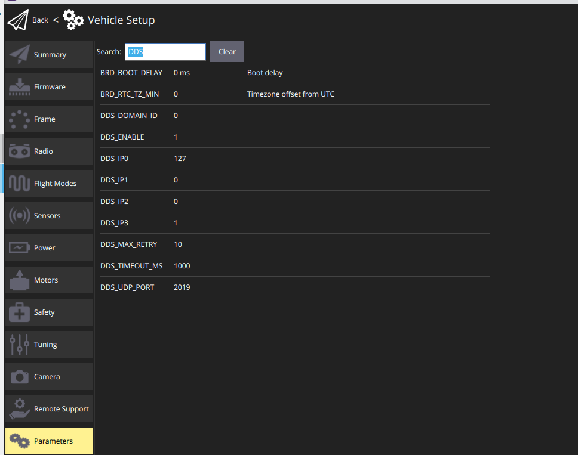

# Ardupilot for ROS2 in Docker
This rep is to proivde a development environment using PX4-Gazebo in Docker that is compataible with ROS2 Humble. 

## 1. Setup Ardupilot with ROS2
### 1.1 build ROS2 pkgs for Ardupilot
This is developed in a Docker container with humble with the working space being set as `ros2_ws`.

Step 1. get 
```bash
    cd ros2_ws/src
    git clone --recursive -b humble https://github.com/micro-ROS/micro-ROS-Agent.git micro_ros_agent
```
Step 2. update ROS2 dep
```bash
    cd ros2_ws
    sudo apt update && rosdep update
    source /opt/ros/humble/setup.bash
    rosdep install --from-paths src --ignore-src -r -y
```

Step 3. install Micro-XRCE-DDS-Gen
```bash
    cd ros2_ws
    sudo apt install default-jre -y
    git clone --recurse-submodules https://github.com/ardupilot/Micro-XRCE-DDS-Gen.git src/Micro-XRCE-DDS-Gen
    cd ros2_ws/src/Micro-XRCE-DDS-Gen
    ./gradlew assemble
    echo "export PATH=\$PATH:$PWD/scripts" >> ~/.bashrc
```
test with 
```bash
    cd ros2_ws
    microxrceddsgen -help
    microxrceddsgen usage:
            microxrceddsgen [options] <file> [<file> ...]
            where the options are:
                    -help: shows this help
                    -version: shows the current version of eProsima Micro XRCE-DDS Gen.
                    -example: Generates an example.
                    -replace: replaces existing generated files.
                    -ppDisable: disables the preprocessor.
                    -ppPath: specifies the preprocessor path.
                    -I <path>: add directory to preprocessor include paths.
                    -d <path>: sets an output directory for generated files.
                    -t <temp dir>: sets a specific directory as a temporary directory.
                    -cs: IDL grammar apply case sensitive matching.
            and the supported input files are:
            * IDL files.

```
Till now, if we follow the guide running `colcon build --packages-up-to ardupilot_dds_tests`, we will meet error casued by `ardupilot_sitl`

```bash
ardupilotros2@Robot:~/ros2_ws$ colcon build --packages-up-to ardupilot_dds_tests
Starting >>> ardupilot_msgs
Starting >>> micro_ros_agent
Finished <<< micro_ros_agent [0.10s]
Finished <<< ardupilot_msgs [0.25s]                    
Starting >>> ardupilot_sitl
--- stderr: ardupilot_sitl                         
gmake[2]: *** [CMakeFiles/ardupilot_build.dir/build.make:70: CMakeFiles/ardupilot_build] Error 1
gmake[1]: *** [CMakeFiles/Makefile2:168: CMakeFiles/ardupilot_build.dir/all] Error 2
gmake: *** [Makefile:146: all] Error 2
---
Failed   <<< ardupilot_sitl [1.80s, exited with code 2]

Summary: 2 packages finished [2.35s]
  1 package failed: ardupilot_sitl
  1 package had stderr output: ardupilot_sitl
  1 package not processed

```
### 1.2 Build Ardupilot for simulation
Step 1 down load Ardupilot source code
```bash
    cd ros2_ws/src
    git clone --recurse-submodules https://github.com/ArduPilot/ardupilot.git
    cd ./ardupilot && git submodule update --init --recursive
```

Step 2 install dependencies
```bash
    cd ros2_ws
    ./src/ardupilot/Tools/environment_install/install-prereqs-ubuntu.sh -y
```

remember to  install `mavproxy`
```bash
    sudo pip3 install mavproxy
```

Step 3. build Ardupilot for STL (only ArduCopter is needed here)
```bash
    cd ros2_ws/src/ardupilot
    ./waf distclean 
    ./waf configure --board sitl --enable-DDS
    ./waf copter
```
we should see 
```console
    BUILD SUMMARY
    Build directory: /home/ardupilotros2/ros2_ws/src/ardupilot/build/sitl
    10:44:21 runner ['/usr/bin/size', 'bin/arducopter']
    Target          Text (B)  Data (B)  BSS (B)  Total Flash Used (B)  Free Flash (B)  External Flash Used (B)
    ----------------------------------------------------------------------------------------------------------
    bin/arducopter   4403129    201437   333024               4604566  Not Applicable  Not Applicable         

    'copter' finished successfully (2m52.064s)
```

Step 4 build ROS2 pkgs for Ardupilot
After building Ardupilot, we still need to build ROS2 pkgs in the workspace.
```bash
    cd ros2_ws
    colcon build
    Starting >>> ardupilot_msgs
    Starting >>> micro_ros_agent
    Finished <<< micro_ros_agent [0.13s]                                                                   
    Finished <<< ardupilot_msgs [0.42s]                     
    Starting >>> ardupilot_sitl
    [Processing: ardupilot_sitl]                             
    [Processing: ardupilot_sitl]                                     
    [Processing: ardupilot_sitl]                                       
    [Processing: ardupilot_sitl]                                       
    [Processing: ardupilot_sitl]                                       
    Finished <<< ardupilot_sitl [2min 56s]                              
    Starting >>> ardupilot_dds_tests
    Finished <<< ardupilot_dds_tests [0.69s]                

    Summary: 4 packages finished [2min 57s]

```
Then, it is possible to launch simulation using `ROS2 launch`.

```bash
    cd ros2_ws
    source install/setup.bash
    ROS2 launch ardupilot_sitl sitl_dds_udp.launch.py \
        transport:=udp4 \
        synthetic_clock:=True \
        wipe:=False \
        model:=quad \
        speedup:=1 \
        slave:=0 \
        instance:=0 \
        defaults:=$(ROS2 pkg prefix ardupilot_sitl)/share/ardupilot_sitl/config/default_params/copter.parm,$(ROS2 pkg prefix ardupilot_sitl)/share/ardupilot_sitl/config/default_params/dds_udp.parm \
        sim_address:=127.0.0.1 \
        master:=tcp:127.0.0.1:5760 \
        sitl:=127.0.0.1:5501
```
which gives 

```bash
[INFO] [launch]: All log files can be found below /home/ardupilotros2/.ros/log/2025-09-21-11-03-43-389876-Robot-25877
[INFO] [launch]: Default logging verbosity is set to INFO
namespace:        
transport:        udp4
middleware:       dds
verbose:          4
discovery:        7400
port:             2019
command:          arducopter
model:            quad
speedup:          1
slave:            0
sim_address:      127.0.0.1
instance:         0
defaults:         /home/ardupilotros2/ros2_ws/install/ardupilot_sitl/share/ardupilot_sitl/config/default_params/copter.parm,/home/ardupilotros2/ros2_ws/install/ardupilot_sitl/share/ardupilot_sitl/config/default_params/dds_udp.parm
synthetic_clock:  True
command:          mavproxy.py
master:           tcp:127.0.0.1:5760
sitl:             127.0.0.1:5501
out:              127.0.0.1:14550
console:          False
map:              False
[INFO] [micro_ros_agent-1]: process started with pid [25878]
[INFO] [dds_udp.parm --synthetic-clock -2]: process started with pid [25880]
[INFO] [mavproxy.py -3]: process started with pid [25883]
[dds_udp.parm --synthetic-clock -2] Setting SIM_SPEEDUP=1.000000
[dds_udp.parm --synthetic-clock -2] Ignoring stale command-line parameter '-S'Suggested EK3_DRAG_BCOEF_* = 17.209, EK3_DRAG_MCOEF = 0.209
[dds_udp.parm --synthetic-clock -2] Starting sketch 'ArduCopter'
[dds_udp.parm --synthetic-clock -2] Starting SITL input
[dds_udp.parm --synthetic-clock -2] Using Irlock at port : 9005
[dds_udp.parm --synthetic-clock -2] Waiting for connection ....
[dds_udp.parm --synthetic-clock -2] bind port 5760 for SERIAL0
[dds_udp.parm --synthetic-clock -2] SERIAL0 on TCP port 5760
[micro_ros_agent-1] [1758452623.416599] info     | UDPv4AgentLinux.cpp | init                     | running...             | port: 2019
[micro_ros_agent-1] [1758452623.416780] info     | Root.cpp           | set_verbose_level        | logger setup           | verbose_level: 4
[dds_udp.parm --synthetic-clock -2] Connection on serial port 5760
[dds_udp.parm --synthetic-clock -2] Loaded defaults from /home/ardupilotros2/ros2_ws/install/ardupilot_sitl/share/ardupilot_sitl/config/default_params/copter.parm,/home/ardupilotros2/ros2_ws/install/ardupilot_sitl/share/ardupilot_sitl/config/default_params/dds_udp.parm
[dds_udp.parm --synthetic-clock -2] bind port 5762 for SERIAL1
[dds_udp.parm --synthetic-clock -2] SERIAL1 on TCP port 5762
[dds_udp.parm --synthetic-clock -2] bind port 5763 for SERIAL2
[dds_udp.parm --synthetic-clock -2] SERIAL2 on TCP port 5763
[dds_udp.parm --synthetic-clock -2] Loaded defaults from /home/ardupilotros2/ros2_ws/install/ardupilot_sitl/share/ardupilot_sitl/config/default_params/copter.parm,/home/ardupilotros2/ros2_ws/install/ardupilot_sitl/share/ardupilot_sitl/config/default_params/dds_udp.parm
[dds_udp.parm --synthetic-clock -2] Home: -35.363262 149.165237 alt=584.000000m hdg=353.000000
[dds_udp.parm --synthetic-clock -2] Smoothing reset at 0.001
[dds_udp.parm --synthetic-clock -2] validate_structures:528: Validating structures
[dds_udp.parm --synthetic-clock -2] Waiting for internal clock bits to be set (current=0x00)
[dds_udp.parm --synthetic-clock -2] Loaded defaults from /home/ardupilotros2/ros2_ws/install/ardupilot_sitl/share/ardupilot_sitl/config/default_params/copter.parm,/home/ardupilotros2/ros2_ws/install/ardupilot_sitl/share/ardupilot_sitl/config/default_params/dds_udp.parm
[dds_udp.parm --synthetic-clock -2] Loaded defaults from /home/ardupilotros2/ros2_ws/install/ardupilot_sitl/share/ardupilot_sitl/config/default_params/copter.parm,/home/ardupilotros2/ros2_ws/install/ardupilot_sitl/share/ardupilot_sitl/config/default_params/dds_udp.parm
[dds_udp.parm --synthetic-clock -2] Loaded defaults from /home/ardupilotros2/ros2_ws/install/ardupilot_sitl/share/ardupilot_sitl/config/default_params/copter.parm,/home/ardupilotros2/ros2_ws/install/ardupilot_sitl/share/ardupilot_sitl/config/default_params/dds_udp.parm
[dds_udp.parm --synthetic-clock -2] Loaded defaults from /home/ardupilotros2/ros2_ws/install/ardupilot_sitl/share/ardupilot_sitl/config/default_params/copter.parm,/home/ardupilotros2/ros2_ws/install/ardupilot_sitl/share/ardupilot_sitl/config/default_params/dds_udp.parm
[dds_udp.parm --synthetic-clock -2] Loaded defaults from /home/ardupilotros2/ros2_ws/install/ardupilot_sitl/share/ardupilot_sitl/config/default_params/copter.parm,/home/ardupilotros2/ros2_ws/install/ardupilot_sitl/share/ardupilot_sitl/config/default_params/dds_udp.parm
[dds_udp.parm --synthetic-clock -2] Loaded defaults from /home/ardupilotros2/ros2_ws/install/ardupilot_sitl/share/ardupilot_sitl/config/default_params/copter.parm,/home/ardupilotros2/ros2_ws/install/ardupilot_sitl/share/ardupilot_sitl/config/default_params/dds_udp.parm
[dds_udp.parm --synthetic-clock -2] Loaded defaults from /home/ardupilotros2/ros2_ws/install/ardupilot_sitl/share/ardupilot_sitl/config/default_params/copter.parm,/home/ardupilotros2/ros2_ws/install/ardupilot_sitl/share/ardupilot_sitl/config/default_params/dds_udp.parm
[dds_udp.parm --synthetic-clock -2] Loaded defaults from /home/ardupilotros2/ros2_ws/install/ardupilot_sitl/share/ardupilot_sitl/config/default_params/copter.parm,/home/ardupilotros2/ros2_ws/install/ardupilot_sitl/share/ardupilot_sitl/config/default_params/dds_udp.parm
[dds_udp.parm --synthetic-clock -2] Loaded defaults from /home/ardupilotros2/ros2_ws/install/ardupilot_sitl/share/ardupilot_sitl/config/default_params/copter.parm,/home/ardupilotros2/ros2_ws/install/ardupilot_sitl/share/ardupilot_sitl/config/default_params/dds_udp.parm
[dds_udp.parm --synthetic-clock -2] Loaded defaults from /home/ardupilotros2/ros2_ws/install/ardupilot_sitl/share/ardupilot_sitl/config/default_params/copter.parm,/home/ardupilotros2/ros2_ws/install/ardupilot_sitl/share/ardupilot_sitl/config/default_params/dds_udp.parm
[dds_udp.parm --synthetic-clock -2] Loaded defaults from /home/ardupilotros2/ros2_ws/install/ardupilot_sitl/share/ardupilot_sitl/config/default_params/copter.parm,/home/ardupilotros2/ros2_ws/install/ardupilot_sitl/share/ardupilot_sitl/config/default_params/dds_udp.parm
[dds_udp.parm --synthetic-clock -2] Loaded defaults from /home/ardupilotros2/ros2_ws/install/ardupilot_sitl/share/ardupilot_sitl/config/default_params/copter.parm,/home/ardupilotros2/ros2_ws/install/ardupilot_sitl/share/ardupilot_sitl/config/default_params/dds_udp.parm
[dds_udp.parm --synthetic-clock -2] Loaded defaults from /home/ardupilotros2/ros2_ws/install/ardupilot_sitl/share/ardupilot_sitl/config/default_params/copter.parm,/home/ardupilotros2/ros2_ws/install/ardupilot_sitl/share/ardupilot_sitl/config/default_params/dds_udp.parm
[dds_udp.parm --synthetic-clock -2] Loaded defaults from /home/ardupilotros2/ros2_ws/install/ardupilot_sitl/share/ardupilot_sitl/config/default_params/copter.parm,/home/ardupilotros2/ros2_ws/install/ardupilot_sitl/share/ardupilot_sitl/config/default_params/dds_udp.parm
[dds_udp.parm --synthetic-clock -2] Loaded defaults from /home/ardupilotros2/ros2_ws/install/ardupilot_sitl/share/ardupilot_sitl/config/default_params/copter.parm,/home/ardupilotros2/ros2_ws/install/ardupilot_sitl/share/ardupilot_sitl/config/default_params/dds_udp.parm
[dds_udp.parm --synthetic-clock -2] Loaded defaults from /home/ardupilotros2/ros2_ws/install/ardupilot_sitl/share/ardupilot_sitl/config/default_params/copter.parm,/home/ardupilotros2/ros2_ws/install/ardupilot_sitl/share/ardupilot_sitl/config/default_params/dds_udp.parm
[dds_udp.parm --synthetic-clock -2] Loaded defaults from /home/ardupilotros2/ros2_ws/install/ardupilot_sitl/share/ardupilot_sitl/config/default_params/copter.parm,/home/ardupilotros2/ros2_ws/install/ardupilot_sitl/share/ardupilot_sitl/config/default_params/dds_udp.parm
[dds_udp.parm --synthetic-clock -2] Loaded defaults from /home/ardupilotros2/ros2_ws/install/ardupilot_sitl/share/ardupilot_sitl/config/default_params/copter.parm,/home/ardupilotros2/ros2_ws/install/ardupilot_sitl/share/ardupilot_sitl/config/default_params/dds_udp.parm
[dds_udp.parm --synthetic-clock -2] Loaded defaults from /home/ardupilotros2/ros2_ws/install/ardupilot_sitl/share/ardupilot_sitl/config/default_params/copter.parm,/home/ardupilotros2/ros2_ws/install/ardupilot_sitl/share/ardupilot_sitl/config/default_params/dds_udp.parm
[dds_udp.parm --synthetic-clock -2] Loaded defaults from /home/ardupilotros2/ros2_ws/install/ardupilot_sitl/share/ardupilot_sitl/config/default_params/copter.parm,/home/ardupilotros2/ros2_ws/install/ardupilot_sitl/share/ardupilot_sitl/config/default_params/dds_udp.parm
[dds_udp.parm --synthetic-clock -2] Loaded defaults from /home/ardupilotros2/ros2_ws/install/ardupilot_sitl/share/ardupilot_sitl/config/default_params/copter.parm,/home/ardupilotros2/ros2_ws/install/ardupilot_sitl/share/ardupilot_sitl/config/default_params/dds_udp.parm
[dds_udp.parm --synthetic-clock -2] Loaded defaults from /home/ardupilotros2/ros2_ws/install/ardupilot_sitl/share/ardupilot_sitl/config/default_params/copter.parm,/home/ardupilotros2/ros2_ws/install/ardupilot_sitl/share/ardupilot_sitl/config/default_params/dds_udp.parm
[mavproxy.py -3] Connect tcp:127.0.0.1:5760 source_system=255
[mavproxy.py -3] Log Directory: 
[mavproxy.py -3] Telemetry log: mav.tlog
[mavproxy.py -3] Waiting for heartbeat from tcp:127.0.0.1:5760
[mavproxy.py -3] AP: RCInput: decoding UDP (Pulses)
[mavproxy.py -3] AP: Calibrating barometer
[mavproxy.py -3] Detected vehicle 1:1 on link 0
[mavproxy.py -3] online system 1
[mavproxy.py -3] STABILIZE> Mode STABILIZE
[mavproxy.py -3] AP: ArduCopter V4.7.0-dev (07cd29fc)
[mavproxy.py -3] AP: 3c1a7efa25eb475084939861d741caa6
[mavproxy.py -3] AP: Frame: QUAD/PLUS
[mavproxy.py -3] AP: Barometer 1 calibration complete
[mavproxy.py -3] AP: Barometer 2 calibration complete
[dds_udp.parm --synthetic-clock -2] Loaded defaults from /home/ardupilotros2/ros2_ws/install/ardupilot_sitl/share/ardupilot_sitl/config/default_params/copter.parm,/home/ardupilotros2/ros2_ws/install/ardupilot_sitl/share/ardupilot_sitl/config/default_params/dds_udp.parm
[micro_ros_agent-1] [1758452625.949405] info     | Root.cpp           | create_client            | create                 | client_key: 0xAAAABBBB, session_id: 0x81
[micro_ros_agent-1] [1758452625.949489] info     | SessionManager.hpp | establish_session        | session established    | client_key: 0xAAAABBBB, address: 127.0.0.1:44708
[mavproxy.py -3] Init Gyro**Received 1359 parameters (ftp)
[mavproxy.py -3] Saved 1359 parameters to mav.parm
[mavproxy.py -3] 
[mavproxy.py -3] AP: ArduPilot Ready
[mavproxy.py -3] AP: AHRS: DCM active
[mavproxy.py -3] AP: DDS: initializing...
[mavproxy.py -3] AP: DDS: Init complete
[micro_ros_agent-1] [1758452625.961717] info     | ProxyClient.cpp    | create_participant       | participant created    | client_key: 0xAAAABBBB, participant_id: 0x001(1)
[micro_ros_agent-1] [1758452625.961951] info     | ProxyClient.cpp    | create_topic             | topic created          | client_key: 0xAAAABBBB, topic_id: 0x000(2), participant_id: 0x001(1)
[micro_ros_agent-1] [1758452625.962006] info     | ProxyClient.cpp    | create_publisher         | publisher created      | client_key: 0xAAAABBBB, publisher_id: 0x000(3), participant_id: 0x001(1)
[micro_ros_agent-1] [1758452625.962322] info     | ProxyClient.cpp    | create_datawriter        | datawriter created     | client_key: 0xAAAABBBB, datawriter_id: 0x000(5), publisher_id: 0x000(3)
[micro_ros_agent-1] [1758452625.962489] info     | ProxyClient.cpp    | create_topic             | topic created          | client_key: 0xAAAABBBB, topic_id: 0x001(2), participant_id: 0x001(1)
[micro_ros_agent-1] [1758452625.962513] info     | ProxyClient.cpp    | create_publisher         | publisher created      | client_key: 0xAAAABBBB, publisher_id: 0x001(3), participant_id: 0x001(1)
[micro_ros_agent-1] [1758452625.962727] info     | ProxyClient.cpp    | create_datawriter        | datawriter created     | client_key: 0xAAAABBBB, datawriter_id: 0x001(5), publisher_id: 0x001(3)
[micro_ros_agent-1] [1758452625.962848] info     | ProxyClient.cpp    | create_topic             | topic created          | client_key: 0xAAAABBBB, topic_id: 0x002(2), participant_id: 0x001(1)
[micro_ros_agent-1] [1758452625.962881] info     | ProxyClient.cpp    | create_publisher         | publisher created      | client_key: 0xAAAABBBB, publisher_id: 0x002(3), participant_id: 0x001(1)
[mavproxy.py -3] AP: DDS: Topic/Pub/Writer session pass for index '0'
[micro_ros_agent-1] [1758452625.963068] info     | ProxyClient.cpp    | create_datawriter        | datawriter created     | client_key: 0xAAAABBBB, datawriter_id: 0x002(5), publisher_id: 0x002(3)
[micro_ros_agent-1] [1758452625.963200] info     | ProxyClient.cpp    | create_topic             | topic created          | client_key: 0xAAAABBBB, topic_id: 0x003(2), participant_id: 0x001(1)
[micro_ros_agent-1] [1758452625.963225] info     | ProxyClient.cpp    | create_publisher         | publisher created      | client_key: 0xAAAABBBB, publisher_id: 0x003(3), participant_id: 0x001(1)
[micro_ros_agent-1] [1758452625.963365] info     | ProxyClient.cpp    | create_datawriter        | datawriter created     | client_key: 0xAAAABBBB, datawriter_id: 0x003(5), publisher_id: 0x003(3)
[micro_ros_agent-1] [1758452625.963464] info     | ProxyClient.cpp    | create_topic             | topic created          | client_key: 0xAAAABBBB, topic_id: 0x004(2), participant_id: 0x001(1)
[micro_ros_agent-1] [1758452625.963481] info     | ProxyClient.cpp    | create_publisher         | publisher created      | client_key: 0xAAAABBBB, publisher_id: 0x004(3), participant_id: 0x001(1)
[micro_ros_agent-1] [1758452625.963650] info     | ProxyClient.cpp    | create_datawriter        | datawriter created     | client_key: 0xAAAABBBB, datawriter_id: 0x004(5), publisher_id: 0x004(3)
[micro_ros_agent-1] [1758452625.963751] info     | ProxyClient.cpp    | create_topic             | topic created          | client_key: 0xAAAABBBB, topic_id: 0x005(2), participant_id: 0x001(1)
[micro_ros_agent-1] [1758452625.963773] info     | ProxyClient.cpp    | create_publisher         | publisher created      | client_key: 0xAAAABBBB, publisher_id: 0x005(3), participant_id: 0x001(1)
[micro_ros_agent-1] [1758452625.963904] info     | ProxyClient.cpp    | create_datawriter        | datawriter created     | client_key: 0xAAAABBBB, datawriter_id: 0x005(5), publisher_id: 0x005(3)
[micro_ros_agent-1] [1758452625.964015] info     | ProxyClient.cpp    | create_topic             | topic created          | client_key: 0xAAAABBBB, topic_id: 0x006(2), participant_id: 0x001(1)
[micro_ros_agent-1] [1758452625.964031] info     | ProxyClient.cpp    | create_publisher         | publisher created      | client_key: 0xAAAABBBB, publisher_id: 0x006(3), participant_id: 0x001(1)
[micro_ros_agent-1] [1758452625.964170] info     | ProxyClient.cpp    | create_datawriter        | datawriter created     | client_key: 0xAAAABBBB, datawriter_id: 0x006(5), publisher_id: 0x006(3)
[micro_ros_agent-1] [1758452625.964268] info     | ProxyClient.cpp    | create_topic             | topic created          | client_key: 0xAAAABBBB, topic_id: 0x007(2), participant_id: 0x001(1)
[micro_ros_agent-1] [1758452625.964293] info     | ProxyClient.cpp    | create_publisher         | publisher created      | client_key: 0xAAAABBBB, publisher_id: 0x007(3), participant_id: 0x001(1)
[micro_ros_agent-1] [1758452625.964433] info     | ProxyClient.cpp    | create_datawriter        | datawriter created     | client_key: 0xAAAABBBB, datawriter_id: 0x007(5), publisher_id: 0x007(3)
[micro_ros_agent-1] [1758452625.964564] info     | ProxyClient.cpp    | create_topic             | topic created          | client_key: 0xAAAABBBB, topic_id: 0x008(2), participant_id: 0x001(1)
[micro_ros_agent-1] [1758452625.964579] info     | ProxyClient.cpp    | create_publisher         | publisher created      | client_key: 0xAAAABBBB, publisher_id: 0x008(3), participant_id: 0x001(1)
[micro_ros_agent-1] [1758452625.964705] info     | ProxyClient.cpp    | create_datawriter        | datawriter created     | client_key: 0xAAAABBBB, datawriter_id: 0x008(5), publisher_id: 0x008(3)
[micro_ros_agent-1] [1758452625.964809] info     | ProxyClient.cpp    | create_topic             | topic created          | client_key: 0xAAAABBBB, topic_id: 0x009(2), participant_id: 0x001(1)
[micro_ros_agent-1] [1758452625.964831] info     | ProxyClient.cpp    | create_publisher         | publisher created      | client_key: 0xAAAABBBB, publisher_id: 0x009(3), participant_id: 0x001(1)
[micro_ros_agent-1] [1758452625.964967] info     | ProxyClient.cpp    | create_datawriter        | datawriter created     | client_key: 0xAAAABBBB, datawriter_id: 0x009(5), publisher_id: 0x009(3)
[micro_ros_agent-1] [1758452625.965059] info     | ProxyClient.cpp    | create_topic             | topic created          | client_key: 0xAAAABBBB, topic_id: 0x00A(2), participant_id: 0x001(1)
[micro_ros_agent-1] [1758452625.965077] info     | ProxyClient.cpp    | create_publisher         | publisher created      | client_key: 0xAAAABBBB, publisher_id: 0x00A(3), participant_id: 0x001(1)
[micro_ros_agent-1] [1758452625.965241] info     | ProxyClient.cpp    | create_datawriter        | datawriter created     | client_key: 0xAAAABBBB, datawriter_id: 0x00A(5), publisher_id: 0x00A(3)
[micro_ros_agent-1] [1758452625.965328] info     | ProxyClient.cpp    | create_topic             | topic created          | client_key: 0xAAAABBBB, topic_id: 0x00B(2), participant_id: 0x001(1)
[micro_ros_agent-1] [1758452625.965346] info     | ProxyClient.cpp    | create_publisher         | publisher created      | client_key: 0xAAAABBBB, publisher_id: 0x00B(3), participant_id: 0x001(1)
[micro_ros_agent-1] [1758452625.965592] info     | ProxyClient.cpp    | create_datawriter        | datawriter created     | client_key: 0xAAAABBBB, datawriter_id: 0x00B(5), publisher_id: 0x00B(3)
[micro_ros_agent-1] [1758452625.965684] info     | ProxyClient.cpp    | create_topic             | topic created          | client_key: 0xAAAABBBB, topic_id: 0x00C(2), participant_id: 0x001(1)
[micro_ros_agent-1] [1758452625.965702] info     | ProxyClient.cpp    | create_publisher         | publisher created      | client_key: 0xAAAABBBB, publisher_id: 0x00C(3), participant_id: 0x001(1)
[micro_ros_agent-1] [1758452625.965917] info     | ProxyClient.cpp    | create_datawriter        | datawriter created     | client_key: 0xAAAABBBB, datawriter_id: 0x00C(5), publisher_id: 0x00C(3)
[micro_ros_agent-1] [1758452625.966027] info     | ProxyClient.cpp    | create_topic             | topic created          | client_key: 0xAAAABBBB, topic_id: 0x00D(2), participant_id: 0x001(1)
[micro_ros_agent-1] [1758452625.966056] info     | ProxyClient.cpp    | create_publisher         | publisher created      | client_key: 0xAAAABBBB, publisher_id: 0x00D(3), participant_id: 0x001(1)
[micro_ros_agent-1] [1758452625.966235] info     | ProxyClient.cpp    | create_datawriter        | datawriter created     | client_key: 0xAAAABBBB, datawriter_id: 0x00D(5), publisher_id: 0x00D(3)
[micro_ros_agent-1] [1758452625.966333] info     | ProxyClient.cpp    | create_topic             | topic created          | client_key: 0xAAAABBBB, topic_id: 0x00E(2), participant_id: 0x001(1)
[micro_ros_agent-1] [1758452625.966370] info     | ProxyClient.cpp    | create_subscriber        | subscriber created     | client_key: 0xAAAABBBB, subscriber_id: 0x00E(4), participant_id: 0x001(1)
[micro_ros_agent-1] [1758452625.966639] info     | ProxyClient.cpp    | create_datareader        | datareader created     | client_key: 0xAAAABBBB, datareader_id: 0x00E(6), subscriber_id: 0x00E(4)
[micro_ros_agent-1] [1758452625.966827] info     | ProxyClient.cpp    | create_topic             | topic created          | client_key: 0xAAAABBBB, topic_id: 0x00F(2), participant_id: 0x001(1)
[micro_ros_agent-1] [1758452625.966857] info     | ProxyClient.cpp    | create_subscriber        | subscriber created     | client_key: 0xAAAABBBB, subscriber_id: 0x00F(4), participant_id: 0x001(1)
[micro_ros_agent-1] [1758452625.967075] info     | ProxyClient.cpp    | create_datareader        | datareader created     | client_key: 0xAAAABBBB, datareader_id: 0x00F(6), subscriber_id: 0x00F(4)
[micro_ros_agent-1] [1758452625.967244] info     | ProxyClient.cpp    | create_topic             | topic created          | client_key: 0xAAAABBBB, topic_id: 0x010(2), participant_id: 0x001(1)
[micro_ros_agent-1] [1758452625.967272] info     | ProxyClient.cpp    | create_subscriber        | subscriber created     | client_key: 0xAAAABBBB, subscriber_id: 0x010(4), participant_id: 0x001(1)
[micro_ros_agent-1] [1758452625.967456] info     | ProxyClient.cpp    | create_datareader        | datareader created     | client_key: 0xAAAABBBB, datareader_id: 0x010(6), subscriber_id: 0x010(4)
[micro_ros_agent-1] [1758452625.967617] info     | ProxyClient.cpp    | create_topic             | topic created          | client_key: 0xAAAABBBB, topic_id: 0x011(2), participant_id: 0x001(1)
[micro_ros_agent-1] [1758452625.967641] info     | ProxyClient.cpp    | create_subscriber        | subscriber created     | client_key: 0xAAAABBBB, subscriber_id: 0x011(4), participant_id: 0x001(1)
[micro_ros_agent-1] [1758452625.967807] info     | ProxyClient.cpp    | create_datareader        | datareader created     | client_key: 0xAAAABBBB, datareader_id: 0x011(6), subscriber_id: 0x011(4)
[micro_ros_agent-1] [1758452625.968520] info     | ProxyClient.cpp    | create_replier           | replier created        | client_key: 0xAAAABBBB, requester_id: 0x000(7), participant_id: 0x001(1)
[mavproxy.py -3] AP: DDS: Topic/Pub/Writer session pass for index '11'
[micro_ros_agent-1] [1758452625.969145] info     | ProxyClient.cpp    | create_replier           | replier created        | client_key: 0xAAAABBBB, requester_id: 0x001(7), participant_id: 0x001(1)
[mavproxy.py -3] AP: DDS: Topic/Pub/Writer session pass for index '12'
[micro_ros_agent-1] [1758452625.969738] info     | ProxyClient.cpp    | create_replier           | replier created        | client_key: 0xAAAABBBB, requester_id: 0x002(7), participant_id: 0x001(1)
[mavproxy.py -3] AP: DDS: Topic/Pub/Writer session pass for index '13'
[mavproxy.py -3] AP: DDS: Topic/Sub/Reader session pass for index '14'
[micro_ros_agent-1] [1758452625.970336] info     | ProxyClient.cpp    | create_replier           | replier created        | client_key: 0xAAAABBBB, requester_id: 0x003(7), participant_id: 0x001(1)
[mavproxy.py -3] AP: DDS: Topic/Sub/Reader session pass for index '15'
[mavproxy.py -3] AP: DDS: Topic/Sub/Reader session pass for index '16'
[micro_ros_agent-1] [1758452625.971030] info     | ProxyClient.cpp    | create_replier           | replier created        | client_key: 0xAAAABBBB, requester_id: 0x004(7), participant_id: 0x001(1)
[mavproxy.py -3] AP: DDS: Topic/Sub/Reader session pass for index '17'
[micro_ros_agent-1] [1758452625.971660] info     | ProxyClient.cpp    | create_replier           | replier created        | client_key: 0xAAAABBBB, requester_id: 0x005(7), participant_id: 0x001(1)

```

### 1.3 Tune Ardupilot parameters to enable DDS communication
Untill now, we can launch Ardupilot STL using `ROS2 launch`, but we cannot obtain ROS2 topics published and subscribed by Ardupilot because of DDS communication.

Launch `QGroundControl` to change two more paramers that are`DDS_ENABLE` and `DDS_ID`:
- set `DDS_ENABLE=1`
- set `DDS_DOMAIN_ID=1` # change it based on your needs

<figure>
    
</figure>

Save it, kill and restart simulation.

Thus, we should be able to see all the topics with `ROS2 topics`.