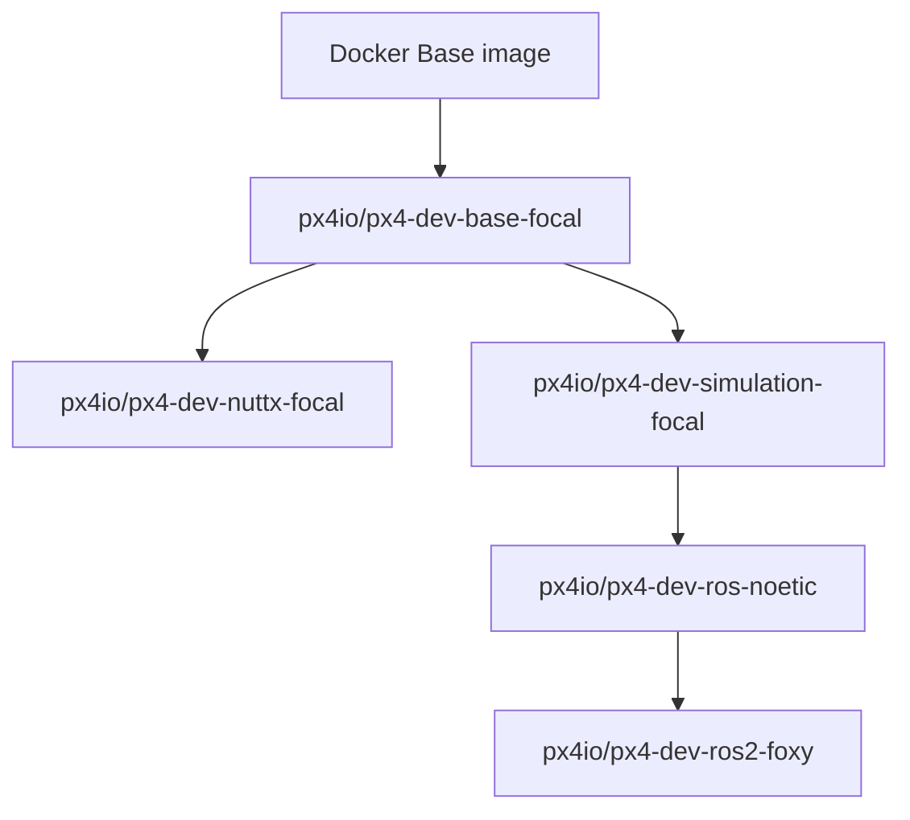

# PX4 in Docker
PX4 provides official guides and Docker images for simulation at [PX4 Docker Containers](https://docs.px4.io/main/en/test_and_ci/docker.html).

It includes containers for different Ubuntu versions, and the corresponding ROS application. This feature is achieved by a hierarchical architecture.

For instance, the ```px4io/px4-dev-base-focal``` is PX4 for Ubuntu 20 that is inherited from the base. In this branch, we have ```px4io/px4-dev-ros-noetic``` for simulation in ros noetic and Gazebo and ```px4io/px4-dev-ros2-foxy```for simulation in ros2 foxy and Gazebo.



Even it is suggested to use ```docker_run.sh``` in the PX4 source code, I still prefer building images myself and custmerise it, which is introduced in section *Calling Docker Manually* in [PX4 Docker Containers](https://docs.px4.io/main/en/test_and_ci/docker.html).

## PX4 in ROS noetic
**Step 1: Prepare Docker Files and PX4 Source Code**

First, download the following files into the folder ```Docker/px4_noetic```:
- Dockerfile
- entrypoint.sh
- build_image.sh
    
Then, we get PX4 source code to a certain lolcation.
```bash
    cd YOUR_PX4
    git clone https://github.com/PX4/PX4-Autopilot.git # get the lastest
```
If you want to clone a specific version (e.g., v1.15.3), use:
```bash
    git clone -b v1.15.3 https://github.com/PX4/PX4-Autopilot.git
```

**Step 2: Switch to a Different PX4 Version (Optional)**

Or you want to switch to different version later, and here is what you need to, for instance you want v1.15.3.
1. clean up the current branch
    ```bash
    make clean
    make distclean
    ```
    You may encounter permission errors when switching branches. If that happens, fix it by:
    ```bash
    sudo chown -R $USER:$USER .
    ```
2. switch to the branch of v1.15.3.
    ```bash
    git checkout v1.15.3
    ```
2. update the submodules for v1.15.3.
    ```bash
    make submodulesclean
    git submodule update --init --recursive
    ```

**Step 3: Build the Docker Image**   
From the ```Docker/px4_noetic folder``` run
    ```bash
    bash ./build_image.sh
    ```

**Step 4: Run the Docker Container** 
In ```run_container.sh```, set ```PX4_SRC_DIR``` to be where the source code is, i.e. ```YOUR_PX4/PX4-Autopilot```. For instance,
```bash
    PX4_SRC_DIR=~/Desktop/Docker/PX4/PX4-Autopilot
```
Then, start the container by 
```bash
    bash run_container.sh
```
**Step 5: Build and Launch PX4 SITL**
1. start PX4 simulation of a quadrotor in Gazebo 
        ```bash
            make px4_sitl_default gazebo-classic
        ```

2. If you encounter permission errors (especially after switching PX4 versions), fix it with:
```bash
    git config --global --add safe.directory /src/PX4-Autopilot
    chown -R root:root /src/PX4-Autopilot
```