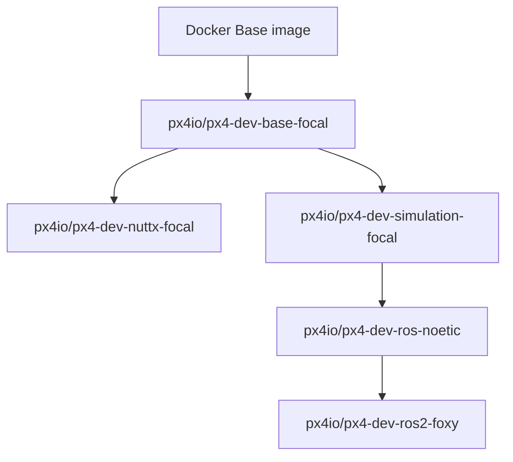

# PX4 in Docker
This rep is to proivde a development environment using PX4-Gazebo in Docker. That is, a PX4 source code should be downloaded and prepared on your host machine, which would be used by this tutorial.

## (optional) Background of PX4 and Docker 
PX4 provides official guides and Docker images for simulation at [PX4 Docker Containers](https://docs.px4.io/main/en/test_and_ci/docker.html).

It includes containers for different Ubuntu versions, and the corresponding ROS application. This feature is achieved by a hierarchical architecture.

For instance, the ```px4io/px4-dev-base-focal``` is PX4 for Ubuntu 20 that is inherited from the base. In this branch, we have ```px4io/px4-dev-ros-noetic``` for simulation in ros noetic and Gazebo and ```px4io/px4-dev-ros2-foxy```for simulation in ros2 foxy and Gazebo.



Even it is suggested to use ```docker_run.sh``` in the PX4 source code, I still prefer building images myself and custmerise it, which is introduced in section *Calling Docker Manually* in [PX4 Docker Containers](https://docs.px4.io/main/en/test_and_ci/docker.html).

## 1. Download PX4 source code
**Step 1: Prepare PX4 Source Code**    
Then, we get PX4 source code to a certain lolcation.
```bash
    cd YOUR_PX4
    git clone https://github.com/PX4/PX4-Autopilot.git # get the lastest
```
If you want to clone a specific version (e.g., v1.15.3), use:
```bash
    git clone -b v1.15.3 https://github.com/PX4/PX4-Autopilot.git
```

**Step 2: Switch to a Different PX4 Version (Optional)**

Or you want to switch to different version later, and here is what you need to, for instance you want v1.15.3.
1. clean up the current branch
    ```bash
    make clean
    make distclean
    ```
    You may encounter permission errors when switching branches. If that happens, fix it by:
    ```bash
    sudo chown -R $USER:$USER .
    ```
2. switch to the branch of v1.15.3.
    ```bash
    git checkout v1.15.3
    ```
2. update the submodules for v1.15.3.
    ```bash
    make submodulesclean
    git submodule update --init --recursive
    ```

**Step 3: Build the Docker Image**   
From the ```Docker/px4_noetic folder``` run
    ```bash
    bash ./build_image.sh
    ```
## 2. Build Docker images in ```Docker/PX4_single_UAV```
You can find the following files:
- ```build_image.sh``` to build a Docker image using ```Dockerfile```
- ```run_container.sh``` to run a Docker container built before
- ```Dockerfile``` 
- ```entrypoint.sh``` to build PX4 simulation and launch it in ros 
- ```data``` to save your data and videos
- ```drone_simulation_tools``` to launch mavros and px4 simulation

Configurations can be done:
1. It is possible to change the image name in ```build_image.sh```
```bash
    IMAGE_NAME="px4_ros_noetic"
```
2. Set the path to your PX4 source code in
```bash
    PX4_SRC_DIR=path_to_PX4/PX4-Autopilot
```

Then, we can build a image named after ```px4_ros_noetic``` by running 
```bash
    bash build_image.sh
```
and run the container which may take longer for the first time
```bash
    bash run_container.sh
```

In case, if you encounter permission errors (especially after switching PX4 versions), fix it with:
```bash
    git config --global --add safe.directory /src/PX4-Autopilot
    chown -R root:root /src/PX4-Autopilot
```