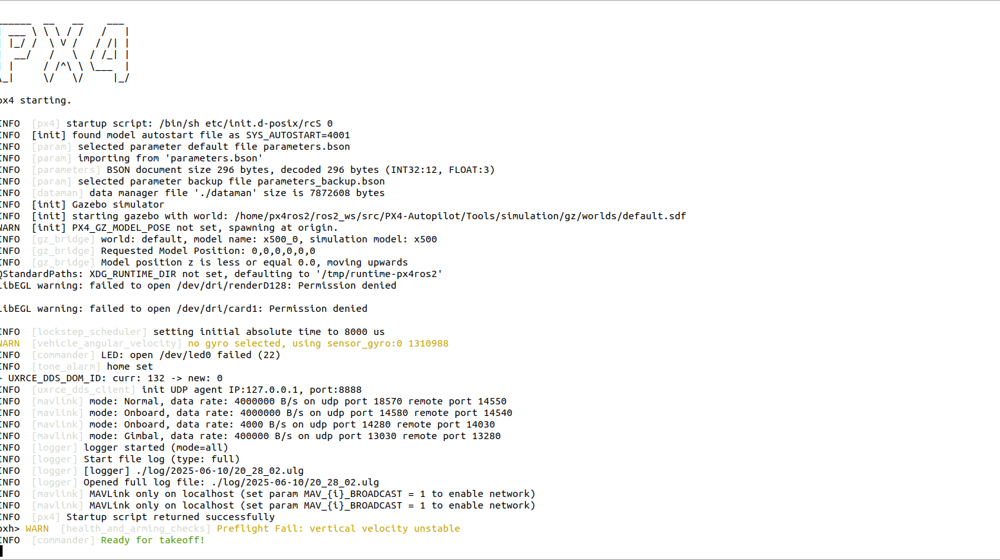
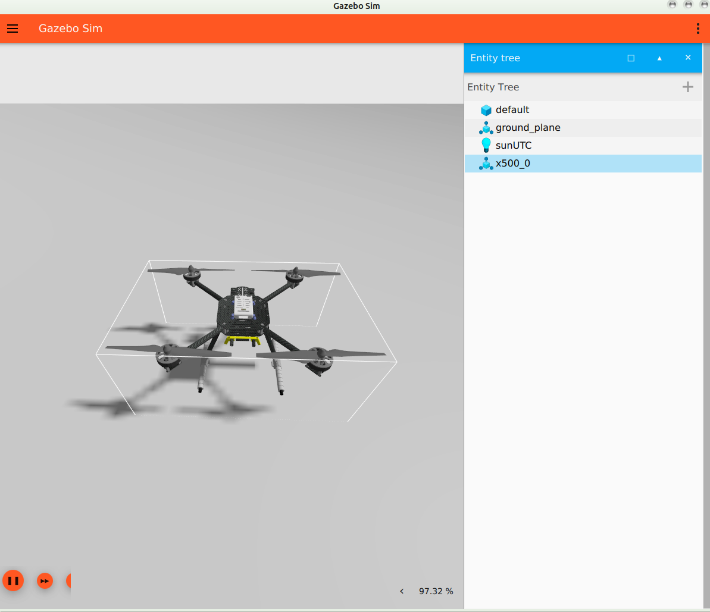
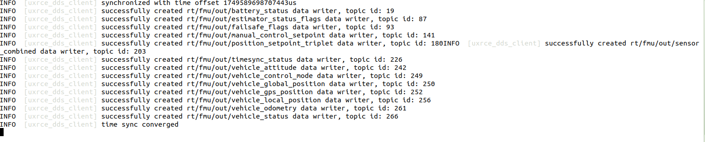
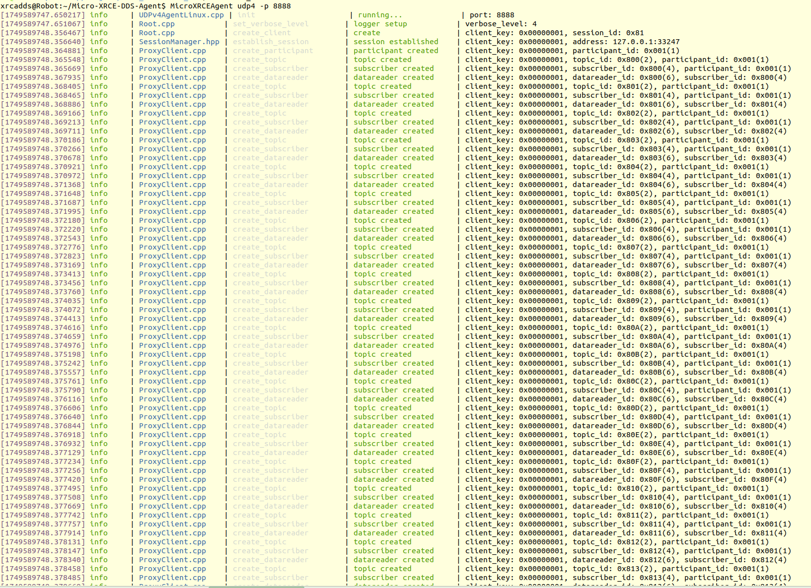
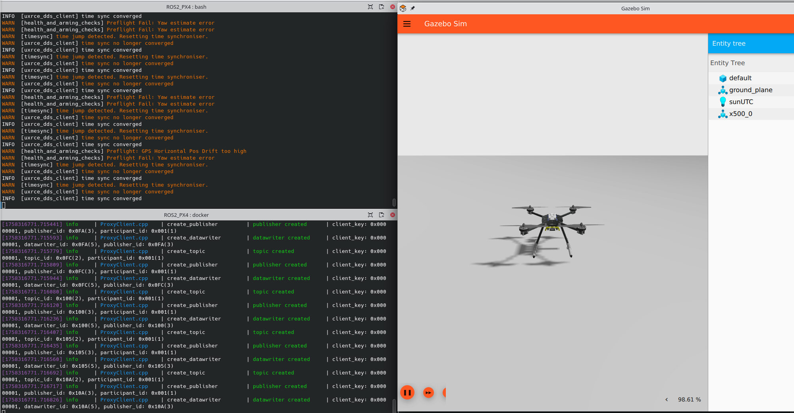
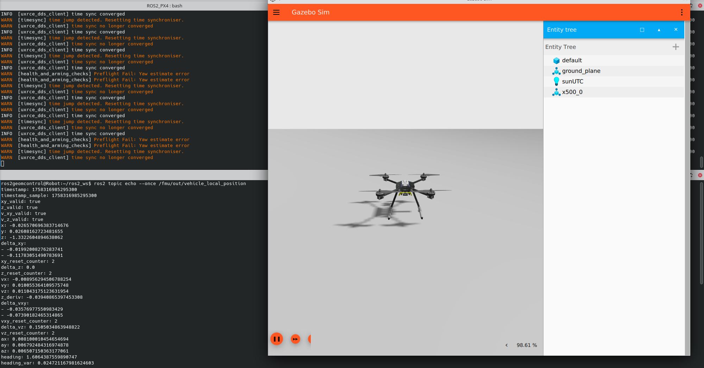

# PX4 for ROS2 in Docker

NOTE: IT IS NOT NOT NOT NOT recommended to use FK PX4!

This rep is to provide a development environment using PX4-Gazebo in Docker that is compataible with ROS2 Humble. 

From PX4, v1.14, uXRCE-DDS middleware is implemented in PX$ firmware to communicatei with ROS2. As shown in the figure below, uXRCE-DDS middleware is composed of two parts
- uXRACE-DDS client is built inside PX4 firmware
- uXRACE-DDS agent should be running on the onboard computer for real-world epxeriments or on the host machine for simulation.
<figure>
    
</figure>

Good examples and tutorials that help this rep are
- [ROS2_PX4_Offboard_Example](https://github.com/ARK-Electronics/ROS2_PX4_Offboard_Example)
- [px4-offboard](https://github.com/Jaeyoung-Lim/px4-offboard)

## 1 PX4 simulation with Gazebo
**Step 1: Prepare PX4 Source Code**    
Then, we get PX4 source code to a certain lolcation. It is suggested to download it in the ```src``` of folder where the files of ``Docker/Px4_ROS2``` are.
```bash
    cd YOUR_PX4
    git clone https://github.com/PX4/PX4-Autopilot.git # get the lastest
```
If you want to clone a specific version (e.g., v1.15.3), use:
```bash
    git clone -b v1.15.3 https://github.com/PX4/PX4-Autopilot.git
```
and update the corresponding sunmodules
```bash
   git submodule update --init --recursive
```
More examples can be found at [GIT Examples](https://docs.px4.io/main/en/contribute/git_examples.html).


**Step 2: Switch to a different PX4 version (Optional)**

Or you want to switch to different version later, and here is what you need to, for instance you want v1.15.3.
1. clean up the current branch
    ```bash
    make clean
    make distclean
    ```
    You may encounter permission errors when switching branches. If that happens, fix it by:
    ```bash
    sudo chown -R $USER:$USER .
    ```
2. switch to the branch of v1.15.3.
    ```bash
    git checkout v1.15.3
    ```
2. update the submodules for v1.15.3.
    ```bash
    make submodulesclean
    git submodule update --init --recursive
    ```

## 2. Run Docker containers 
**Step 1: Build Docker Image**   
From the ```Docker/Px4_ROS2``` run
```bash
    bash ./build_image.sh
```
which will build a Dockerimage called ```ros2_px4```.
In that folder, there are 
- ```build_image.sh``` to build a Docker image using ```Dockerfile```
- ```run_container.sh``` to run a Docker container built before
- ```Dockerfile``` 

**Step 2: Run Docker container**   

In ```run_container.sh```, we need to speicfy the address of PX4 source code using variable
```bash 
    PX4_SRC_DIR="${SCRIPT_DIR}/src/"
```

Then we can start the container by 
```bash
    bash run_container.sh
```

**Step 2: Start Gazebo-simulation**   
Inside the contaienr, we navigate to ```/home/px4ros2/ros2_ws/src/PX4-Autopilot``` where the PX4 source code is mounted.

```bash
    make px4_sitl gz_x500
```
In that terminal, you should see
<figure>
    
</figure>
and a GUI of Gazebo
<figure>
    
</figure>

## 2. Use uXRACE-DDS agent to enable ROS2 communication
uXRACE-DDS client automatically start after following the steps in  [PX4 simulation with Gazebo](#step-1-px4-simulation-with-gazebo)


Now, we need to run uXRACE-DDS agent on the host machine to get PX4 ROS2 topics.

For PX4 v1.15.4, you should use `2.4.2` of Micro-XRCE-DDS-Agent.git, which has been forked into my rep.
```bash
    cd Docker/uXRAXE_DDS
    git clone -b feature/xrce-agent-v2.4.2 https://github.com/ZhongmouLi/Micro-XRCE-DDS-Agent.git
```

<!-- Then, build a Docker image running 
```bash
    bash build_image.sh
```
and obtain the image called ```xrace_px4```.

We can start the container with the command 
```bash
    bash run_container.sh
```
and inside the container  -->
```bash
    cd Micro-XRCE-DDS-Agent
    MicroXRCEAgent udp4 -p 8888
```

If uXRACE-DDS client of PX4 is connected with uXRACE-DDS agent of the host machine, we should be able to see the information in PX4 terminal
<figure>
    
</figure>
and the information in the container's terminal of uXRACE-DDS agent 
<figure>
    
</figure>

Finally, we should see
<figure>
    
</figure>

## 3 ROS2 communication with PX4

## 3.1 ROS2 pkgs for PX4 messages
In order to read and send messages defined by PX4, we need to build and install `px4_ros_com` and `px4_msgs` packages in our workspace.

Note that
>You should use a version of the px4msgs package with the _same message definitions as the PX4 firmware you have installed in the step above. Branches in the px4_msgs repo are named to correspond to the message definitions for different PX4 releases. If for any reason you cannot ensure the same message definitions between your PX4 firmware and ROS 2 px4_msgs package, you will additionally need to start the message translation node as part of your setup process.

Form [px4_msgs](https://github.com/PX4/px4_msgs), we can see the table

Here's the data formatted as a Markdown table:

| PX4 Version | ROS 2 Distribution | Ubuntu Version | Branch |
|-------------|-------------------|----------------|---------|
| v1.13 | Foxy | Ubuntu 20.04 | release/1.13 |
| v1.14 | Foxy | Ubuntu 20.04 | release/1.14 |
| v1.14 | Humble | Ubuntu 22.04 | release/1.14 |
| v1.14 | Rolling | Ubuntu 22.04 | release/1.14 |
| v1.15 | Foxy | Ubuntu 20.04 | release/1.15 |
| v1.15 | Humble | Ubuntu 22.04 | release/1.15 |
| v1.15 | Rolling | Ubuntu 22.04 | release/1.15 |
| main | Foxy | Ubuntu 22.04 | main |
| main | Humble | Ubuntu 22.04 | main |
| main | Rolling | Ubuntu 22.04 | main |

Since our PX4 is v1.15, therefore, we should get the branck `release/1.15` of [px4_msgs](https://github.com/PX4/px4_msgs), so does [px4_ros_com](https://github.com/PX4/px4_ros_com).

```bash
    cd ros2_ws
    git clone -b release/1.15 https://github.com/PX4/px4_ros_com.git ./src/px4_ros_com 
    git clone -b release/1.15 https://github.com/PX4/px4_msgs.git ./src/px4_msgs
    # build and install
    colcon build
    source install/setup.bash
```

### 3.3 ROS2 topics published by PX4
After building the  `px4_ros_com` and `px4_msgs` packages, we should be able to access to topics published and received by PX4.

First, run PX4 simulation 
```bash
    cd PX4-Autopilot
    make px4_sitl gz_x500
```
and then start DDS
```bash
    cd Micro-XRCE-DDS-Agent
    MicroXRCEAgent udp4 -p 8888
```
Now, we should be able to see all the topics as
```bash
mconros2@Robot:~/ros2_ws$ ros2 topic list
    /fmu/in/actuator_motors
    /fmu/in/actuator_servos
    /fmu/in/arming_check_reply
    /fmu/in/aux_global_position
    /fmu/in/config_control_setpoints
    /fmu/in/config_overrides_request
    /fmu/in/differential_drive_setpoint
    /fmu/in/goto_setpoint
    /fmu/in/manual_control_input
    /fmu/in/message_format_request
    /fmu/in/mode_completed
    /fmu/in/obstacle_distance
    /fmu/in/offboard_control_mode
    /fmu/in/onboard_computer_status
    /fmu/in/register_ext_component_request
    /fmu/in/sensor_optical_flow
    /fmu/in/telemetry_status
    /fmu/in/trajectory_setpoint
    /fmu/in/unregister_ext_component
    /fmu/in/vehicle_attitude_setpoint
    /fmu/in/vehicle_command
    /fmu/in/vehicle_command_mode_executor
    /fmu/in/vehicle_mocap_odometry
    /fmu/in/vehicle_rates_setpoint
    /fmu/in/vehicle_thrust_setpoint
    /fmu/in/vehicle_torque_setpoint
    /fmu/in/vehicle_trajectory_bezier
    /fmu/in/vehicle_trajectory_waypoint
    /fmu/in/vehicle_visual_odometry
    /fmu/out/battery_status
    /fmu/out/estimator_status_flags
    /fmu/out/failsafe_flags
    /fmu/out/manual_control_setpoint
    /fmu/out/position_setpoint_triplet
    /fmu/out/sensor_combined
    /fmu/out/timesync_status
    /fmu/out/vehicle_attitude
    /fmu/out/vehicle_control_mode
    /fmu/out/vehicle_global_position
    /fmu/out/vehicle_gps_position
    /fmu/out/vehicle_local_position
    /fmu/out/vehicle_odometry
    /fmu/out/vehicle_status
    /parameter_events
    /rosout
```
We can also test the communication between PX4 and ROS2 by `echo one topic /fmu/out/vehicle_local_position`

<figure>
    
</figure>
whic is

```bash
ros2geomcontrol@Robot:~/ros2_ws$ ros2 topic echo --once /fmu/out/vehicle_local_position
timestamp: 1758316797221394
timestamp_sample: 1758316797221394
xy_valid: true
z_valid: true
v_xy_valid: true
v_z_valid: true
x: 0.005272798240184784
y: 0.004483045544475317
z: -1.4886863231658936
delta_xy:
- -0.01992008276283741
- -0.11783051490783691
xy_reset_counter: 2
delta_z: 0.0
z_reset_counter: 2
vx: 0.046801142394542694
vy: -0.020133737474679947
vz: -0.011780082248151302
z_deriv: 0.02171844057738781
delta_vxy:
- -0.03576977550983429
- -0.07390182465314865
vxy_reset_counter: 2
delta_vz: 0.1505034863948822
vz_reset_counter: 2
ax: 0.022386133670806885
ay: -0.007310322020202875
az: -0.0019008292583748698
heading: 1.5566940307617188
heading_var: 0.03312407433986664
unaided_heading: 0.0009401877759955823
delta_heading: 1.5814168453216553
heading_reset_counter: 1
heading_good_for_control: false
tilt_var: 9.568795940140262e-05
xy_global: true
z_global: true
ref_timestamp: 909506
ref_lat: 47.39797142860683
ref_lon: 8.546163065851305
ref_alt: -1.1543443202972412
dist_bottom: 0.11634039878845215
dist_bottom_valid: true
dist_bottom_sensor_bitfield: 0
eph: 0.28590285778045654
epv: 0.27440762519836426
evh: 0.1330057829618454
evv: 0.0732169821858406
dead_reckoning: false
vxy_max: .inf
vz_max: .inf
hagl_min: .inf
hagl_max: .inf
---
```

In fact, we can find ros2 topics related to PX4 at [dds_topics.yaml](https://github.com/PX4/PX4-Autopilot/blob/main/src/modules/uxrce_dds_client/dds_topics.yaml).

## 4 Control PX4 in Gazebo using ROS2
One example is provided at [ROS 2 Offboard Control Example](https://docs.px4.io/main/en/ros2/offboard_control.html).


### 4.1 Subscribe to PX4 topics


### 4.2 Publish to PX4 topics


### 4.3 Send commands to PX4


#### 5 Arm and switch to offboard


#### 6 Control

##### 6.1 

To obtain the mass of `x500`, we can run 
```bash
    $ gz model -m x500_0 --link
```
and we should get 
```bash
Requesting state for world [default]...

- Link [11]
  - Name: base_link
  - Parent: x500_0 [10]
  - Mass (kg): 2.000000
  - Inertial Pose [ XYZ (m) ] [ RPY (rad) ]:
    [0.000000 0.000000 0.000000]
    [0.000000 -0.000000 0.000000]
  - Inertial Matrix (kg.m^2):
    [0.021667 0.000000 0.000000]
    [0.000000 0.021667 0.000000]
    [0.000000 0.000000 0.040000]
  - Pose [ XYZ (m) ] [ RPY (rad) ]:
    [0.000000 0.000000 0.240000]
    [0.000000 -0.000000 0.000000]
  - Sensor [25]
    - Name: air_pressure_sensor
    - Parent: x500_0 [10]
    - Pose [ XYZ (m) ] [ RPY (rad) ]:
      [0.000000 0.000000 0.000000]
      [0.000000 -0.000000 0.000000]
    - Reference altitude (m): 0
    - Pressure noise:
      - Mean (Pa): 0
      - Bias mean (Pa): 0
      - Standard deviation (Pa): 0.01
      - Bias standard deviation (Pa): 0
      - Precision: 0
      - Dynamic bias standard deviation (Pa): 0
      - Dynamic bias correlation time (s): 0
  - Sensor [26]
    - Name: imu_sensor
    - Parent: x500_0 [10]
    - Pose [ XYZ (m) ] [ RPY (rad) ]:
      [0.000000 0.000000 0.000000]
      [0.000000 -0.000000 0.000000]
    - Linear acceleration X-axis noise:
      - Mean (m/s^2): 0
      - Bias mean (m/s^2): 0
      - Standard deviation (m/s^2): 0.00186
      - Bias standard deviation (m/s^2): 0
      - Precision: 0
      - Dynamic bias standard deviation (m/s^2): 0.006
      - Dynamic bias correlation time (s): 300
    - Linear acceleration Y-axis noise:
      - Mean (m/s^2): 0
      - Bias mean (m/s^2): 0
      - Standard deviation (m/s^2): 0.00186
      - Bias standard deviation (m/s^2): 0
      - Precision: 0
      - Dynamic bias standard deviation (m/s^2): 0.006
      - Dynamic bias correlation time (s): 300
    - Linear acceleration Z-axis noise:
      - Mean (m/s^2): 0
      - Bias mean (m/s^2): 0
      - Standard deviation (m/s^2): 0.00186
      - Bias standard deviation (m/s^2): 0
      - Precision: 0
      - Dynamic bias standard deviation (m/s^2): 0.006
      - Dynamic bias correlation time (s): 300
    - Angular velocity X-axis noise:
      - Mean (rad/s): 0
      - Bias mean (rad/s): 0
      - Standard deviation (rad/s): 0.00018665
      - Bias standard deviation (rad/s): 0
      - Precision: 0
      - Dynamic bias standard deviation (rad/s): 3.8785e-05
      - Dynamic bias correlation time (s): 1000
    - Angular velocity Y-axis noise:
      - Mean (rad/s): 0
      - Bias mean (rad/s): 0
      - Standard deviation (rad/s): 0.00018665
      - Bias standard deviation (rad/s): 0
      - Precision: 0
      - Dynamic bias standard deviation (rad/s): 3.8785e-05
      - Dynamic bias correlation time (s): 1000
    - Angular velocity Z-axis noise:
      - Mean (rad/s): 0
      - Bias mean (rad/s): 0
      - Standard deviation (rad/s): 0.00018665
      - Bias standard deviation (rad/s): 0
      - Precision: 0
      - Dynamic bias standard deviation (rad/s): 3.8785e-05
      - Dynamic bias correlation time (s): 1000
    - Gravity direction X [XYZ]: 1 0 0
    - Gravity direction X parent frame:
    - Localization:CUSTOM
    - Custom RPY: 0 0 0
    - Custom RPY parent frame:
    - Orientation enabled:1
  - Sensor [27]
    - Name: navsat_sensor
    - Parent: x500_0 [10]
    - Pose [ XYZ (m) ] [ RPY (rad) ]:
      [0.000000 0.000000 0.000000]
      [0.000000 -0.000000 0.000000]
- Link [28]
  - Name: rotor_0
  - Parent: x500_0 [10]
  - Mass (kg): 0.016077
  - Inertial Pose [ XYZ (m) ] [ RPY (rad) ]:
    [0.000000 0.000000 0.000000]
    [0.000000 -0.000000 0.000000]
  - Inertial Matrix (kg.m^2):
    [0.000000 0.000000 0.000000]
    [0.000000 0.000026 0.000000]
    [0.000000 0.000000 0.000026]
  - Pose [ XYZ (m) ] [ RPY (rad) ]:
    [0.174000 -0.174000 0.300000]
    [0.000000 -0.000000 -0.000000]
- Link [32]
  - Name: rotor_1
  - Parent: x500_0 [10]
  - Mass (kg): 0.016077
  - Inertial Pose [ XYZ (m) ] [ RPY (rad) ]:
    [0.000000 0.000000 0.000000]
    [0.000000 -0.000000 0.000000]
  - Inertial Matrix (kg.m^2):
    [0.000000 0.000000 0.000000]
    [0.000000 0.000026 0.000000]
    [0.000000 0.000000 0.000026]
  - Pose [ XYZ (m) ] [ RPY (rad) ]:
    [-0.174000 0.174000 0.300000]
    [0.000000 -0.000000 -0.000000]
- Link [36]
  - Name: rotor_2
  - Parent: x500_0 [10]
  - Mass (kg): 0.016077
  - Inertial Pose [ XYZ (m) ] [ RPY (rad) ]:
    [0.000000 0.000000 0.000000]
    [0.000000 -0.000000 0.000000]
  - Inertial Matrix (kg.m^2):
    [0.000000 0.000000 0.000000]
    [0.000000 0.000026 0.000000]
    [0.000000 0.000000 0.000026]
  - Pose [ XYZ (m) ] [ RPY (rad) ]:
    [0.174000 0.174000 0.300000]
    [0.000000 -0.000000 -0.000000]
- Link [40]
  - Name: rotor_3
  - Parent: x500_0 [10]
  - Mass (kg): 0.016077
  - Inertial Pose [ XYZ (m) ] [ RPY (rad) ]:
    [0.000000 0.000000 0.000000]
    [0.000000 -0.000000 0.000000]
  - Inertial Matrix (kg.m^2):
    [0.000000 0.000000 0.000000]
    [0.000000 0.000026 0.000000]
    [0.000000 0.000000 0.000026]
  - Pose [ XYZ (m) ] [ RPY (rad) ]:
    [-0.174000 -0.174000 0.300000]
    [0.000000 -0.000000 -0.000000]
```

We can compute the total mass of `x500` that is `2.0643kg`.

X (F) / normalised_thurst = (2.0643*9.8)/0.72

normalised_thurst = X (F) * 0.72/(2.0643*9.8)


x: 0.2744081914424896
y: -0.06982909142971039
z: -0.7043076753616333


## Reference
- [OS 2 User Guide, PX4]https://docs.px4.io/main/en/ros2/user_guide.html
