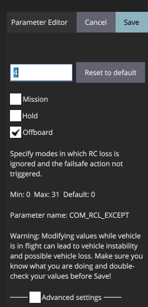
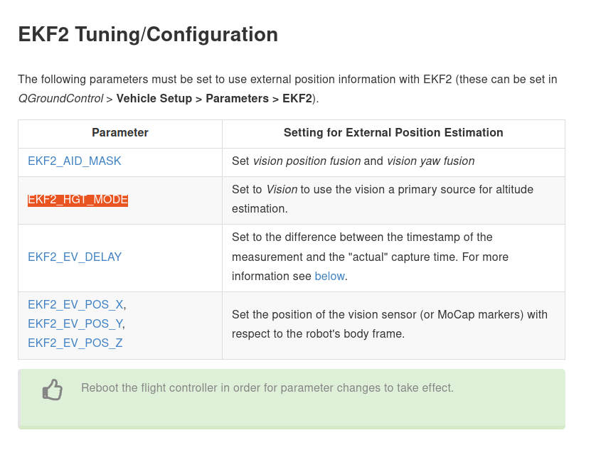
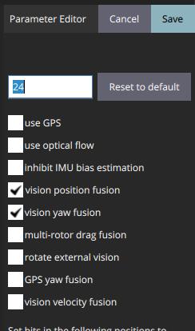
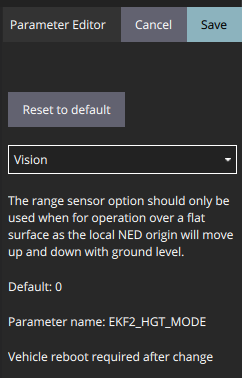

# Run Px4-gazebo-ROS simluation 
Simulation is to test our methods to robots in a safe way and help debug before real-time experiments.

  
Here, we use PX4-Gazebo to test auto flights. PX4 provides an *Offboard* mode for auto flights that allow onboard computers to take control of drones. 

## 1. Auto flights with GPS
This is to create a simulation case where **drone navigation information is from GPS and IMU**.

### 1.1 Step 1 Config PX4 to use GPS information and offboard mode
First read prearm,arm and disarm specified by [PX4](https://docs.px4.io/master/en/advanced_config/prearm_arm_disarm.html). How can I comment on this: it is not better than shit.

Arming and disarming decides what cases will stop drones. One of the cases is that should a drone be stoped, or disarmed, if it cannot receive RC signals for a certain amount of time.

1. allow arming drones without RC signal
We allow drones armed in offboard modes by setting ```COM_RCL_EXCEPT=4``` like 
<figure>
    
    <figcaption>Explainnation of COM_RCL_EXCEPT</figcaption>
</figure>
Only setting this can we keep our drone armed when there is no RC input.


2.  change timeout parameters
Other paramerts can be set to allow more time to take actions

```bash
COM_OF_LOSS_T = 10
COM_DISARM_LAND =10
```
### 1.2 Step 2 Choose drone controller library
There are serverial libraries developed for PX4 drones.

Here are some good reps:
-  Jaeyoung-Lim/mavros_controllers, https://github.com/Jaeyoung-Lim/mavros_controllers
-  uzh-rpg/rpg_quadrotor_control, https://github.com/uzh-rpg/rpg_quadrotor_control

### 1.3 Step 3 Papare simulation
1. start by creating a <u>px4-drone model</u> in simulation in Gazebo 
```shell
roslaunch px4 posix_sitl.launch
```
2. call <u>mavros</u> to enable communication between PX4 and PC throught ROS
```shell
roslaunch mavros px4.launch fcu_url:="udp://:14540@127.0.0.1:14557"
```
3. apply controller, for instance  geometric_controller, to control drone fly
```shell
roslaunch geometric_controller sitl_trajectory_track_circle.launch
```
Note: check if controllers to be run already call mavros or not.

## 2 Auto flights with Vicon
This simulation case is to simulate **drone navigation information is from external vision system**, like Vicon and Qualisys. 

Let us take Vicon for example.


### 2.1 Step 1. Config PX4 to use Vicon information
Therefore, we need to configure PX4 such that it takes navigation information from Vicon instead of GPS or IMU. Turtorial are given by PX4, i.e.[EKF2 Tuning/Configuration, Using Vision or Motion Capture Systems for Position Estimation](https://dev.px4.io/v1.11_noredirect/en/ros/external_position_estimation.html)

<div style="text-align: center"></div>

1. setting ```EKF2_AID_MASK = 3: vision position fusion + 4: vision yaw fusion```, we set position information is from Vicon.

<div style="text-align: center"></div>

2. setting ```EKF2_HGT_MODE = 3: Vision```, we set height information is also from Vicon

<div style="text-align: center"></div>

### 2.2 Step 2. Create a fake Vicon and feed Vicon information to Mavros
If you dont want to read details, I have provided packages for you [drone_simulation_tools](https://github.com/EEEManchester/drone_simulation_tools).

What you need to do is
1. clone the packages into ```catkin_src``` 
    ```shell
      git clone git@github.com:EEEManchester/drone_simulation_tools.git
      ```
2.  build the packages
    ```shell
    catkin build
    ```
3.  run launch file 
    ```shell
    roslaunch drone_simulation_tools drone_sim_vision_map_mavros.launch
    ```
Finally, two nodes apart from PX4 and Mavros will be running:
+ package ```fake_qualisys``` fakes a Vicon sytem taking drone pose information from Gazebo and publishes to topics in a Vicon way
+ package ```mocap_to_mavros_sim``` takes drone pose information from Vicon (through a topic) and publish to ```/mavros/vision_pose/pose``` **feeding Vicon information to drone**.