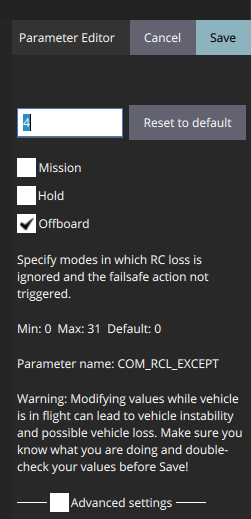

# Simluation
Simulation is to test our methods to robots in a safe way and help debug before real-time experiments.

Here, we choose to use PX4-Gazebo as our simulation platform.

## Step 1 Change some parameters of PX4s
First read prearm,arm and disarm specified by [PX4](https://docs.px4.io/master/en/advanced_config/prearm_arm_disarm.html).
How can I comment on this: it is just better than shit.

**Note** remember to set 
```COM_RCL_EXCEPT=4.```
This parameter means
<figure>
    
    <figcaption>Explainnation of COM_RCL_EXCEPT</figcaption>
</figure>
Only setting this can we keep our drone armed when there is no RC input.
Other paramerts can be set to allow more time to take actions

```
COM_OF_LOSS_T = 10
COM_DISARM_LAND =10
```

## Step 2 
```
roslaunch px4 posix_sitl.launch
```
s

```
roslaunch geometric_controller sitl_trajectory_track_circle.launch

```