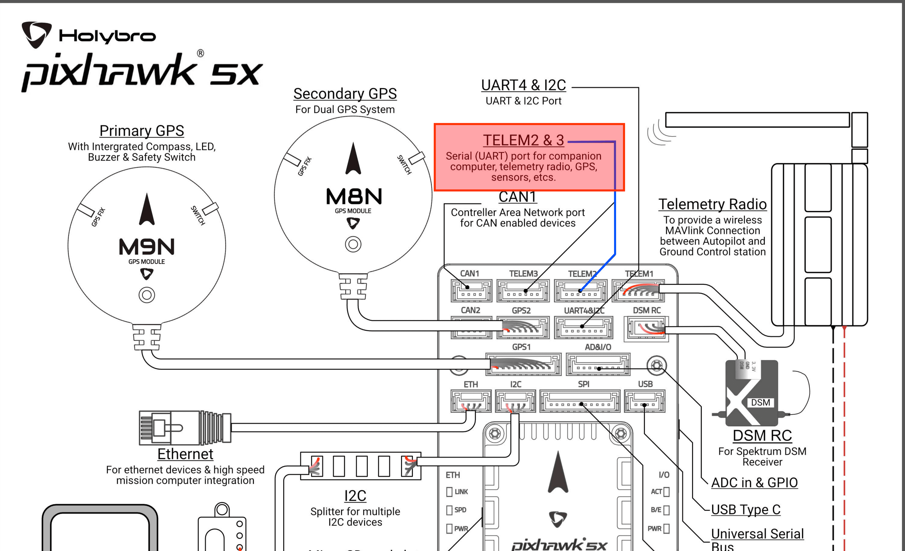
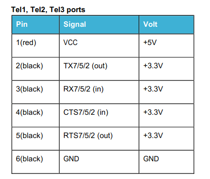
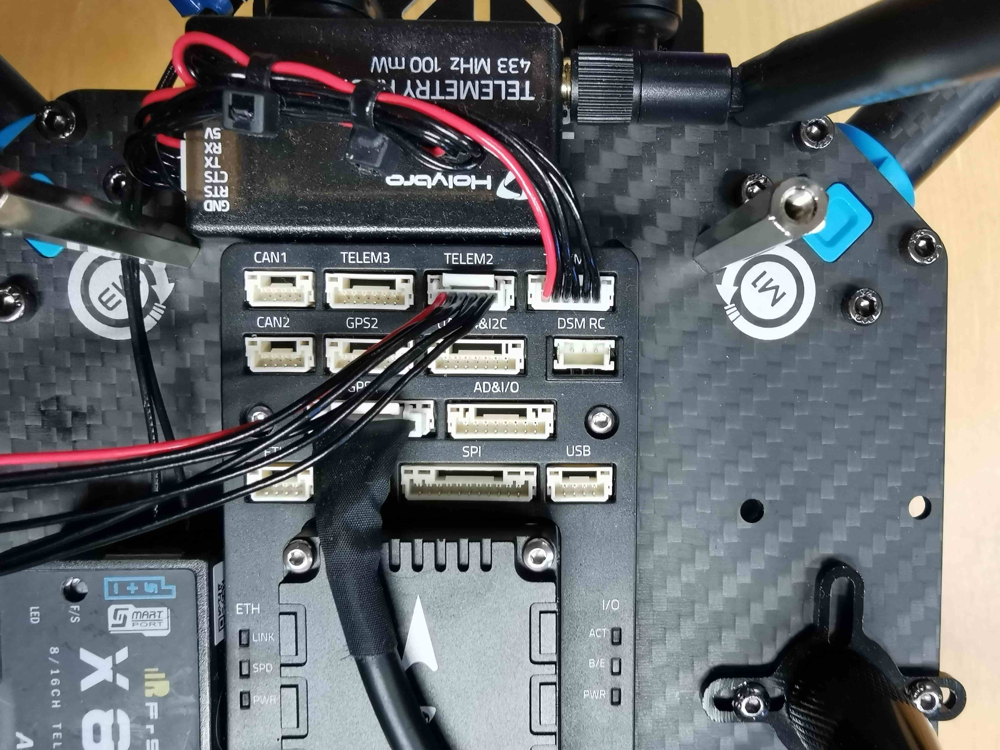
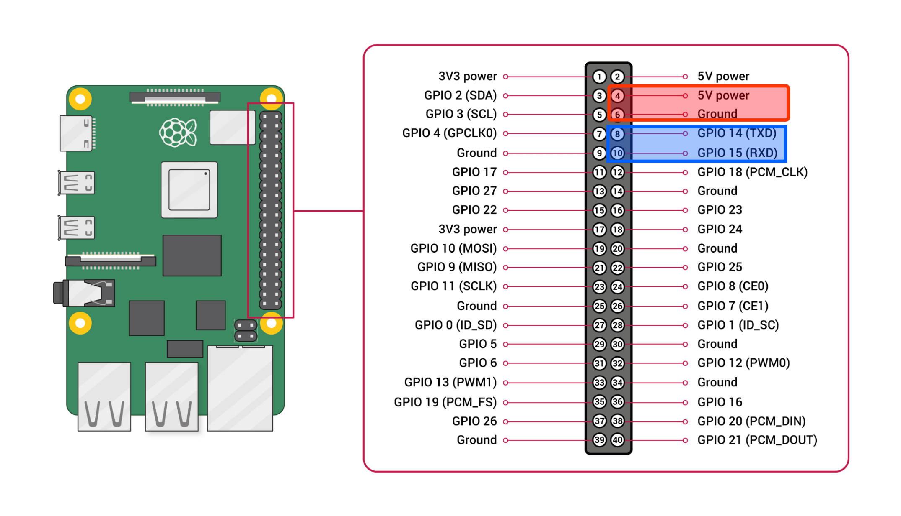
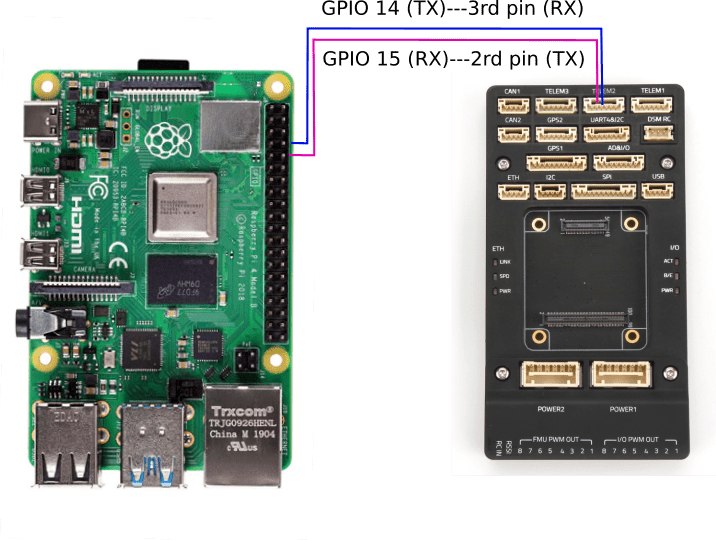

# Enable communication between Raspberry Pi and Pixhawk

Here illustrate how to connect Pixhawk to Raspberry and which parameters of PX4 should be tuned in order to enable communication between them.

## 1. Pixhawk 
### 1.1 Pixhawk 5
It is the port TELEM of Pixhawk 5 that is for onboard computers. There are two ways for communication between a Pixhawk 5 and a Raspberry pi 4B+:
- through serial ports
- through USB cables

There are also different methods to power Raspberry Pi:
- through battery and BEC
- through autopilot (not tested)

#### 1.1.1 Pixhawk 5 --TELEM2 --> serial ports -- Raspberry Pi
Let us have a look at all the ports provided by Pixhawk 5.
<figure>
    
    <figcaption> Pixhawk ports </figcaption>
</figure>
Therefore, we will use Telem 2 as the port for Raspberry Pi.

The details of Telem 2 is shown by the figure below
<figure>
    
    <figcaption> Pins of Tele 2 port </figcaption>
</figure>

Pins in red and black can be indentified by using cables with Pixhawk. Here is an example.
<figure>
    
    <figcaption> Pixhawk ports </figcaption>
</figure>

<figure>
    
    <figcaption> Pixhawk ports </figcaption>
</figure>

We need to make a wire to connect them like the way below
<figure>
    
    <figcaption> Pixhawk 5x - Raspberry Pi </figcaption>
</figure>

#### 1.1.2 Pixhawk 5 --TELEM2 --> USB port -- Raspberry Pi
### 1.2 Pixhawk 4 mini

## 2 Communication through USB ports of Raspberry Pi

## 2 Set parameters on PX4
### 2.1 Pixhawk 5

Since we use TELEM2, the corresponding parameters to change are

- MAV_2_CONFIG = TELEM 2
- MAV_2_MODE = Onboard
- MAV_2_RATE= 80000 Bytes/s
- MAV_2_FORWARD = True
- SER_TEL2_BAUD = 921600 baud

The explnation of these can be found at [MAVLink Peripherals (GCS/OSD/Gimbal/Camera/Companion) ](https://docs.px4.io/main/en/peripherals/mavlink_peripherals.html).

### 2.1 Pixhawk 4 mini