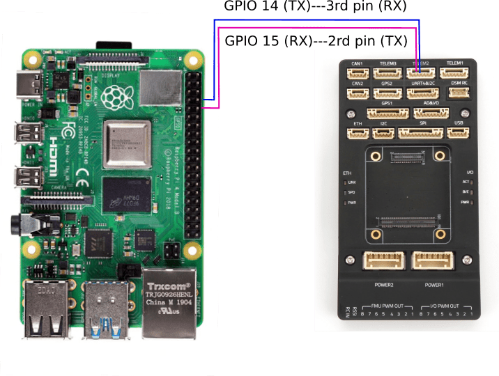

# Communciation between Rapsberry Pi 4B+ and Pixhawk 5.

There are two ways for communication between a Pixhawk 5 and a Raspberry pi 4B+:
- through serial ports
- through USB ports

There are also different methods to power Rapsberry Pi:
- through battery and BEC
- through autopilot (not tested)

## 1 Communication through serial ports of Rapsberry Pi
### 1.1 Connect Rapsberry Pi and Pixhawk 5
Let us have a look at all the ports provided by Pixhawk 5.
<figure>
    
    <figcaption> Pixhawk ports </figcaption>
</figure>
Therefore, we will use Telem 2 as the port for Raspberry Pi.

The details of Telem 2 is shown by the figure below
<figure>
    
    <figcaption> Pins of Tele 2 port </figcaption>
</figure>

Pins in red and black can be indentified by using cables with Pixhawk. Here is an example.
<figure>
    
    <figcaption> Pixhawk ports </figcaption>
</figure>

<figure>
    
    <figcaption> Pixhawk ports </figcaption>
</figure>

We need to make a wire to connect them like the way below
<figure>
    
    <figcaption> Pixhawk 5x - Raspberry Pi </figcaption>
</figure>

### 1.2 Set parameters on PX4
Serverl parameters are needed to be modified to enbale serial communication between Pixhawk and Raspberry Pi.

Here are the list
- MAV_2_CONFIG = TELEM 2
- MAV_2_MODE = Onboard
- MAV_2_RATE= 80000 Bytes/s
- MAV_2_FORWARD = True
- SER_TEL2_BAUD = 921600 baud

## 2 Communication through USB ports of Raspberry Pi

