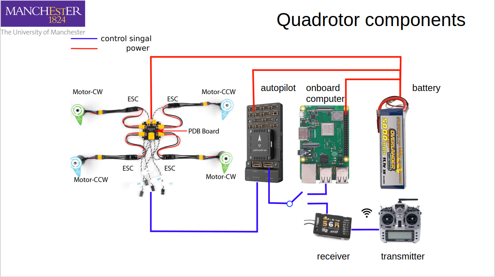
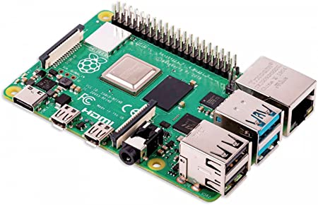
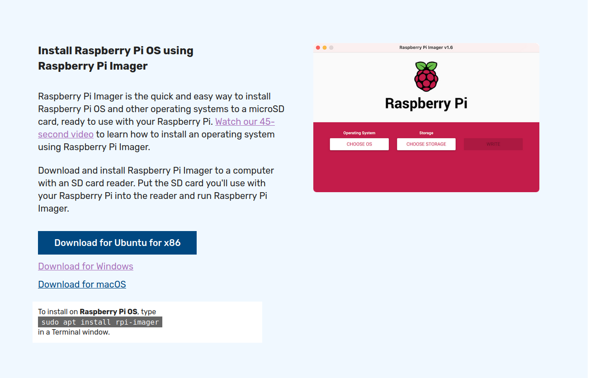
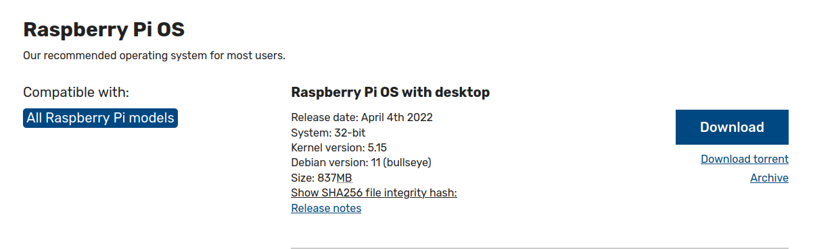
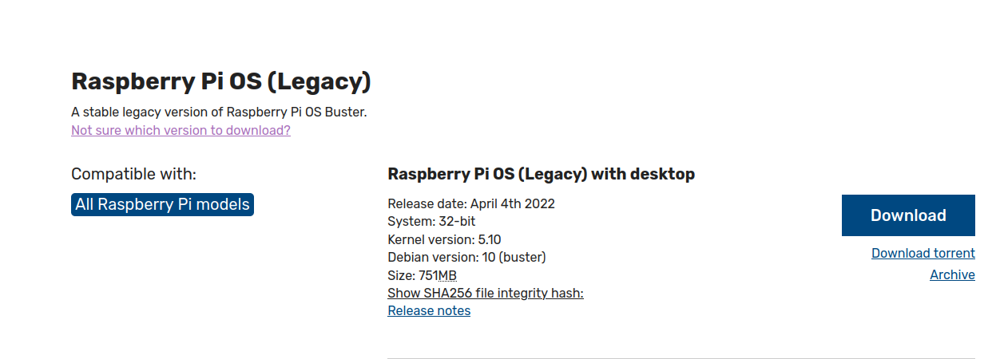

# Set Raspbeery Pi 4B+ as an onboard computer

## Table of contents
  - [Step 1. Brief introduction of onboard computer (Raspberry Pi 4B)](#step-1-brief-introduction-of-onboard-computer-raspberry-pi-4b)
  - [Step 2. Use Raspberry Pi Imager to write OS images](#step-2-use-raspberry-pi-imager-to-write-os-images)
  - [Step 3. Install operating systems on Raspberry Pi 4B](#step-3-install-operating-systems-on-raspberry-pi-4b)
    - [Step 3A Install Ubuntu Server 20.04](#step-3a-install-ubuntu-server-2004)
    - [Step 3B Install Ubuntu Mate (for Raspberry Pi) 20.04 from Ubuntu Server 20.04](#step-3b-install-ubuntu-mate-for-raspberry-pi-2004-from-ubuntu-server-2004)
    - [Step 3C. Choose Raspberry Pi OS](#step-3c-choose-raspberry-pi-os)
  - [Step 4. Onboard computer ROS configuration](#step-4-onboard-computer-ros-configuration)
    - [Step 4.1 Configure Ubuntu](#step-41-configure-ubuntu)
    - [Step 4.1 Install ROS Melodic in Raspberry Pi 4B with OS (Legacy)](#step-41-install-ros-melodic-in-raspberry-pi-4b-with-os-legacy)
  - [Step 4.2 Communciation between Rapsberry PI and Pixhawk](#step-42-communciation-between-rapsberry-pi-and-pixhawk)
    - [Set parameters on PX4](#set-parameters-on-px4)
  - [5 WIFI communication between Raspberry Pi and base station](#5-wifi-communication-between-raspberry-pi-and-base-station)
    - [6.1 static IP address for base station and drone](#61-static-ip-address-for-base-station-and-drone)
    - [5.2 ssh setup](#52-ssh-setup)
    - [5.3 time synchrionasation](#53-time-synchrionasation)
  - [ROS communication between Rapsberry Pi and base station](#ros-communication-between-rapsberry-pi-and-base-station)
    - [6.1 ROS master and client](#61-ros-master-and-client)

Big picture of a drone with a Pixhawk 5 and a raspberry pi 4b.

<figure>
    
    <figcaption></figcaption>
</figure>


## Step 1. Brief introduction of onboard computer (Raspberry Pi 4B)
Onborad computer is responsible for transfer commands from base station to autoploit and convert sensor information from autoploit, cameras etc. back to Onborad computers.

Choices for onborad computers are Raspberry Pi, Odroid, Tegra K1 etc. Here we show how to buid a drone using Raspberry Pi, i.e. Raspbery Pi 4B.
<figure>
    
    <figcaption>Raspbery Pi 4B</figcaption>
</figure>

Raspberry Pi requires an operating system (OS). However, The supported OSs by Raspberry Pi depend on versions. Raspberry Pi 4B can only support Ubuntu desktop 21.04 (Not LTS), Raspberry Pi OS, Ubuntu server 20.04 (LTS), Ubuntu Core 20, which can be found at (see [Ubuntu for Raspberry Pi](https://ubuntu.com/download/raspberry-pi)).

## Step 2. Install operating systems on Raspberry Pi 4B
**Note:** An image is provided for  Ubuntu Mate for Raspberry Pi 20.04 with ROS and mavors.

Raspberry Pi Imager is officierial tool to install OS for raspberry pi boards. It can be downloaded from [https://www.raspberrypi.com/software/](https://www.raspberrypi.com/software/).

 A Youtube video is available [here](https://youtu.be/y45hsd2AOpw).

<figure>
    
    <figcaption>Raspbery Pi Imager</figcaption>
</figure>

Here are serveral potions for OS to be used on Raspberry Pi 4b:
- Ubuntu Desktop/Server 20.04
- **(recommended)** Ubuntu Mate 20.04 for Raspberry Pi
- Raspberry Pi OS

### Step 2A Install Ubuntu Server 20.04
A server is ligher than a Desktop as it does not contain packages for GUI and Office. Thus, choosing server is also a good choice for an onboard computer.

1. Choose Ubuntu Server 20.04 LTS using Raspberry Pi Imager.
2. Insert the SD carder in Raspberry Pi and start it with a mouse, keybord and a monior connected.
3. Log in Ubuntu server with
    - usranme ubuntu
    - password ubuntu
4. Connect Raspberry Pi to Wifi using netplan explained [here](https://itsfoss.com/connect-wifi-terminal-ubuntu/)
    - check Internet class ```ls /sys/class/net``` 
    - find and edit config file ```sudo nano /etc/netplan/50-cloud-init.yaml```
    - put available wifi infor as
    ```
        wifis:
            wlan0:
                dhcp4: true
                optional: true
                access-points:
                    "WIFI_ID":
                        password: "WiFi_password"
    ```   
    - apply this config ```sudo netplan generate```
    - connect to Wifi ```sudo netplan apply```
5. **reboot**
6. Install Mate Desktop environment
    - ```sudo apt install taskel```
    - ```sudo apt install ubuntu-mate-desktop```    
    - choose gmd3 or lightdm (recommended)

### Step 2B Install Ubuntu Mate (for Raspberry Pi) 20.04 from Ubuntu Server 20.04
Repeat Steps 1-5 above in Step 2A.

6. Use Desktopify to convert Ubuntu server 20.04 to Ubuntu Mate 20.04. A video tutorial is available [Install Ubuntu Mate On the Raspberry Pi 4 with Desktopify The Fastest Desktop Experience For The Pi4](https://youtu.be/zo5eReiXYuo).
    - ```cd ~```
      ```git clone https://github.com/wimpysworld/desktopify.git```
    - ```cd desktopify``` 
        ```sudo ./desktopify --de ubuntu-mate```     

### Step 2C Install Raspberry Pi OS
Raspberry Pi OS is an official operating system supported by Raspberry Pi.

After understanding how to use Raspberry Pi Imager, a choice is going to be made for choosing a version of Raspberry Pi OS, yes, another choice of versions :( . In fact, Raspberry Pi OS is built using a Linux kernel of Debian, therefore we can find Debian version information of each Raspberry Pi OS. Raspberry Pi OS uses Debian 11 (Bullseye), while Raspberry Pi OS (Legacy) takes Debian 10 (Buster).
<figure>
    
    <figcaption>Raspbery Pi OS with Debian 11 (Bullseye)</figcaption>
</figure>
<figure>
    
    <figcaption>Raspbery Pi OS (Legacy) with Debian 10 (Buster)</figcaption>
</figure>


Wait a minute. Think about the most important tools are to be used in comboard computers; that is ROS. Choosing Raspberry Pi OS (Debian 11) or Raspberry Pi OS (Legacy) (Debian 10) depends on which one allows us to use a proper ROS.

Till April 2022, there two ROS options to choose: ROS Melodic and ROS Noetic. Noetic is developed for Debian 10 (Buster) and Melodic is for Debian 9 (Stretch). So, Debian 11 (Bullseye) is not supported yet for ROS 1 or never. The only choice is Debian 10 (Buster), then we must install Raspberry Pi OS (Legacy).

Flasing Raspberry Pi OS (Legacy) into a SD card and use that to boot Raspberry Pi. 


## Step 3. Onboard computer ROS configuration

### Step 3.1 Configure Ubuntu
1. Boot your Ubuntu MATE 
    - set language and user names
        - user name: droneREEG
        - passwork: 123456
        - computer name: drone1 (drone2 for a second drone)
        - this can also be done by specifying options of Raspberry Pi Imager before installing
2. Disable auto update in *Software&Updates > Updates*
    - stop ubuntu kernel update
        ```
            sudo apt-mark hold linux-generic linux-image-generic linux-headers-generic
        ```
3. Set time zone and keyboard layout


