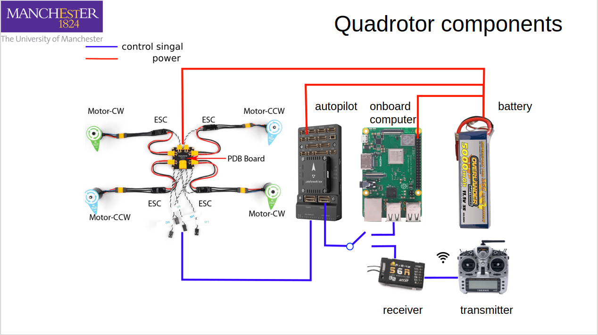
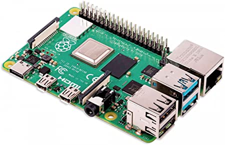
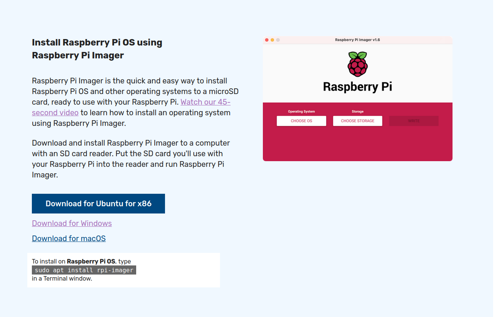
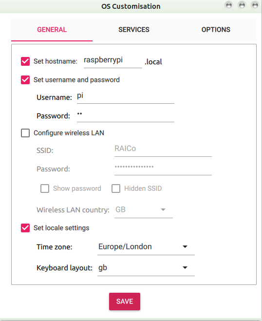

# Set up Raspberry Pi for ROS1 application

Here show two main ways:
- Ubuntu 20 (server or desktop) + ros noetic
- Ubuntu 22 server + Docker (ros noetic) 

<figure>
    
    <figcaption></figcaption>
</figure>

## 1. Brief introduction of onboard computer (Raspberry Pi 4B)
Onboard computer is responsible for transfer commands from base station to autoploit and convert sensor information from autoploit, cameras etc. back to Onboard computers.

Choices for onboard computers are Raspberry Pi, Odroid, Tegra K1 etc. Here we show how to buid a drone using Raspberry Pi, i.e. Raspberry Pi 4B.
<figure>
    
    <figcaption>Raspberry Pi 4B</figcaption>
</figure>

Raspberry Pi requires an operating system (OS). However, The supported OSs by Raspberry Pi depend on versions. Raspberry Pi 4B can only support Ubuntu desktop 21.04 (Not LTS), Raspberry Pi OS, Ubuntu server 20.04 (LTS), Ubuntu Core 20, which can be found at (see [Ubuntu for Raspberry Pi](https://ubuntu.com/download/raspberry-pi)).

## 2. Tools for installing operating systems on Raspberry Pi 4B
**Note:** An image is provided for  team members that is Ubuntu Mate for Raspberry Pi 20.04 with ROS and mavors.
Raspberry Pi Imager is official tool to install OS for raspberry pi boards. It can be downloaded from [https://www.raspberrypi.com/software/](https://www.raspberrypi.com/software/).

 A Youtube video is available [here](https://youtu.be/y45hsd2AOpw).

<figure>
    
    <figcaption>Raspberry Pi Imager</figcaption>
</figure>

Here are several potions for OS to be used on Raspberry Pi 4b:
- Ubuntu Desktop/Server 20.04
- **(recommended)** Ubuntu Mate 20.04 for Raspberry Pi
- Ubuntu Desktop/Server 22.04 (Docker approach)

## 3. Install Ubuntu Server 20.04
A server is lighter than a Desktop as it does not contain packages for GUI and Office. Thus, choosing server is also a good choice for an onboard computer.

1. Choose Ubuntu Server 20.04 LTS using Raspberry Pi Imager.
2. Insert the SD carder in Raspberry Pi and start it with a mouse, keyboard and a monitor connected.
3. Log in Ubuntu server with
    - username ubuntu
    - password ubuntu
4. Connect Raspberry Pi to Wifi using netplan explained [here](https://itsfoss.com/connect-wifi-terminal-ubuntu/)
    - check Internet class ```ls /sys/class/net``` 
    - find and edit config file ```sudo nano /etc/netplan/50-cloud-init.yaml```
    - put available wifi infor as
    ```
        wifis:
            wlan0:
                dhcp4: true
                optional: true
                access-points:
                    "WIFI_ID":
                        password: "WiFi_password"
    ```   
    - apply this config ```sudo netplan generate```
    - connect to Wifi ```sudo netplan apply```
5. **reboot**
6. Install Mate Desktop environment
    - ```sudo apt install taskel```
    - ```sudo apt install ubuntu-mate-desktop```    
    - choose gmd3 or lightdm (recommended)

## 4. Install Ubuntu Mate (for Raspberry Pi) 20.04 from Ubuntu Server 20.04
Repeat Steps 1-5 above in Step 2A.

6. Use Desktopify to convert Ubuntu server 20.04 to Ubuntu Mate 20.04. A video tutorial is available [Install Ubuntu Mate On the Raspberry Pi 4 with Desktopify The Fastest Desktop Experience For The Pi4](https://youtu.be/zo5eReiXYuo).
    - ```cd ~```
      ```git clone https://github.com/wimpysworld/desktopify.git```
    - ```cd desktopify``` 
        ```sudo ./desktopify --de ubuntu-mate```     
Take the sd card and put it into the sd slot.

Connect the Raspberry Pi with a monitor through a HDMI cable, a mouse through a USB port, a keyboard through a USB port. Then, use the power supply module provided by the manufacturer.

Now, we should see a Ubuntu Mate start in the monitor. Here is what we need to do for configure basics of the OS.

1. Boot your Ubuntu MATE 
    - set language and user names
        - user name: droneREEG
        - passwork: 123456
        - computer name: drone1 (drone2 for a second drone)
        - this can also be done by specifying options of Raspberry Pi Imager before installing
2. Disable auto update in *Software&Updates > Updates*
    - stop ubuntu kernel update
        ```
            sudo apt-mark hold linux-generic linux-image-generic linux-headers-generic
        ```

## 4. Install Ubuntu Server 22.04 (Docker approach)
The last verion of Raspberry Pi Imager in 2025 allows more settings at the beginning.

For instance, it is possible to configure WIFI
<figure>
    
    <figcaption>Raspberry Pi Imager</figcaption>
</figure>

Setting an available WIFI here is helpful for us to install tools and libraries after.


Ref:
- [How to get started with Ubuntu Core on Raspberry Pi](https://www.youtube.com/watch?v=aekZhezFCHM&t=681s&ab_channel=CanonicalUbuntu)
- [Your first robot, part 1: A beginner's guide to ROS and Ubuntu Core](https://www.youtube.com/watch?v=KidVVqbsIHI&ab_channel=KyleFazzari)
- [Ubuntu Core](https://www.youtube.com/watch?v=6NDWqH1SrGs&list=PLwFSk464RMxk54Xdcb90rgfoyRlKUOjLM&ab_channel=CanonicalUbuntu)
##TODO
Ubuntu ESM for ros [ROS Expanded Security Maintenance](https://ubuntu.com/robotics/ros-esm)


