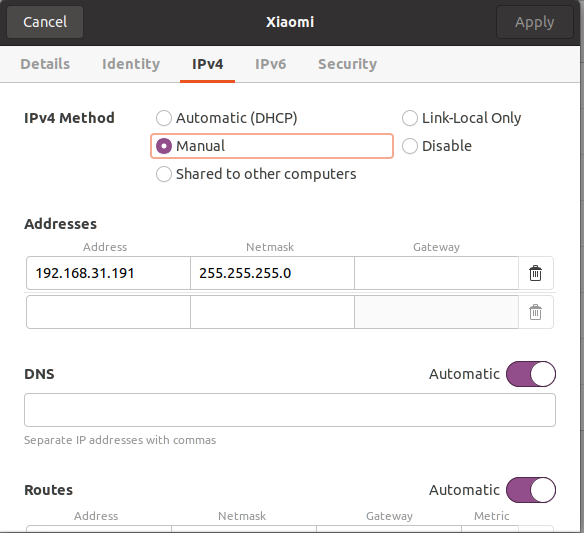
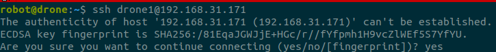
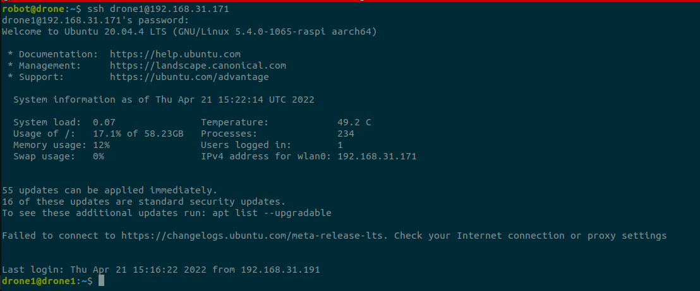
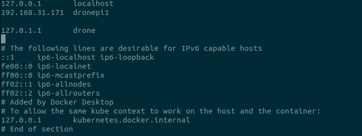
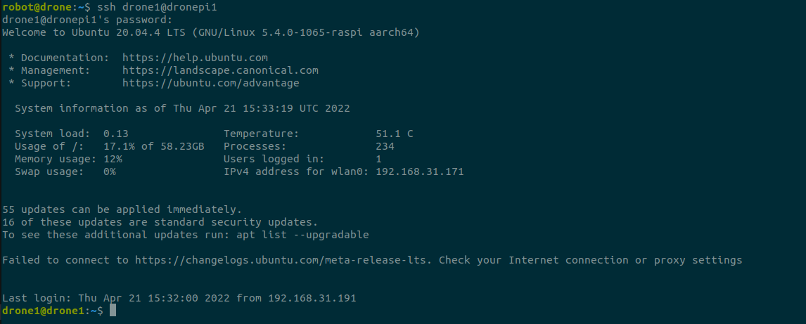
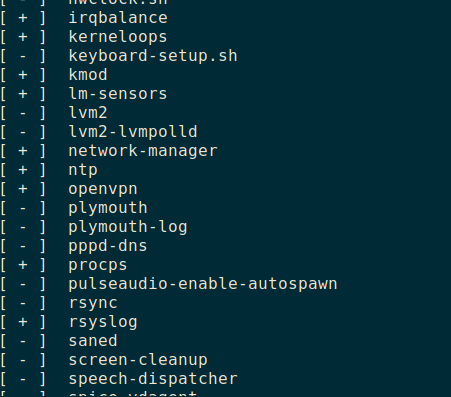
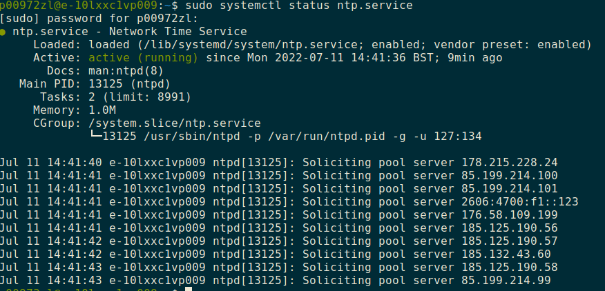

# ROS communiction through WIFI between onboard computer and base station

## 1 Install ROS and ROS pkgs for onboard computer
### 1.1 Install ROS 
- for team members, please skip this step
- for Ubuntu or Ubuntu Mate, please refoer to [ROS Installation](http://wiki.ros.org/ROS/Installation).

- for Rapsberry Pi OS, 
    -   ROS Melodic is still possible to be installed on Raspberry Pi with Raspbian Buster following a different approach [ROSberryPi/Installing ROS Melodic on the Raspberry Pi](http://wiki.ros.org/ROSberryPi/Installing%20ROS%20Melodic%20on%20the%20Raspberry%20Pi).

    - A tutorial to install Melodic on Rapsberry Pi OS is given [here](https://www.linkedin.com/pulse/easiest-way-install-ros-melodic-raspberrypi-4-shubham-nandi/).  
### 1.2 Install mavros
- for team members, please skip this step
- for others, please ref to Section Simulation_ROS.


## 2 Enable WIFI communication between onboard computer and base station

### 2.1 Set static IP address for onboard computer and base station
Connect to WIFI and open Internet settings.

Find Tap IPv4, then choose Manual instead of DHCP.

Then, input an address like 192.168.31.191 where the router's address is 192.168.31.1. Note here, the first three parts must be the same with your router's. Netmask usually should be ```255.255.255.0```. More details can be found at [Subnets of Linux Journey](https://linuxjourney.com/lesson/subnets).
<figure>
    
</figure>


### 2.2 Set ssh for remote login
Install ssh on both machines
```shell
    sudo apt install openssh-client openssh-server
```
and we ca check the installation by 
<figure>
    
</figure>


On base station, we can connect to Raspberry Pi with 
```shell
    ssh username@servername
```
where servername can be IP address like 192.168.31.171 and site address like example.com

Lets say our username is drone1 and its pws is 123456.

From base station to connect.
1. We start ssh request
```shell
    ssh drone1@192.168.31.171
```
and entre yes then
<figure>
    
</figure>

2. We entre the pwd of the user of sever, i.e. drone1, which should be 123456. 
<figure>
    
</figure>

3. We are now in the server as the user drone1, as you can see a new user name and a new machine name in the terminal.

4. It is not surpised that we dont want to type ip address every time. Since we know the ip address of the Raspberry Pi wont change, it is nature to think can we type something meaningful as long as my machine can understhand my input and link that to the correct ip address.

    Here, we can modify /etc/hosts to enable our machine to do that.

    We give a name for our Raspberry Pi as dronepi1, as
<figure>
    
</figure>    

5. Now, we can connect to the Raspberry Pi with drone1@dronepi1
<figure>
    
</figure>    

References on ssh:
1. [How to use SSH (to connect to another computer), Youtube](https://www.youtube.com/watch?v=3bQRaOPns9k&ab_channel=SyntheticEverything)

2. [Running ROS across multiple machines](http://wiki.ros.org/ROS/Tutorials/MultipleMachines)

3. [How to enable SSH on Linux Ubuntu (Easy step by step guide), Youtube](https://www.youtube.com/watch?v=Wlmne44M6fQ&ab_channel=KnowledgeSharingTech)

4. [SSH in Chinese](https://wangdoc.com/ssh/client)

## 3 Set ROS communication through WIFI between onboard computer and base station 

### 3.1 time synchrionasation
We are going to use ntp service for time synchronisation such that time of onboard computer is based on that of base station.

First of all, install ntp by running
```bash
sudo apt install ntp
```
Check if ntp service is on or not
```bash
service --status-all
```
<figure>
    
    <figcaption> Ntp service is on </figcaption>
</figure>
and check its status

```bash
sudo systemctl status ntp.service
```
<figure>
    

Check all the servers
```bash
    ntpq -p
```
##TODO

### 3.2 ROS communication between Rapsberry Pi and base station
Once we can ensure Intercet connection between the onboard computer and our base station, we can process ROS communication between them.

We only need to specify the IP addresses of onboard computer and base station into ROS.

1. for the onboard computer, open ```.bashrc``` and add
```bash
    export ROS_MASTER_URI=http://IP_base_station:11311
    export ROS_IP=IP_onboard_computer
```

2. for the base station, open ```.bashrc``` and add
```bash
    #export ROS_MASTER_URI=http://master:11311

    export ROS_MASTER_URI=http://IP_base_station:11311
    export ROS_IP=IP_base_station
```
Note: this configuration only works for THE WLAN. We may need to modify the IP addresses for different WLANs.

Also, we need to comment the two commannds below and uncomment the one above in order to do local simulation and experiments.

More details can be found at [Running ROS on multiple machines](https://husarion.com/tutorials/ros-tutorials/5-running-ros-on-multiple-machines/).