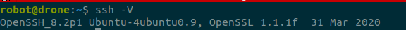

# ROS communiction through WIFI between onboard computer and base station

## 1 Install ROS and ROS pkgs for onboard computer
### 1.1 Install ROS 
- for team members, please skip this step
- for Ubuntu or Ubuntu Mate, please refoer to [ROS Installation](http://wiki.ros.org/ROS/Installation).

- for Rapsberry Pi OS, 
    -   ROS Melodic is still possible to be installed on Raspberry Pi with Raspbian Buster following a different approach [ROSberryPi/Installing ROS Melodic on the Raspberry Pi](http://wiki.ros.org/ROSberryPi/Installing%20ROS%20Melodic%20on%20the%20Raspberry%20Pi).

    - A tutorial to install Melodic on Rapsberry Pi OS is given [here](https://www.linkedin.com/pulse/easiest-way-install-ros-melodic-raspberrypi-4-shubham-nandi/).  
### 1.2 Install mavros
- for team members, please skip this step
- for others, please ref to Section Simulation_ROS.


## 2 Enable WIFI communication between onboard computer and base station

### 2.1 Set static IP address for onboard computer

### 2.1 Set static IP address for base station


### 2.3 Set ssh for remote login
Install ssh on both machines
```shell
    sudo apt install openssh-client
```
and we ca check the installation by 
<figure>
    
</figure>


On base station, we can connect to Raspberry Pi with 
```shell
    ssh username@servername
```
where servername can be IP address like 192.168.31.171 and site address like example.com

Lets say our username is drone1 and its pws is 123456.

From base station to connect.
1. We start ssh request
```shell
    ssh drone1@192.168.31.171
```
and entre yes then
<figure>
    
</figure>

2. We entre the pwd of the user of sever, i.e. drone1, which should be 123456. 
<figure>
    
</figure>

3. We are now in the server as the user drone1, as you can see a new user name and a new machine name in the terminal.

4. It is not surpised that we donot want to type ip address every time, and we want to type just another time with sense. Here, we can modify /etc/hosts to enable our machine to do that.

    We give a name for our Raspberry Pi as dronepi1, as
<figure>
    
</figure>    

5. Now, we can connect to the Raspberry Pi with drone1@dronepi1
<figure>
    
</figure>    


## 3 Set ROS communication through WIFI between onboard computer and base station 

### Step 6.3 time synchrionasation
We are going to use ntp service for synchronisation.
First of all, install ntp by running
```bash
sudo apt install ntp
```
Check if ntp service is on or not
```bash
service --status-all
```
<figure>
    
    <figcaption> Ntp service is on </figcaption>
</figure>
and check its status
```bash
sudo systemctl status ntp.service
```
<figure>
    
    <figcaption> Pixhawk 5x - Raspberry Pi </figcaption>
</figure>
Check all the servers
```bash
    ntpq -p
```

TODO
## Step 6. ROS communication between Rapsberry Pi and base stationdf