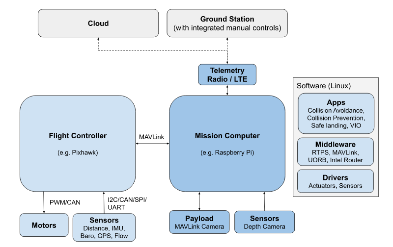
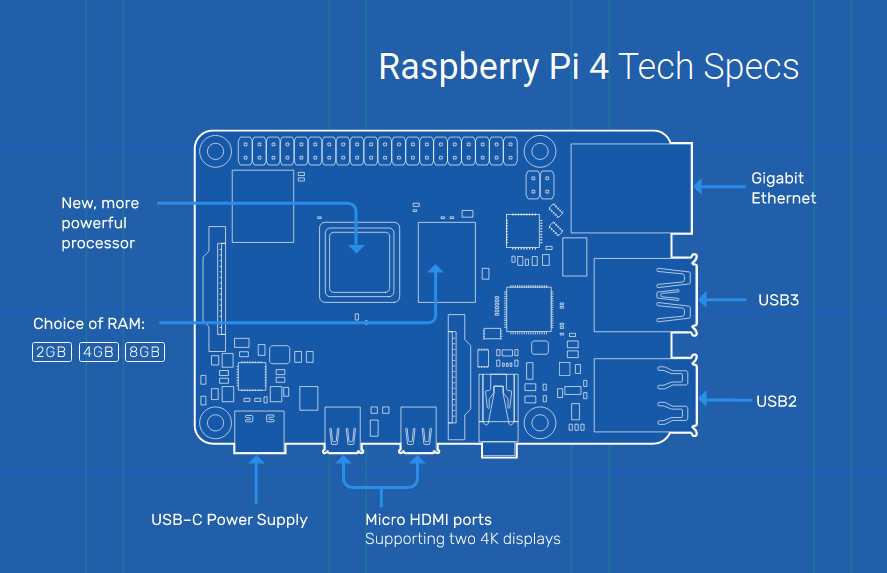
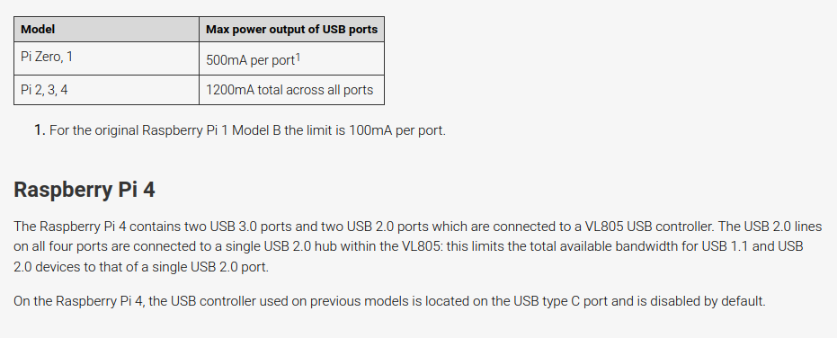

# Hardware setup
## Big picture of Pixhawks_Rapebrrypi
<figure>
    
    <figcaption> PX4 system and Companion Computer (https://docs.px4.io/master/en/concept/px4_systems_architecture.html)</figcaption>
</figure>

## Power Raspberry Pi
### Power requirements of Raspberry Pi 4
Power supply for Rasberry Pi can be found [Power Supply](https://www.raspberrypi.com/documentation/computers/raspberry-pi.html#power-supply).
<figure>
    
    <figcaption> PX4 system and Companion Computer (https://www.raspberrypi.com/products/raspberry-pi-4-model-b/specifications/)</figcaption>
</figure>

<figure>
    
    <figcaption> USB ports of Raspberry Pi (https://www.raspberrypi.com/documentation/computers/raspberry-pi.html#universal-serial-bus-usb)</figcaption>
</figure>

https://www.raspberrypi.com/documentation/computers/os.html#gpio-and-the-40-pin-header

https://pinout.xyz/pinout/5v_power#

PX4 is configured by default to connect to a companion computer connected to the TELEM 2 serial port. No additional PX4-side configuration should be required if you use this port

### Solutions to power Raspberry Pi 4

### Setup Wifi rooter in F46

username and password are admin.
