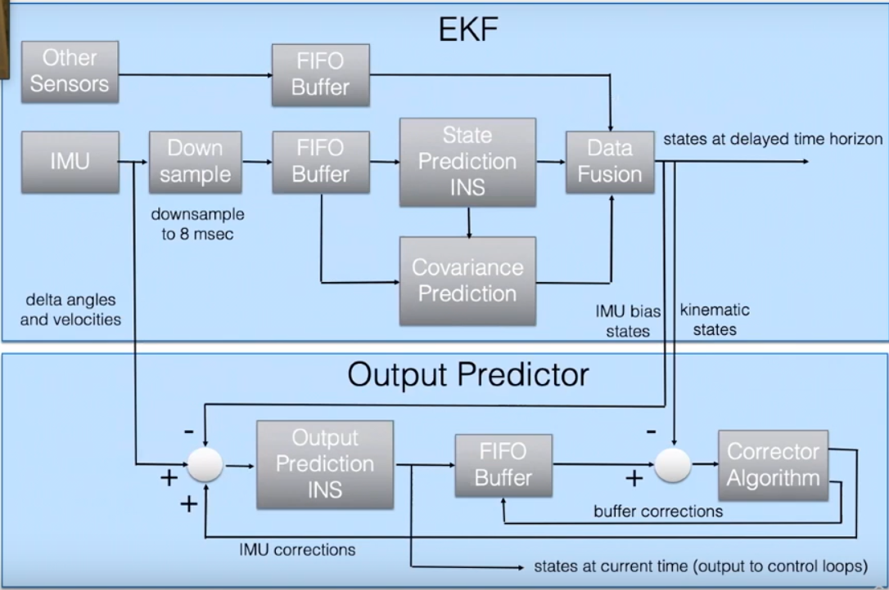

# Use Mocap for drone indoor flight
## Communication schematic among MoCap, drone and base station
image missing

## State estimation operated by PX4
https://docs.px4.io/v1.12/en/advanced_config/tuning_the_ecl_ekf.html
<figure>
    
    <figcaption>EKF in PX4 ECL</figcaption>
</figure>

Choosing instances of EKF depends on the number of IMUs and the number of magnetometers. For pixhawks 5x, there are
 - 3 IMUS,
 - 1 magnetometer,

therefore, we should set 
 
 - EKF2_MULTI_IMU = 3,
 - EKF2_MULTI_MAG = 1,

which leads to 
```
    N_instances = MAX(EKF2_MULTI_IMU , 1) x MAX(EKF2_MULTI_MAG , 1) = 3
```
Following the guide [https://docs.px4.io/v1.12/en/advanced_config/tuning_the_ecl_ekf.html](https://docs.px4.io/v1.12/en/advanced_config/tuning_the_ecl_ekf.html), we should set
    - SENS_IMU_MODE = 1 as 1: Publish primary IMU selection,
    - SENS_MAG_MODE = 1 as 1: Publish primary magnetometer

## Set Px4 to accept MoCap infor
Indoor flights need Motion Capture System to provide pose information for drones. Vicon is setup in F46 and we shall configure PX4 such that our drone takes pose information from Vicon to meet auto flight conditions.

EKF2_AID_MASK is the parameter to be tuned:
    - click 3 if **horizontal position data** will be used and set EKF2_HGT_MODE = 3 if **vertical position data**,
    - click 8 if **velocity data** is used,
    - click 4 if **orientation data** is used for **for yaw estimation**, or click 6 if vision reference frame offset will be estimated and used to rotate the external vision system data. 

https://risc.readthedocs.io/1-indoor-flight.html


https://docs.px4.io/main/en/advanced/switching_state_estimators.html

https://docs.px4.io/main/en/ros/external_position_estimation.html

https://docs.px4.io/main/en/ros/external_position_estimation.html#reference-frames-and-ros

https://docs.px4.io/v1.12/en/computer_vision/motion_capture.html

https://docs.px4.io/v1.12/en/tutorials/motion-capture-vicon-optitrack.html

https://docs.px4.io/v1.12/en/ros/external_position_estimation.html#reference-frames-and-ros


Source:
    1.  External Vision System, PX4, https://docs.px4.io/v1.12/en/advanced_config/tuning_the_ecl_ekf.html.
    2.  EKF2_AID_MASK, https://docs.px4.io/v1.12/en/advanced_config/parameter_reference.html#EKF2_AID_MASK.

## Set frame transmition
    


    SYS_MC_EST_GROUP


    https://404warehouse.net/2015/12/20/autopilot-offboard-control-using-mavros-package-on-ros/