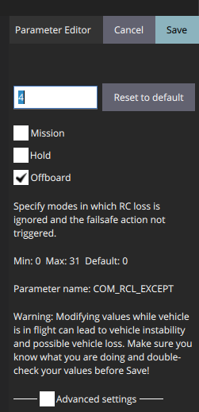
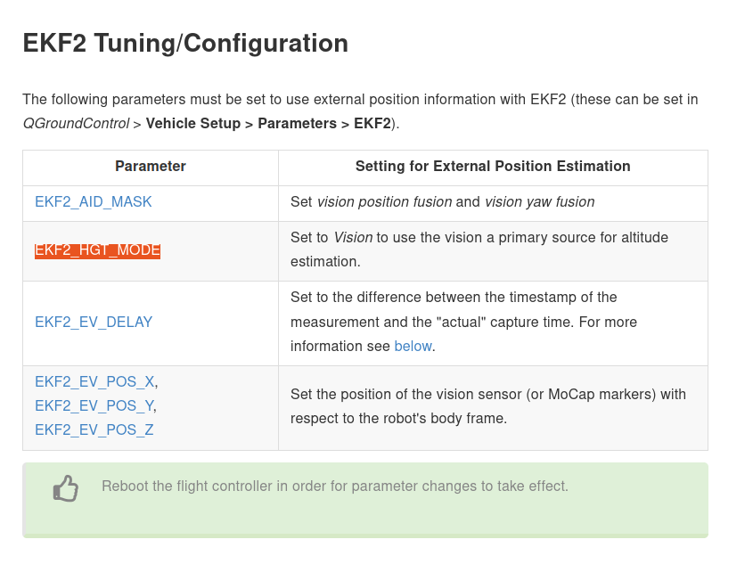
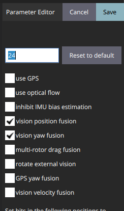
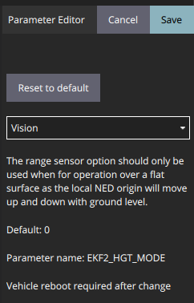
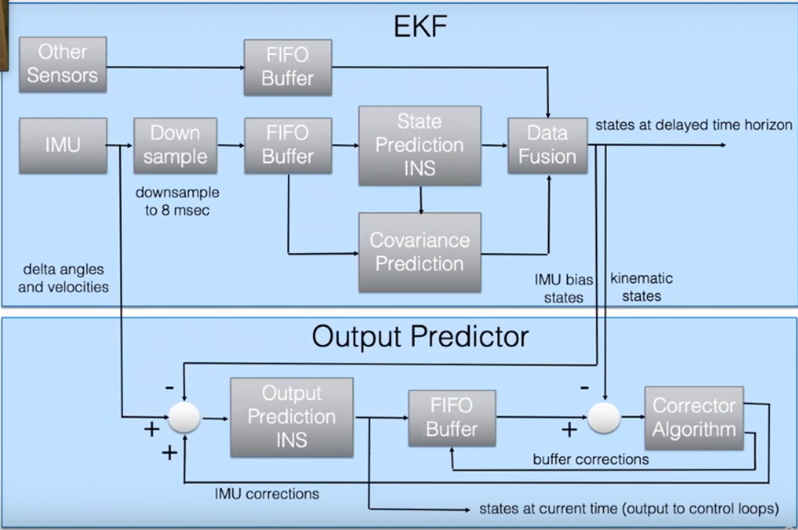

# Configure PX4 to perform indoor flights with Vicon

## 1. Basic configuraiton of PX4 
First read prearm,arm and disarm specified by PX4. How can I comment on this: it is not better than shit.

Arming and disarming decides what cases will stop drones. One of the cases is that should a drone be stopped, or disarmed, if it cannot receive RC signals for a certain amount of time.

1. Allow arming drones without RC signal
We allow drones armed in offboard modes by setting ```COM_RCL_EXCEPT=4``` like 
    <figure>
        
        <figcaption>Explanation of COM_RCL_EXCEPT</figcaption>
    </figure>
Only setting this if we want to keep our drone armed when there is no RC input.

2.  Change timeout parameters to allow more time to take actions

    ```bash
    COM_OF_LOSS_T = 10
    COM_DISARM_LAND =10 
    COM_DISARM_LAND = -1 #means disable this
    ```


## 2 Use Vicon information in PX4

Indoor flights need Motion Capture System to provide pose information for drones in order to switch to the mode **OFFBOARD**. Check [Using Vision or Motion Capture Systems for Position Estimation](https://docs.px4.io/v1.12/en/ros/external_position_estimation.html).

**EKF2_AID_MASK** and **EKF2_HGT_MODE** are the parameters to be tuned first.
<div style="text-align: center"></div>

We need to configure PX4 such that it takes navigation information from Vicon instead of GPS or IMU. Tutorials are given by PX4, i.e. [EKF2 Tuning/Configuration, Using Vision or Motion Capture Systems for Position Estimation](https://dev.px4.io/v1.11_noredirect/en/ros/external_position_estimation.html)

1. Set ```EKF2_AID_MASK = 24``` which means ```3: vision position fusion + 4: vision yaw fusion```, we set position information is from Vicon.
    -  <div style="text-align: center"></div>
    -   more details can be found at ```EKF2_AID_MASK``` at [advanced_config/parameter_reference](https://docs.px4.io/v1.12/en/advanced_config/parameter_reference.html#EKF2_AID_MASK).
2. Set ```EKF2_HGT_MODE = 3: Vision```, we set height information is also from Vicon

    <div style="text-align: center"></div>

Reference:
1. Indoor flying, RISC Lab Documentation, https://risc.readthedocs.io/1-indoor-flight.html.


2. https://docs.px4.io/main/en/advanced/switching_state_estimators.html

3. https://docs.px4.io/main/en/ros/external_position_estimation.html

4. https://docs.px4.io/main/en/ros/external_position_estimation.html#reference-frames-and-ros

5. https://docs.px4.io/v1.12/en/computer_vision/motion_capture.html

6. https://docs.px4.io/v1.12/en/tutorials/motion-capture-vicon-optitrack.html

7. https://docs.px4.io/v1.12/en/ros/external_position_estimation.html#reference-frames-and-ros

## 3 Tune EKF (Optional)


Choosing instances of EKF depends on the number of IMUs and the number of magnetometers. For pixhawks 5x, there are
 - 3 IMUS,
 - 1 magnetometer,

therefore, we should set 
 
 - EKF2_MULTI_IMU = 3,
 - EKF2_MULTI_MAG = 1,

which leads to 
```
    N_instances = MAX(EKF2_MULTI_IMU , 1) x MAX(EKF2_MULTI_MAG , 1) = 3
```
Following the guide [https://docs.px4.io/v1.12/en/advanced_config/tuning_the_ecl_ekf.html](https://docs.px4.io/v1.12/en/advanced_config/tuning_the_ecl_ekf.html), we should set
    - SENS_IMU_MODE = 1 as 1: Publish primary IMU selection,
    - SENS_MAG_MODE = 1 as 1: Publish primary magnetometer


https://docs.px4.io/v1.12/en/advanced_config/tuning_the_ecl_ekf.html.


Source:
    1.  External Vision System, PX4, 
    2.  EKF2_AID_MASK, https://docs.px4.io/v1.12/en/advanced_config/parameter_reference.html#EKF2_AID_MASK.

## Set frame transmition
    


    SYS_MC_EST_GROUP


    https://404warehouse.net/2015/12/20/autopilot-offboard-control-using-mavros-package-on-ros/


## 2 Communication schematic among MoCap, drone and base station


### 2.1 State estimation operated by PX4
https://docs.px4.io/v1.12/en/advanced_config/tuning_the_ecl_ekf.html
<figure>
    
    <figcaption>EKF in PX4 ECL</figcaption>
</figure>
