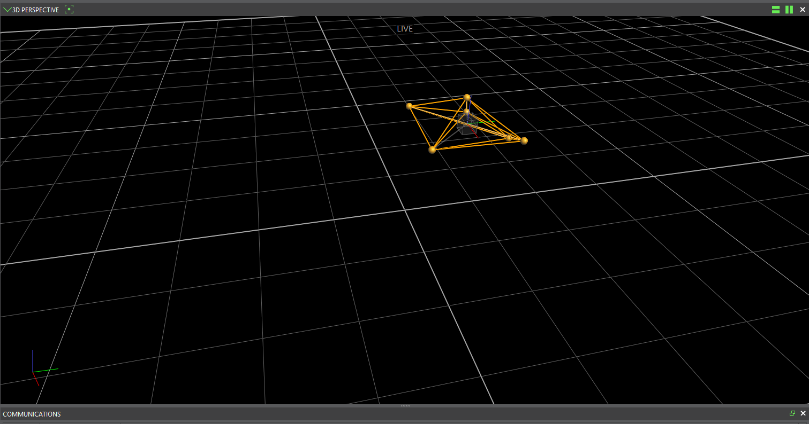

# Use Vicon for drone indoors flight

- [ ] How to start vicon
    - [X] image of online
    - [ ] image of wand
    - [X] image of vicon with objects 
    - [ ] image of vicon in ros topic and message
- [ ] Vicon frame explanation
- [ ] How to use Vicon
    - [ ] EKF 2
    - [ ] use vicon in drone controller
    
Here is where you are going to fly drones with Vicon at the University of Manchester.
<figure>
    
</figure>

Indoor flights with a drone and a Vicon system is illusrated by the figure below.
<figure>
    
</figure>

Several points to understand this figure:
- every thing is connected to a WIFI router,
- Vicon system detects the markers attahced to a drone and computes its pose,
- base station runs the package vicon_bridge to get Vicon information into ros topics,
- control signals computed by base station are sent to drone by publishing to ros topics that are provided by mavros. 


## 1. How to configurate Vicon for the 1st time
### 1.1 Start Vicon system at Vicon computer
1. Satart *Vicon tracker*
2. **Calibrate system** (do it everytime before experiments)
    - dance with favourite music waving your magic wand.
    <figure>
        
    </figure>    
    - camera's light becomes green: it mean OK.
    - all cameras's light becoming blinking if they are all calibrated.
    <figure>
        
    </figure>
3. Set origin
    - set volume origin 
    - put the bar on the ground where you want **the origin** is
    - and click *Start* and *Set*
    - you should find the cameras' position in the **3D perspective** as the same as the real world.  
        <figure>
            
        </figure>
    - **NOTE** the red-gren-bleu coordinate at the left bottom indicates x, y, z directions.
    
4. Recalibrate Vicon
    -   **Donot touch cage or gate to impact cameras**. 
    - once a camera's light is blinking, redo calibration.
5. Set static IP
    - set a static IP for Vicon system when connecting to WIFI.  
### 1.2 Build rigid body in Vicon at Vicon computer
1. Put markers on a drone
    - not symmetric
    - not covered 
    - put drone in flight cage and check if all markers can be seen in Vicon
2. In *Vicon tracker*, Choose *Objects* tag and select all markers
3. Name object and then create
4. Select object in *Object* Tag: the object DRONE_z is chosen.
<figure>
    
</figure>
6. *Go Live* 
<figure>
    
</figure>
    and we should see the object like below
<figure>
    
</figure>

### 1.3 Get Vicon information in ros at base station    
This is done at base station.

1. Download and build ros package *vicon_bridge* from EEEManchester [https://github.com/EEEManchester/vicon_bridge.git](https://github.com/EEEManchester/vicon_bridge.git).

2. Connnect base station to WIFI with a static IP, like 192.168.10.XX
    - given a base station with Ubuntu 20.04 and WIFI name being *drone_wifi-5GHz*,
    - WIFI settings can be used configure static IP
        <figure>
            
        </figure>
        
        - change IPv4 method to be *Manual* meaning that IP adress for this base statino is set manually by us instead of being allocated dynamically,
        - put a user-defined address in the first line below *Address*. Puting 192.168.1.21 means that once this base station is connected to *drone_wifi-5GHz*, its IP address will always be 192.168.1.21.     
3. Check WIFI connection between base station and Vicon system
    - at vicon computer, ping base station with the static IP just set
    ```shell
        ping base_station_IP
    ```
    - at base tation, ping vicon system,
    ```shell
        ping vicon_system_IP
    ```
    - this can also be used to test WIFI connection among Vicon, base station and drone. For instance, at drone, do
    ```shell
        ping base_station_IP
        ping vicon_system_IP
    ```

4. in Vicon launch file, put the IP address of Vicon system as the 
**datastream_hostport**, like 192.168.10.183::801 in the launch file below.
        <figure>
            
        </figure> 
5. run vicon_bridge by
```shell
    roslaunch vicon_bridge vicon_launch
```
6. then, a rostopic named after */vicon/object_name/object_name* should be generated and drone pose information should be found there. 

    <figure>
        
    </figure> 

    It is possible to change the topic of the object in vicon like make DRONE_z' pose information be published to the topic /vicon/drone
    ```xml
        <remap from="/vicon/DRONE_z/DRONE_z" to="/vicon/drone" />  
    ```
    then we can find /vicon/drone in rostopic list
    <figure>
            
    </figure> 

7. Vicon ros msg includes position information and attitude in quaterion
    <figure>
            
    </figure> 


## 2. How to use Vicon
1. **Calibrate Vicon** 
    - dance with favourite music
    - camera's light becomes green: it mean OK.
    - all cameras's light becoming blinking if they are all calibrated.
2. run *vicon_bridge* at base station
    ```shell
    roslaunch vicon_bridge vicon_launch
    ```
3. check drone pose information by 
    ```shell
    rostopic echo /vicon/object_name/object_name
    ```
4. **NOTE change yaw rotation**
    It is highly recommended that drones are placed with zero yaw angle.

    Take a quadrotor for example. We usually set the reference yaw angle to be zero, which can cause a potenial risk if the drone is palced with a non-zero yaw angle.

    This image shows a 180 yaw rotation from the origin.
<figure>
    
</figure>    


## 3. Use rospackages developed for F46.
1. get vicon_bridge from https://github.com/ZhongmouLi/vicon_bridge
2. get drone_experiment_tool from https://github.com/EEEManchester/drone_experiment_tools_F46

3. change object name in line 5
    ```xml
        <remap from="/vicon/DRONE_z/DRONE_z" to="/vicon/drone" />  
    ```
4. run 
    ```shell
        roslaunch drone_experiment_tools drone_ex_F46_setup.launch        
    ```     

##TODO

### 3.1 Use Vicon information in drone controller


### 3.2 Use Vicon information in PX4

Indoor flights need Motion Capture System to provide pose information for drones. Vicon is setup in F46 and we shall configure PX4 such that our drone takes pose information from Vicon to meet auto flight conditions.

EKF2_AID_MASK is the parameter to be tuned:
    - click 3 if **horizontal position data** will be used and set EKF2_HGT_MODE = 3 if **vertical position data**,
    - click 8 if **velocity data** is used,
    - click 4 if **orientation data** is used for **for yaw estimation**, or click 6 if vision reference frame offset will be estimated and used to rotate the external vision system data. 

https://risc.readthedocs.io/1-indoor-flight.html


https://docs.px4.io/main/en/advanced/switching_state_estimators.html

https://docs.px4.io/main/en/ros/external_position_estimation.html

https://docs.px4.io/main/en/ros/external_position_estimation.html#reference-frames-and-ros

https://docs.px4.io/v1.12/en/computer_vision/motion_capture.html

https://docs.px4.io/v1.12/en/tutorials/motion-capture-vicon-optitrack.html

https://docs.px4.io/v1.12/en/ros/external_position_estimation.html#reference-frames-and-ros


Source:
    1.  External Vision System, PX4, https://docs.px4.io/v1.12/en/advanced_config/tuning_the_ecl_ekf.html.
    2.  EKF2_AID_MASK, https://docs.px4.io/v1.12/en/advanced_config/parameter_reference.html#EKF2_AID_MASK.

## Set frame transmition
    


    SYS_MC_EST_GROUP


    https://404warehouse.net/2015/12/20/autopilot-offboard-control-using-mavros-package-on-ros/


TODO
## 2 Communication schematic among MoCap, drone and base station


### 2.1 State estimation operated by PX4
https://docs.px4.io/v1.12/en/advanced_config/tuning_the_ecl_ekf.html
<figure>
    
    <figcaption>EKF in PX4 ECL</figcaption>
</figure>

Choosing instances of EKF depends on the number of IMUs and the number of magnetometers. For pixhawks 5x, there are
 - 3 IMUS,
 - 1 magnetometer,

therefore, we should set 
 
 - EKF2_MULTI_IMU = 3,
 - EKF2_MULTI_MAG = 1,

which leads to 
```
    N_instances = MAX(EKF2_MULTI_IMU , 1) x MAX(EKF2_MULTI_MAG , 1) = 3
```
Following the guide [https://docs.px4.io/v1.12/en/advanced_config/tuning_the_ecl_ekf.html](https://docs.px4.io/v1.12/en/advanced_config/tuning_the_ecl_ekf.html), we should set
    - SENS_IMU_MODE = 1 as 1: Publish primary IMU selection,
    - SENS_MAG_MODE = 1 as 1: Publish primary magnetometer
