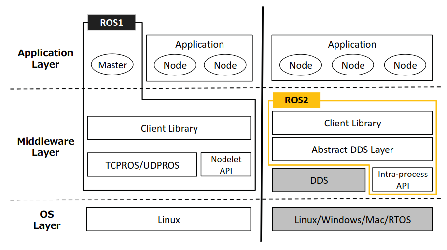
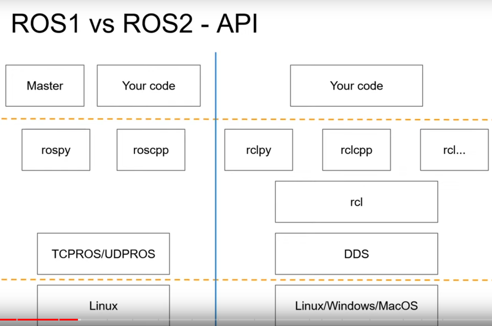
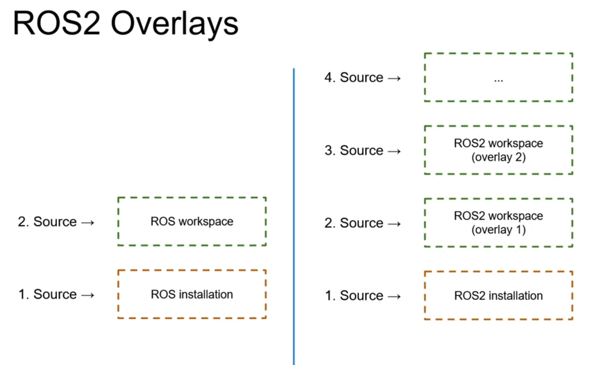

## Structure of ROS2 Foxy
### Why move to ROS2 from ROS
| | ROS2   |      ROS      |
|:----: |:----: |:----: |
|Design target | For Industry |   For Academia |
|Design origin | For multi robots |   For single robot |
|Platform | Multi-platform |   Linux |
|Real-time | Yes |   No |
|Sensor   | Small processors |     Complex robots and sensors   | 
|Network environment | Unreliable network is OK|  Perfect network is perfered(ideally on the same computer)| 
| Others| Deterministic behavior| Lot of computational power| 
| | Error recovery| | 

### Differences in structues of ROS and ROS2

Key difference is ROS 2 has no ros master.

ROS 2 allows to completely create a distributed system.

**API differences**

- c++ and python in ROS 2 are united by using a common client library.
  - roscpp and rospy are independent, some functions exsit only for one or the other. It is possible to come across that the needed features only are available in rospy, while your project uses roscpp.
  - rclcpp and rclpy are much more simular. Both of them depend on rcl and providing the binding: all functions are implemented in rcl. 
- ROS 2 enables developers using other language to expereince a simular API. It is possible to use libraries in other languages like java as long as a binding between rcl ane them are developed.
- A new feature once is realsed, it will be available for all languages in ROS2. Only a binding is needed. By contrast, in ROS, 

Supports for Python and C++
- ROS 2 is only for Python 3.
- ROS 2 supports C++ 11 and 14 by default, C++ 17 is also on the roadmap.

**Workspace overlays**

We can overlay workspace and pkgs.

### Key concepts of ROS2
#### Node
A node can send and receive data from other nodes via topics, services, actions, or parameters. Usually, a node should be responible for for a single and modular purpose like controlling the wheel motors and publishing the sensor data from a laser range-finder.

**Difference in concept from ROS**

One executable in ROS2 can contain several nodes:
- ROS 1: the node is the entire executable
- ROS 2: several nodes in the same executable (classes)

Because of this key difference, ROS2 is very suitable for a multi-robot system. ROS2 allows one executable, or package, to be programmed for one type of task wiht each node is in charge of one individual fucntion or module. 

In contrast, one robot may need multiple executables/nodes. 

A node in ROS2 is a class that can be:
- Compiled, run or stopped independently
- Written in different languages (C++ / Python3)

ROS1 vs ROS2, Practical Overview For ROS Developers, https://roboticsbackend.com/ros1-vs-ros2-practical-overview/