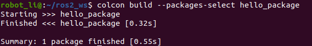

## Workspace Configuration for ROS2
In ROS2, ament is the new building system, and on top of that we get the colcon command line tool.

However, in ROS, catkin is the building system that combines CMake macros and Python scripts on top of CMake's normal workflow. That is why we use CMakeLists.txt.

To better understand, we use ROS as a refernce
- colcon like catkin tools, provide commands to create, build and test pkgs,
- ament is iterated on catkin from ROS.

### Configuration for colcon
Three tools are essential for ROS2:
- ROS2, itself;
- colcon as build tools.

We need colcon to build and manage pkgs developed in ROS2. Workspace is where these pkgs are located. In this case, we create the workspace as the folder *ros2_ws* by

```bash
    cd ~
    mkdir ros2_ws
    cd ros2_ws && mkdir src
```
where
- *ros2_ws* is the workspace in which we use build pkgs
- *ros2_ws/src* is where the built pkgs

1. colcon tools to build ROS2 pkgs
    Install colcon
    ```bash
        sudo apt install python3-colcon-common-extensions
    ```
2. Enable auto completation of colcon    
   -   check if ```colcon-argcomplete.bash``` exisits in 
    ```bash
    cd /usr/share/colcon_argcomplete/
    ``` 
    -  modify ~/.bashrc to source ```colcon-argcomplete.bash``` whenever a new terminal is called by adding the following command
    ```bash
    source /usr/share/colcon_argcomplete/colcon-argcomplete.bash
    ```  
3. Enable the searching availablity of pkgs in *ros2_ws* by adding the following command to ~/.bashrc
    ```bash
    source ~/ros2_ws/install/setup.bash
    ```  
Finally, we have added three lines into ~/.bashrc
```bash
    # ROS2 foxy
    source /opt/ros/foxy/setup.bash
    # ros2 workspace
    source ~/ros2_ws/install/setup.bash
    # auto completation of colcon
    source /usr/share/colcon_argcomplete/hook/colcon-argcomplete.bash
```  
### colcon commands for ROS2

| | ROS2   |      ROS      |
|:----: |:--------: |:--------: |
|Build pkgs | colcon build | catkin build |
|Create pkg | ros2 pkg create <pkg_name> --build-type ament_cmake | catkin create pkg  <pkg_name>|
|| ros2 pkg create <pkg_name> --build-type ament_python| |
|Build certain pkg| colcon build --packages-select  <pkg_name> | catkin build <pkg_name> |
|Run pkg | ros2 run <pkg_name> <exe_name>  | ros run <pkg_name> <exe_name> |
|Find exe | ros2 pkg prefix <pkg_name> | ros pkg find <pkg_name> |

## Build Pkgs
A package is a basic organizational unit for your ROS2. 

### Simple example to create pkg
Steps in details to follow "how to create a hello world" C++ pkg in ROS 2 https://docs.ros.org/en/foxy/Tutorials/Beginner-Client-Libraries/Creating-Your-First-ROS2-Package.html.

Step 1: create a hello world c++ pkg

```shell
    cd ros2_ws/src
    ros2 pkg create --build-type ament_cmake --node-name hello_node hello_package
```
we should see


Step 2: build hello world pkg
```shell
    cd ros2_ws/
    colcon build --packages-select hello_package
```
as



Step 3: source for new pkg

```shell
    cd ros2_ws/
    source install/local_setup.bash
```


Sourcing the local_setup of the overlay will only add the packages available in the overlay to your environment. setup sources the overlay as well as the underlay it was created in, allowing you to utilize both workspaces.

So, sourcing your main ROS 2 installation’s setup and then the ros2_ws overlay’s local_setup, like you just did, is the same as just sourcing ros2_ws’s setup, because that includes the environment of its underlay.

Step 4: run pkg
```shell
    ros2 run hello_package hello_node
```


Refereces:
1. ROS2 Basics #3 - Understanding ROS2 Packages and Workspace https://youtu.be/lN4_-l7FCWk.
2. ROS2 Tutorials #4: How to create a ROS2 Package for C++ [NEW], https://youtu.be/C2bKwFJ5HEY.
3. what is the use of --symlink-install in ROS2 colcon build?, https://answers.ros.org/question/371822/what-is-the-use-of-symlink-install-in-ros2-colcon-build/


```html
    my_package/
        CMakeLists.txt
        include/my_package/
        package.xml
        src/
        launch/
```
where
- CMakeLists.txt file that describes how to build the code within the package
- include/<package_name> directory containing the public headers for the package
- package.xml file containing meta information about the package
- src directory containing the source code for the package

### CMakeLists for ament

```cmake
    cmake_minimum_required(VERSION 3.5)
    project(my_project)

    ament_package()
```