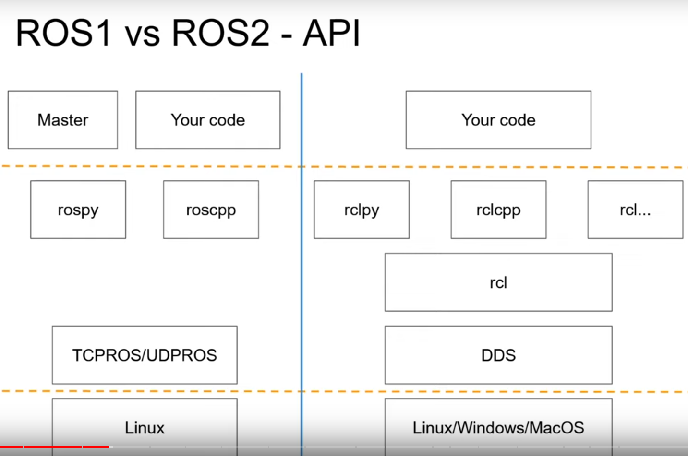

# ROS2 and PX4
This page is to step into the ROS2's world.

Development envrionmen
- Ubuntu 20.04
- ROS2 foxy

## Install ROS2
1. Choose ROS2 version at http://docs.ros.org/
    <figure>
     
    </figure>
    Version can be chosen according to OS. For example foxy is recommended for Ubuntu 22.04.

    The steps below are just following guidances given at http://docs.ros.org/en/foxy/Installation/Ubuntu-Install-Debians.html.

2. Get locale supports of UTF-8. 
   
   2.1 Check supoort by typing 
   ```bash
   local
   ```
   2.2 It is supported.
   It means they are already supported if we see 
    <figure>
     
    </figure>
    
    which shows that LANG=en.UTF-8 and UTF-8 support is set alreay.

   2.3 It is not supported and needs to be installed
    Run the follwoing commands in the terminal. 
    
    ```bash
    sudo apt update && sudo apt install locales
    sudo locale-gen en_US en_US.UTF-8
    sudo update-locale LC_ALL=en_US.UTF-8 LANG=en_US.UTF-8
    export LANG=en_US.UTF-8
    ```

3. Setup Sources for ROS2

    We should set universal apt available for the system. This can be checked by
    
    ```bash
        apt-cache policy | grep universal
    ```
    which results into
        <figure>
        
        </figure>    

    Then, add the ROS2 GPG key with apt.

    ```bash
        sudo apt update && sudo apt install curl -y
        sudo curl -sSL https://raw.githubusercontent.com/ros/rosdistro/master/ros.key -o /usr/share/keyrings/ros-archive-keyring.gpg
    ```
    and add the rep

    ```bash
        echo "deb [arch=$(dpkg --print-architecture) signed-by=/usr/share/keyrings/ros-archive-keyring.gpg] http://packages.ros.org/ros2/ubuntu $(. /etc/os-release && echo $UBUNTU_CODENAME) main" | sudo tee /etc/apt/sources.list.d/ros2.list > /dev/null
    ```
4. Install ROS2 packages
   - update and upgrade 
    ```bash
        sudo apt update && sudo apt upgrade
    ```
   - install desktop (Recommended): ROS, RViz, demos, tutorials
    ```bash
        sudo apt install ros-foxy-desktop python3-argcomplete
    ```
    - install development tools like compilers
    ```bash
        sudo apt install ros-dev-tools
    ```
5. Make ROS2 compatible with ROS

    .bashrc needs to be modified in order to source ROS and ROS2.

    - find .bashrc in ~
    - find and comments source commands for ROS, like ROS noetic
        ```bash
        # ROS noetic
        #source /opt/ros/noetic/setup.bash
        #source ~/catkin_ws/devel/setup.bash  
        ```       
    - add source commands for ROS2 such that
        ```bash
        # ROS noetic
        #source /opt/ros/noetic/setup.bash
        #source ~/catkin_ws/devel/setup.bash

        # ROS2 foxy
        source /opt/ros/foxy/setup.bash    
        ```
    - NOTE switching between ROS and ROS2 is done through modifying .bashrc
      - use ROS by commenting source commands for ROS2
        ```bash
        # ROS noetic
        source /opt/ros/noetic/setup.bash
        source ~/catkin_ws/devel/setup.bash

        # ROS2 foxy
        #source /opt/ros/foxy/setup.bash    
        ```
      - use ROS2 by commenting source commands for ROS
        ```bash
        # ROS noetic
        #source /opt/ros/noetic/setup.bash
        #source ~/catkin_ws/devel/setup.bash

        # ROS2 foxy
        source /opt/ros/foxy/setup.bash    
        ```
6. Check ROS2 installation
   
   In a terminal
   ```bash
        ros2 run demo_nodes_cpp talker
   ```
   and in another
   ```bash
        ros2 run demo_nodes_cpp listener
   ```   

   Installation is completed if we can see 
        <figure>
        
        </figure>   

    We can find the rqt_grap by typing rqt_gragh in termainl and 
         <figure>
        
        </figure>      
## Structure of ROS2 Foxy
### Why move to ROS2 from ROS
| | ROS2   |      ROS      |
|:----: |:----: |:----: |
|Design target | For Industry |   For Academia |
|Design origin | For multi robots |   For single robot |
|Platform | Multi-platform |   Linux |
|Real-time | Yes |   No |
|Sensor   | Small processors |     Complex robots and sensors   | 
|Network environment | Unreliable network is OK|  Perfect network is perfered(ideally on the same computer)| 
| Others| Deterministic behavior| Lot of computational power| 
| | Error recovery| | 

### Differences in structues of ROS and ROS2


Key difference is ROS 2 has no ros master.

ROS 2 allows to completely create a distributed system.

**API differences**


- c++ and python in ROS 2 are united by using a common client library.
  - roscpp and rospy are independent, some functions exsit only for one or the other. It is possible to come across that the needed features only are available in rospy, while your project uses roscpp.
  - rclcpp and rclpy are much more simular. Both of them depend on rcl and providing the binding: all functions are implemented in rcl. 
- ROS 2 enables developers using other language to expereince a simular API. It is possible to use libraries in other languages like java as long as a binding between rcl ane them are developed.
- A new feature once is realsed, it will be available for all languages in ROS2. Only a binding is needed. By contrast, in ROS, 

Supports for Python and C++
- ROS 2 is only for Python 3.
- ROS 2 supports C++ 11 and 14 by default, C++ 17 is also on the roadmap.

### Key concepts of ROS2
#### Node
A node can send and receive data from other nodes via topics, services, actions, or parameters. Usually, a node should be responible for for a single and modular purpose like controlling the wheel motors and publishing the sensor data from a laser range-finder.


**Difference in concept from ROS**

One executable in ROS2 can contain several nodes:
- ROS 1: the node is the entire executable
- ROS 2: several nodes in the same executable (classes)

Because of this key difference, ROS2 is very suitable for a multi-robot system. ROS2 allows one executable, or package, to be programmed for one type of task wiht each node is in charge of one individual fucntion or module. 

In contrast, one robot may need multiple executables/nodes. 

A node in ROS2 is a class that can be:
- Compiled, run or stopped independently
- Written in different languages (C++ / Python3)

## Workspace Configuration for ROS2
### Configuration for colcon 
Three tools are essential for ROS2:
- ROS2, itself;
- colcon as build tools.

We need colcon to build and manage pkgs developed in ROS2. Workspace is where these pkgs are located. In this case, we create the workspace as the folder *ros2_ws* by

```bash
    cd ~
    mkdir ros2_ws
    cd ros2_ws && mkdir src
```
where
- *ros2_ws* is the workspace in which we use build pkgs
- *ros2_ws/src* is where the built pkgs

1. colcon tools to build ROS2 pkgs
    Install colcon
    ```bash
        sudo apt install python3-colcon-common-extensions
    ```
2. Enable auto completation of colcon    
   -   check if ```colcon-argcomplete.bash``` exisits in 
    ```bash
    cd /usr/share/colcon_argcomplete/
    ``` 
    -  modify ~/.bashrc to source ```colcon-argcomplete.bash``` whenever a new terminal is called by adding the following command
    ```bash
    source /usr/share/colcon_argcomplete/colcon-argcomplete.bash
    ```  
3. Enable the searching availablity of pkgs in *ros2_ws* by adding the following command to ~/.bashrc
    ```bash
    source ~/ros2_ws/install/setup.bash
    ```  
Finally, we have added three lines into ~/.bashrc
```bash
    # ROS2 foxy
    source /opt/ros/foxy/setup.bash
    # ros2 workspace
    source ~/ros2_ws/install/setup.bash
    # auto completation of colcon
    source /usr/share/colcon_argcomplete/hook/colcon-argcomplete.bash
```  
### colcon commands for ROS2

| | ROS2   |      ROS      |
|:----: |:--------: |:--------: |
|Build pkgs | colcon build | catkin build |
|Create pkg | ros2 pkg create <pkg_name> --build-type ament_cmake | catkin create pkg  <pkg_name>|
|| ros2 pkg create <pkg_name> --build-type ament_python| |
|Find pkg | ros2 run <pkg_name> <exe_name>  | ros run <pkg_name> <exe_name> |
|Run exe | ros2 pkg prefix <pkg_name> | ros pkg find <pkg_name> |


## Reference
1. Install ROS2 Along With ROS1 | Foxy | Noetic | Simple ROS2 Tutorial | 2022 https://www.youtube.com/watch?v=CtW7Cqzeb8o&ab_channel=HarshMittal
2. Olivier Kermorgant, http://pagesperso.ls2n.fr/~kermorgant-o/teaching.html#C++_programming
3. Using colcon to build packages https://docs.ros.org/en/foxy/Tutorials/Beginner-Client-Libraries/Colcon-Tutorial.html?highlight=colcon