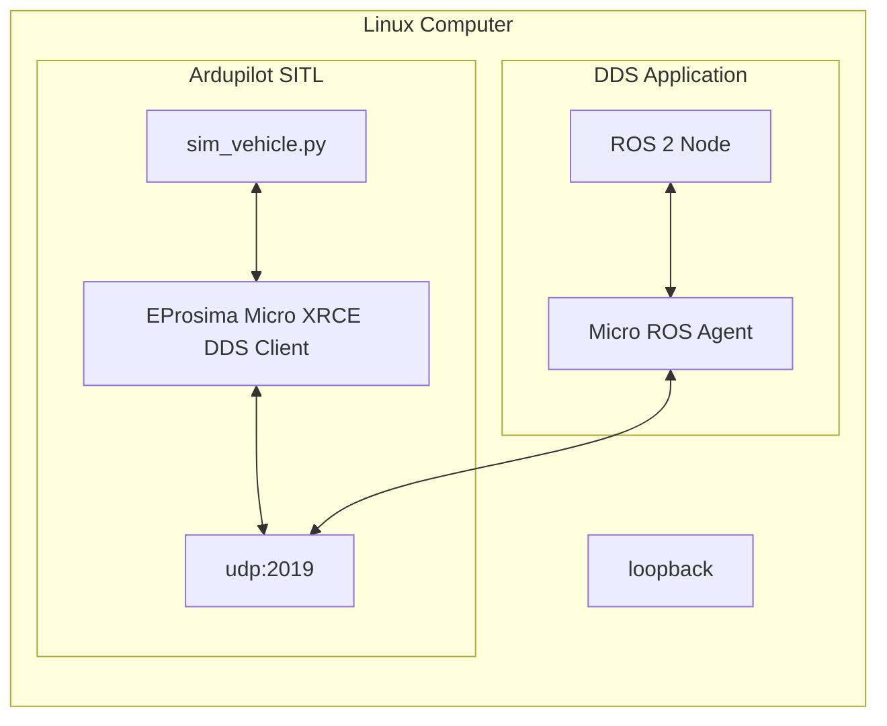
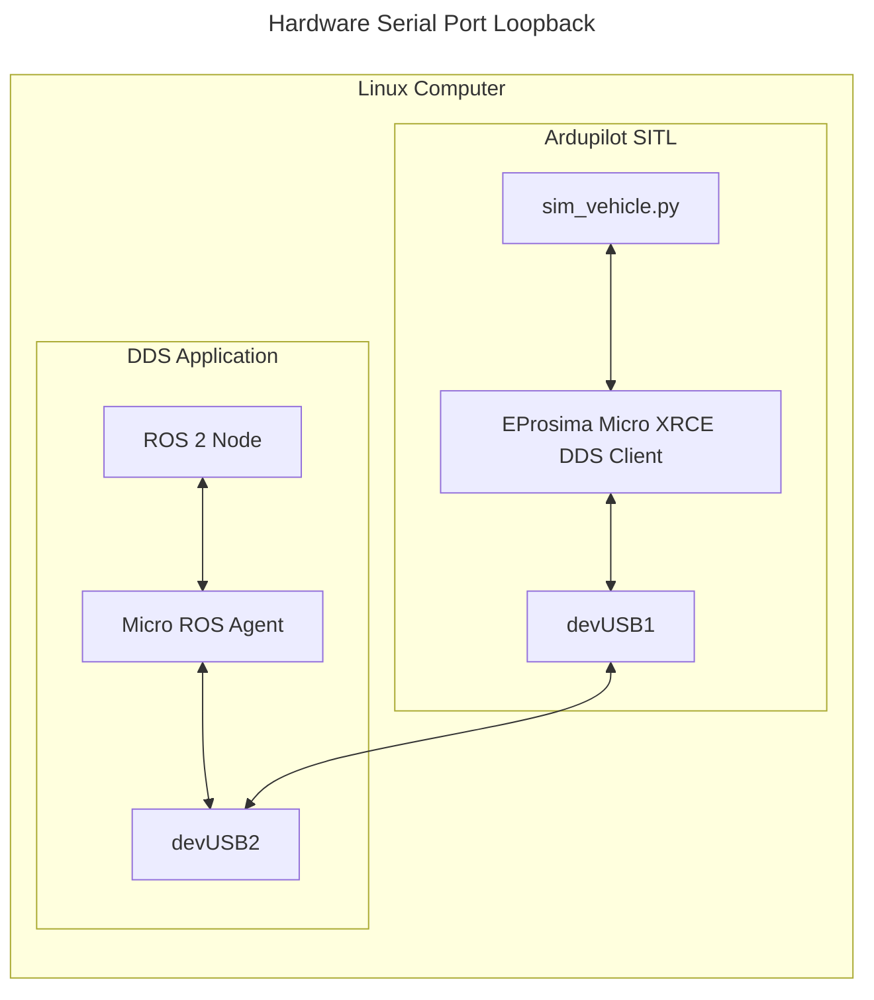
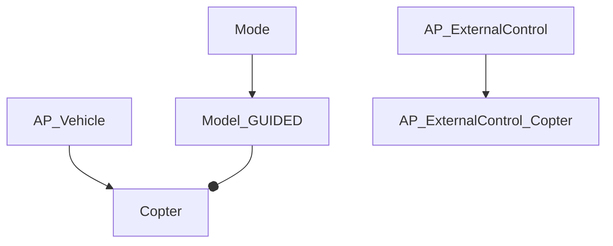
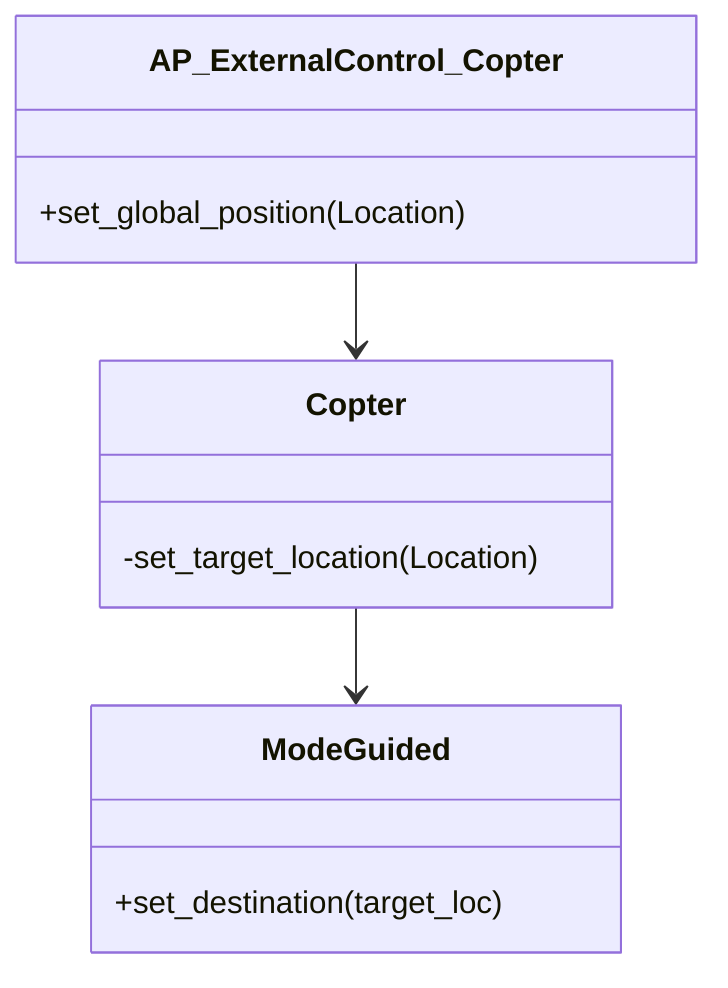

# Ardupilot and ROS2

## 1 ROS2 communication of Ardupilot
Ardupilot runs a xRCE client in simulation and in autopilots in real-world experiments. Then the xRCE client talks to a xRACE agent and the xRACE agent bridges Ardupilot's messages into ROS2 bidirectionaly. More details can be found [AP_DDS/README](https://github.com/ArduPilot/ardupilot/blob/master/libraries/AP_DDS/README.md).






## 2 Communication inside Ardupilot
There is no document talking about it. Then, there is no way but to read the PRs to find out.


The three components in ArduPilot enabling this are:
- [`AP_DDS_Client.cpp`](https://github.com/ArduPilot/ardupilot/blob/master/libraries/AP_DDS/AP_DDS_Client.cpp) – the core DDS client interface in ArduPilot
- [`AP_DDS_ExternalControl.cpp`](https://github.com/ArduPilot/ardupilot/blob/master/libraries/AP_DDS/AP_DDS_ExternalControl.cpp) – the translator for incoming ROS 2 control commands
- `AP_ExternalControl_Copter.cpp` – the ArduCopter-specific handler that injects external


PRs to learn:
- Overview
  -[AP_DDS: Design the ROS2 control interface](https://github.com/ArduPilot/ardupilot/issues/23363)
- Add topics:
  - [AP_DDS: Added attitude target topic](https://github.com/ArduPilot/ardupilot/pull/29833/files)
  - [Enabled sending waypoints to ardupilot for copter and rover](https://github.com/ArduPilot/ardupilot/pull/26362/files)
  - [AP_ExternalControl: initial implementation of external control library](https://github.com/ArduPilot/ardupilot/pull/24549)

- Add services:
  - [AP_DDS: Copter takeoff service](https://github.com/ArduPilot/ardupilot/pull/26911/files)
  - [Dds arm through external control](https://github.com/ArduPilot/ardupilot/pull/28609/files)

- Add messages for topics:
  - [AP_DDS: RC channels message](https://github.com/ArduPilot/ardupilot/pull/28907/files)

- Others
  -[Add airspeed control to AP_DDS for plane in GUIDED](https://github.com/ArduPilot/ardupilot/pull/29829/files)
  - [AP_DDS: /ap/cmd_vel accepts body-frame messages](https://github.com/ArduPilot/ardupilot/pull/24734/files)

- DDS
  - [AP_DDS: Add velocity control DDS subscriber](https://github.com/ArduPilot/ardupilot/pull/24479/files)
  - [AP_DDS: Add dynamic TF subscriber support for odometry](https://github.com/ArduPilot/ardupilot/pull/24155/files)
  - [DDS external odometry/localization support](https://github.com/ArduPilot/ardupilot/pull/24518/files)
  - [AP_DDS: Publish all available GPS instances](https://github.com/ArduPilot/ardupilot/pull/29419/files)

- [GSoC 2023: GPS-Denied Autonomous Exploration with ROS 2](https://discuss.ardupilot.org/t/gsoc-2023-gps-denied-autonomous-exploration-with-ros-2/101121/17)
- [Guide for using DDS over PPP with a Raspberry Pi 4 companion computer](https://discuss.ardupilot.org/t/guide-for-using-dds-over-ppp-with-a-raspberry-pi-4-companion-computer/126128)
- [AP_DDS: Added direct actuator control](https://github.com/ArduPilot/ardupilot/pull/29179)




### 2.1 AP_ExternalControl
#### 2.1 AP_ExternalControl to Copter to mode
In [```ardupilot/ArduCopter/AP_ExternalControl_Copter.cpp```](https://github.com/ArduPilot/ardupilot/blob/master/ArduCopter/AP_ExternalControl_Copter.cpp), we can find control interface exposed by Arducopter
- ```bool AP_ExternalControl_Copter::set_linear_velocity_and_yaw_rate(const Vector3f &linear_velocity, float yaw_rate_rads)```
- ```bool AP_ExternalControl_Copter::set_global_position(const Location& loc)```

This is explained with an example given by rmackay9 at [Enabled sending waypoints to ardupilot for copter and rover #26362](https://github.com/ArduPilot/ardupilot/pull/26362/files). It adds a function ```set_global_position``` in the class ```AP_ExternalControl_Copter``` calling the function ```set_target_location```  in the class ```Copter```, which calls the function ```set_destination``` defined in the class ```ModeGuided```. This relation is described in the image below.




#### 2.1 AP_ExternalControl to Copter to mode

[AP_DDS: Copter takeoff service](https://github.com/ArduPilot/ardupilot/pull/26911/files) adds a service for copter to accept takeoff commands using DDS support in ROS2. 

It frist defines a ROS2 message for takeoff. The message itself is defined in ```Tools/ros2/ardupilot_msgs/srv/Takeoff.srv``` as
```srv
# This service requests the vehicle to takeoff

# alt : Set the takeoff altitude above home or above terrain(in case of rangefinder)

float32 alt
---
# status    : True if the request for mode switch was successful, False otherwise

bool status
```
Then, the file is added to ```Tools/ros2/ardupilot_msgs/CMakeLists.txt``` to to introduce a message interface for takeoff.
```cmake
rosidl_generate_interfaces(${PROJECT_NAME}
  "msg/GlobalPosition.msg"
  "msg/Status.msg"
  "srv/ArmMotors.srv"
  "srv/ModeSwitch.srv"
  "srv/Takeoff.srv" # ROS2 takeoff message
  DEPENDENCIES geometry_msgs std_msgs
  ADD_LINTER_TESTS
)
```

Then, since all services are wrapped in ifdefs, i.e. ```libraries/AP_DDS/AP_DDS_config.h``` as
```cpp
  #ifndef AP_DDS_VTOL_TAKEOFF_SERVER_ENABLED
  #define AP_DDS_VTOL_TAKEOFF_SERVER_ENABLED 1
  #endif
```


#### 2.4 AP_DDS_Client to AP_DDS_External_Control

##### Service

```C++
void AP_DDS_Client::on_request(uxrSession* uxr_session, uxrObjectId object_id, uint16_t request_id, SampleIdentity* sample_id, ucdrBuffer* ub, uint16_t length)
{
    (void) request_id;
    (void) length;
    switch (object_id.id) {
#if AP_DDS_ARM_SERVER_ENABLED
    case services[to_underlying(ServiceIndex::ARMING_MOTORS)].rep_id: {
        ardupilot_msgs_srv_ArmMotors_Request arm_motors_request;
        ardupilot_msgs_srv_ArmMotors_Response arm_motors_response;
        const bool deserialize_success = ardupilot_msgs_srv_ArmMotors_Request_deserialize_topic(ub, &arm_motors_request);
        if (deserialize_success == false) {
            break;
        }

        GCS_SEND_TEXT(MAV_SEVERITY_INFO, "%s Request for %sing received", msg_prefix, arm_motors_request.arm ? "arm" : "disarm");
#if AP_EXTERNAL_CONTROL_ENABLED
        const bool do_checks = true;
        arm_motors_response.result = arm_motors_request.arm ? AP_DDS_External_Control::arm(AP_Arming::Method::DDS, do_checks) : AP_DDS_External_Control::disarm(AP_Arming::Method::DDS, do_checks);
        if (!arm_motors_response.result) {
            // TODO #23430 handle arm failure through rosout, throttled.
        }
#endif // AP_EXTERNAL_CONTROL_ENABLED

    }
}
```

```C++
bool AP_DDS_External_Control::arm(AP_Arming::Method method, bool do_arming_checks)
{
    auto *external_control = AP::externalcontrol();
    if (external_control == nullptr) {
        return false;
    }

    return external_control->arm(method, do_arming_checks);
}
```

###### Topics

```C++
void AP_DDS_Client::on_topic(uxrSession* uxr_session, uxrObjectId object_id, uint16_t request_id, uxrStreamId stream_id, struct ucdrBuffer* ub, uint16_t length)
{
    /*
    TEMPLATE for reading to the subscribed topics
    1) Store the read contents into the ucdr buffer
    2) Deserialize the said contents into the topic instance
    */
    (void) uxr_session;
    (void) request_id;
    (void) stream_id;
    (void) length;
    switch (object_id.id) {
    /**/
    #if AP_DDS_VEL_CTRL_ENABLED
        case topics[to_underlying(TopicIndex::VELOCITY_CONTROL_SUB)].dr_id.id: {
            const bool success = geometry_msgs_msg_TwistStamped_deserialize_topic(ub, &rx_velocity_control_topic);
            if (success == false) {
                break;
            }
    #if AP_EXTERNAL_CONTROL_ENABLED
            if (!AP_DDS_External_Control::handle_velocity_control(rx_velocity_control_topic)) {
                // TODO #23430 handle velocity control failure through rosout, throttled.
            }
    #endif // AP_EXTERNAL_CONTROL_ENABLED
            break;
        }
    #endif // AP_DDS_VEL_CTRL_ENABLED

  /**/
  }

}
```
Reference
- [ardupilot/libraries/AP_DDS](https://github.com/ArduPilot/ardupilot/tree/master/libraries/AP_DDS)
