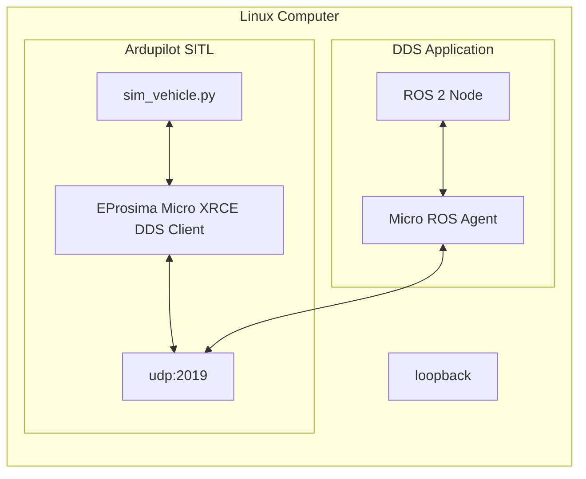
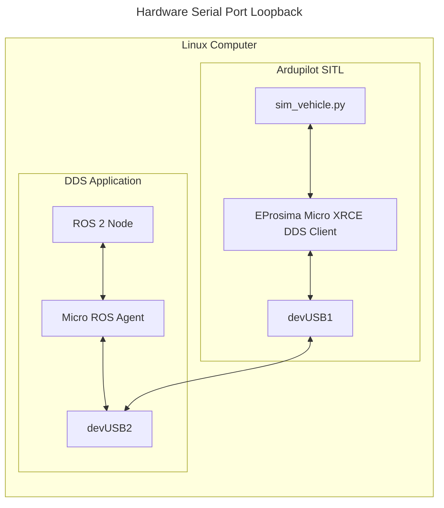
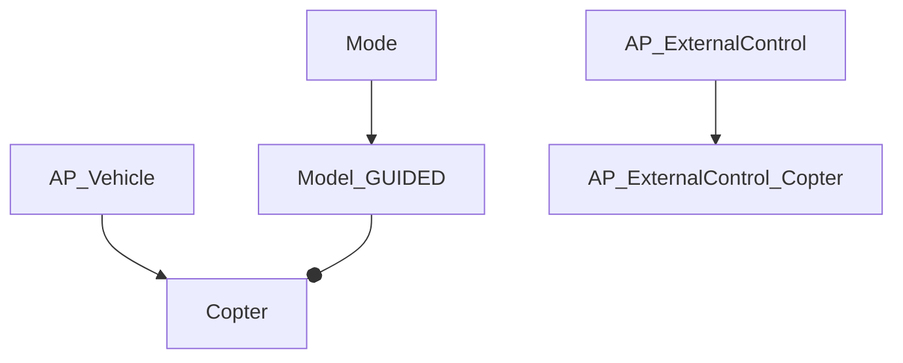
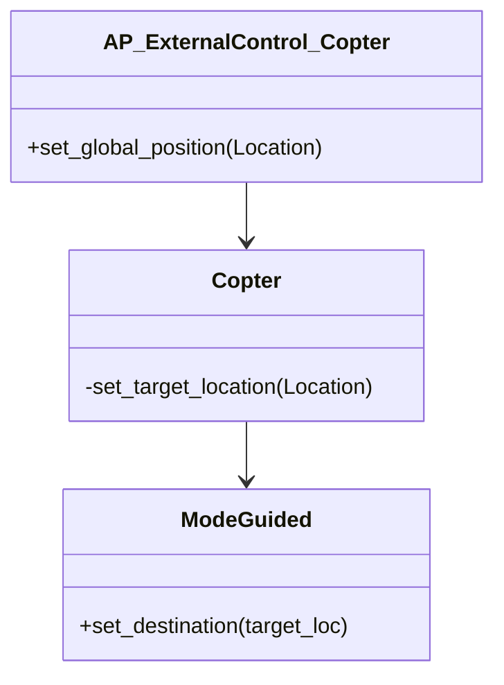

# Ardupilot and ROS2

## 1 ROS2 communication of Ardupilot
Ardupilot runs a xRCE client in simulation and in autopilots in real-world experiments. Then the xRCE client talks to a xRACE agent and the xRACE agent bridges Ardupilot's messages into ROS2 bidirectionaly. More details can be found [AP_DDS/README](https://github.com/ArduPilot/ardupilot/blob/master/libraries/AP_DDS/README.md).






## 2 Communication inside Ardupilot
There is no document talking about it. Then, there is no way but to read the PRs to find out.

PRs;
- [AP_ExternalControl: initial implementation of external control library](https://github.com/ArduPilot/ardupilot/pull/24549)
- [AP_DDS: Design the ROS2 control interface](https://github.com/ArduPilot/ardupilot/issues/23363)
- [AP_DDS: Add velocity control DDS subscriber](https://github.com/ArduPilot/ardupilot/pull/24479/files)
- [AP_DDS: /ap/cmd_vel accepts body-frame messages](https://github.com/ArduPilot/ardupilot/pull/24734)
- [GSoC 2023: GPS-Denied Autonomous Exploration with ROS 2](https://discuss.ardupilot.org/t/gsoc-2023-gps-denied-autonomous-exploration-with-ros-2/101121/17)
- [Guide for using DDS over PPP with a Raspberry Pi 4 companion computer](https://discuss.ardupilot.org/t/guide-for-using-dds-over-ppp-with-a-raspberry-pi-4-companion-computer/126128)
- [AP_DDS: Added attitude target topic](https://github.com/ArduPilot/ardupilot/pull/29833/files)
- [AP_DDS: Added direct actuator control](https://github.com/ArduPilot/ardupilot/pull/29179)




### 2.1 AP_ExternalControl
In [```ardupilot/ArduCopter/AP_ExternalControl_Copter.cpp```](https://github.com/ArduPilot/ardupilot/blob/master/ArduCopter/AP_ExternalControl_Copter.cpp), we can find control interface exposed by Arducopter
- ```bool AP_ExternalControl_Copter::set_linear_velocity_and_yaw_rate(const Vector3f &linear_velocity, float yaw_rate_rads)```
- ```bool AP_ExternalControl_Copter::set_global_position(const Location& loc)```

One example is given by rmackay9 at [Enabled sending waypoints to ardupilot for copter and rover #26362](https://github.com/ArduPilot/ardupilot/pull/26362/files). It adds a function ```set_global_position``` in the class ```AP_ExternalControl_Copter``` calling the function ```set_target_location```  in the class ```Copter```, which calls the function ```set_destination``` defined in the class ```ModeGuided```. This relation is described in the image below.




[AP_DDS: Copter takeoff service](https://github.com/ArduPilot/ardupilot/pull/26911/files) adds a service for copter to accept takeoff commands using DDS support in ROS2. 

It frist defines a ROS2 message for takeoff. The message itself is defined in ```Tools/ros2/ardupilot_msgs/srv/Takeoff.srv``` as
```srv
# This service requests the vehicle to takeoff

# alt : Set the takeoff altitude above home or above terrain(in case of rangefinder)

float32 alt
---
# status    : True if the request for mode switch was successful, False otherwise

bool status
```
Then, the file is added to ```Tools/ros2/ardupilot_msgs/CMakeLists.txt``` to to introduce a message interface for takeoff.
```cmake
rosidl_generate_interfaces(${PROJECT_NAME}
  "msg/GlobalPosition.msg"
  "msg/Status.msg"
  "srv/ArmMotors.srv"
  "srv/ModeSwitch.srv"
  "srv/Takeoff.srv" # ROS2 takeoff message
  DEPENDENCIES geometry_msgs std_msgs
  ADD_LINTER_TESTS
)
```

Then, since all services are wrapped in ifdefs, i.e. ```libraries/AP_DDS/AP_DDS_config.h``` as
```cpp
  #ifndef AP_DDS_VTOL_TAKEOFF_SERVER_ENABLED
  #define AP_DDS_VTOL_TAKEOFF_SERVER_ENABLED 1
  #endif
```

Reference
- [ardupilot/libraries/AP_DDS](https://github.com/ArduPilot/ardupilot/tree/master/libraries/AP_DDS)
