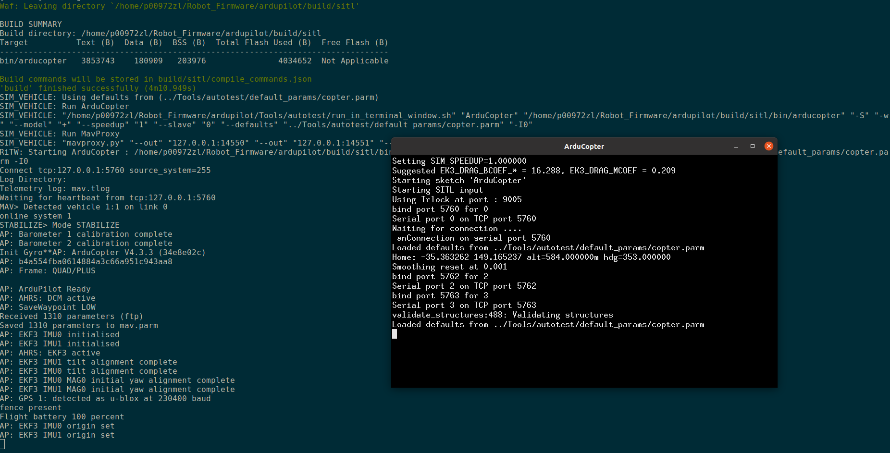
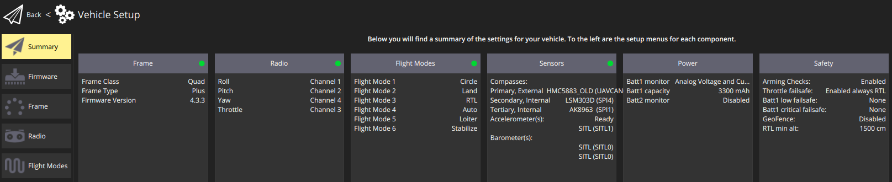

# Kiss Ardupilot
Arduploit is a great choice for people tired of PX4. Of course, be a nice guy, I should cite someone telling the differences

<figure>
    
</figure>

## Build Arduploit from source code
1. clone a arduploit rep from my github and do not foret adding a star
```git
    git clone https://github.com/ZhongmouLi/ardupilot
```
2. choose a proper and stable version for the drone according to the hardware that we are going to use.
    - find the hardware at [https://firmware.ardupilot.org/Copter/stable/](https://firmware.ardupilot.org/Copter/stable/)
    - Given Pixhawk5x, check Pixhawk5x/firmware-version.txt
    ```txt
            4.3.3-FIRMWARE_VERSION_TYPE_OFFICIAL
    ```
    - switch to this version, like 4.3.3
    ```shell
        cd ardupilot
        git checkout Copter-4.3.3
    ```
3. update submodue in arduploit
    ```shell
        cd arduploit
        git submodule update --init --recursive
    ```        
4. install dependencies and configure base station
    - manullay install dependcies
        - packages

            ```
            ## install packages
            sudo apt install python-matplotlib python-serial python-wxgtk3.0 python-wxtools python-lxml python-scipy python-opencv ccache gawk python-pip python-pexpect
            ```

            ```
            ## install MAVproxy
            sudo pip install future pymavlink MAVProxy
            ```
        - update .bashrc adding
            ```shell
                export PATH=$PATH:$HOME/ardupilot/Tools/autotest
                export PATH=/usr/lib/ccache:$PATH
            ```
    - auto setup dependencies
        - use install-prereqs-ubuntu.sh for ubuntu base station
        ```shell                   
            cd arduploit
            Tools/environment_install/install-prereqs-ubuntu.sh -y
        ```
        - reload settings 
            - [ ] to check this method
                ```shell
                        cd arduploit
                        . ~/.profile
                ```   
                - log out and log in
            - modify .bashrc
            ```shell
                export PATH=$PATH:$HOME/{where_to_ardupilot}/ardupilot/Tools/autotest 
                export PATH=/usr/lib/ccache:$PATH
            ```                   
    - test by runging a STIL
        ```shell
            cd arduploit/ArduCopter
            # for the first time add -w
            sim_vehicle.py -w
        ```
<figure>
    
</figure>

Launch Qgroundcontrol and we can see the version that we choose
<figure>
    
</figure>

5. use Waf to build an ardupliot firmware for the chosen board. Tutorials to use Waf https://github.com/ArduPilot/ardupilot/blob/master/BUILD.md.
    - clean previous built firmware
    ```shell
         cd ardupliot
         ./waf distclean
    ``` 
    - The available list can be found by 
    ```shell
        cd ardupliot
        ./waf list_boards
    ```
    <figure>
        
    </figure>

    - video tutorial for next two steps https://youtu.be/lNSvAPZOM_o.
    - choose firmware - it is Pixhawk5X for us
    ```shell
        cd ardupliot 
        ./waf configure --board Pixhawk5X
    ```
    <figure>
        
    </figure>
    
    - build it
    ```shell
        cd ardupliot
        ./waf copter
    ```
    <figure>
        
    </figure>

    - find the built ardupliot file at /ardupliot/build/board_name/bin, like
    <figure>
        
    </figure>    
    


## Download Arduploit firemware
1. we can build an Arduploit firmware at https://custom.ardupilot.org/ choosing
    + drone type
    + board of autoploit
    + **features that are needed**
<figure>
    
</figure>


# Source
1. how to install ardupliot
https://github.com/Intelligent-Quads/iq_tutorials/blob/master/docs/Installing_Ardupilot.md
2. https://ardupilot.org/dev/docs/building-setup-linux.html
3. https://discuss.ardupilot.org/t/arducopter-version-check-api/46694
4. build firmware online https://ardupilot.org/copter/docs/common-loading-firmware-onto-chibios-only-boards.html#common-loading-firmware-onto-chibios-only-boards
5. GSoC 2021 - Custom Firmware Builder, https://discuss.ardupilot.org/t/gsoc-2021-custom-firmware-builder/74946