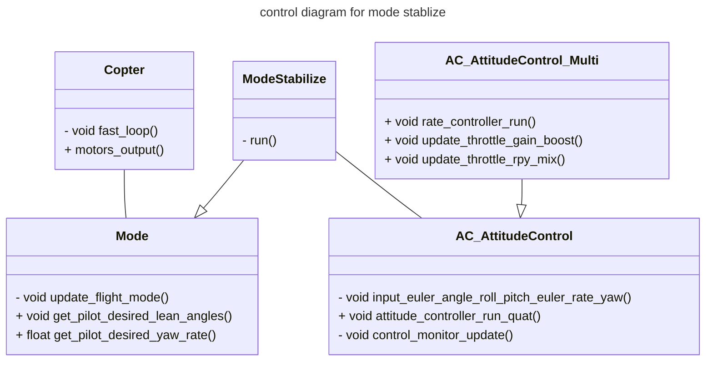

# Kiss Ardupilot
Arduploit is a great choice for people tired of PX4. Of course, be a nice guy, I should cite someone telling the differences

<figure>
    
</figure>


## 2 Learn code of ArduCopter
Ardupilot is mainly built on C++ and Class are used widely there.

Source [Learning the ArduPilot Codebase](https://ardupilot.org/dev/docs/learning-the-ardupilot-codebase.html).
[ArduCopter Flight Controllers](https://nrotella.github.io/journal/arducopter-flight-controllers.html)



Explanation of methods
+   AC_AttitudeControl_Multi
    - ```rate_controller_run()```, AC_AttitudeControl_Multi.cpp, https://github.com/ArduPilot/ardupilot/blob/Copter-4.2/libraries/AC_AttitudeControl/AC_AttitudeControl_Multi.cpp
    - ```update_throttle_rpy_mix()```, AC_AttitudeControl_Multi.cpp, https://github.com/ArduPilot/ardupilot/blob/Copter-4.2/libraries/AC_AttitudeControl/AC_AttitudeControl_Multi.cpp
    - ```void update_throttle_gain_boost()```
+ AC_AttitudeControl
    - attitude_controller_run_quat, AC_AttitudeControl.cpp, https://github.com/ArduPilot/ardupilot/blob/Copter-4.2/libraries/AC_AttitudeControl/AC_AttitudeControl.cpp
    - input_euler_angle_roll_pitch_euler_rate_yaw, https://github.com/ArduPilot/ardupilot/blob/Copter-4.2/libraries/AC_AttitudeControl/AC_AttitudeControl.cpp
+ AC_AttitudeControl_Multi
    - rate_controller_run(), https://github.com/ArduPilot/ardupilot/blob/Copter-4.2/libraries/AC_AttitudeControl/AC_AttitudeControl_Multi.cpp
    - set_throttle_out, AC_AttitudeControl_Multi, https://github.com/ArduPilot/ardupilot/blob/Copter-4.2/libraries/AC_AttitudeControl/AC_AttitudeControl_Multi.cpp
+ ModeStabilize    
    - run()
+ Motor    
    - motor output https://github.com/ArduPilot/ardupilot/blob/Copter-4.2/ArduCopter/motors.cpp
    - control_monitor_update(), ControlMonitor.cpp, https://github.com/ArduPilot/ardupilot/blob/Copter-4.2/libraries/AC_AttitudeControl/ControlMonitor.cpp.


### 2.1 Position control 
Source:
- [Copter Position Control and Navigation](https://ardupilot.org/dev/docs/code-overview-copter-poscontrol-and-navigation.html)


### 2.3 Attitude control
- [Copter Attitude Control](https://ardupilot.org/dev/docs/apmcopter-programming-attitude-control-2.html)

## 3 Guided mode and Guided_NoGPS mode
Guided Mode allows us to control Ardupilot from an onboard computer autonoumously. This is usually essentially needed in research on drones.

Ardupilot provides us with two guided modes:
- Guided mode that requires a GPS and enables to send one of post, vel and acc comands and some combinations of them.
- Guided_NoGPS mode that can take angle or body rate commands.

Source
- [ArduCopter Flight Controllers](https://nrotella.github.io/journal/arducopter-flight-controllers.html)
