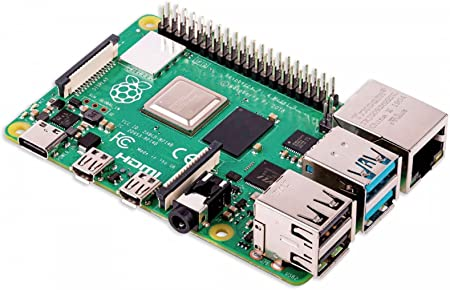
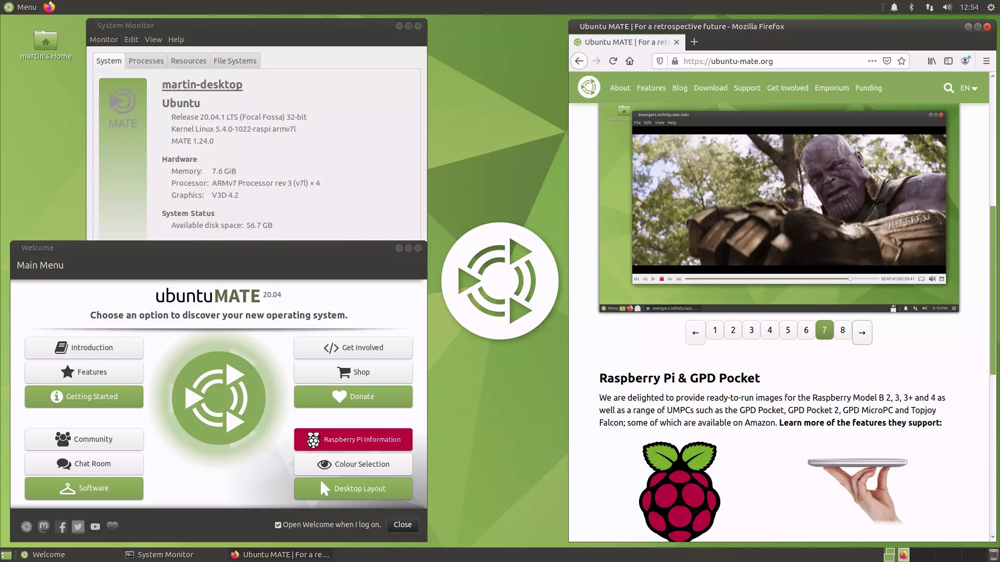
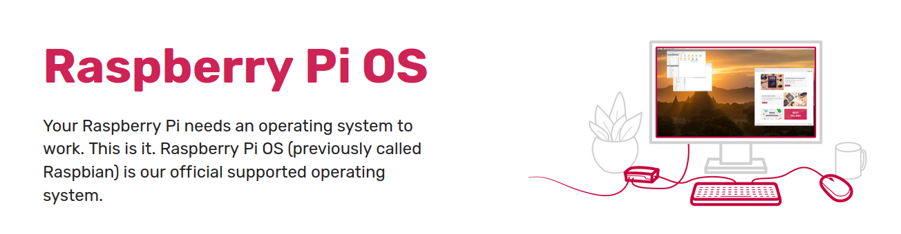
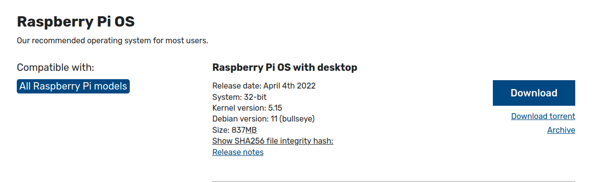
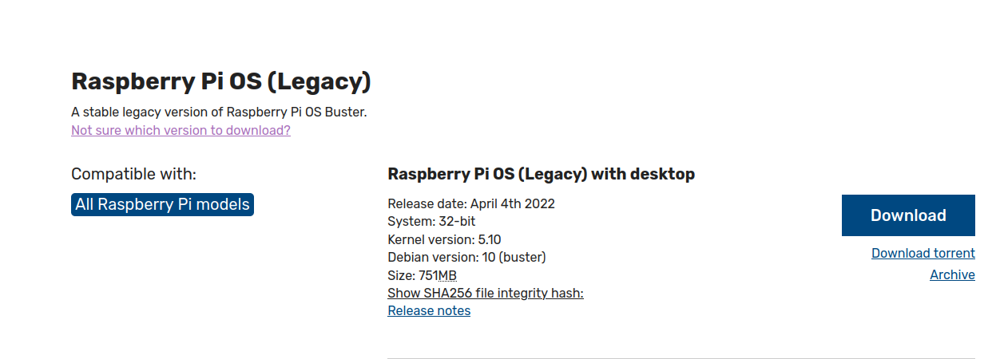

# Drone Development Notes
This note shows main steps to build a drone from kits (hardware) and integrate it in ROS framework (software).

## 0. Drone kits and commercial elements
1. Drone frame Kits: [Holybro X500 V2 Kit](http://www.holybro.com/product/x500-v2-kit/) cluding
    - X500 V2 Frame Kit
    - Motors – Holybro 2216 KV920 Motor
    - ESCs – BLHeli S ESC 20A 
    - Self locking propellers 1045 (cheaper options T1045 Self locking Props)
    - Power Distribution Board – XT60 plug for battery & XT30 plug for ESCs & peripherals
2. Autopliot and framework
    - Pixhawk 4 mini and Pixhawk 5
    - PX4 version (**To decide**)
3. Onboard computer and OS
    - Raspberry PI 4b+ or Intel NUC (**To decide**)
4. Remote controller and receivor
    - FrSky Taranis X9D
    - FRsky X8R


## Step 1. Drone frame assembly


## Step 2. Autopliot configuration


## Step 3. Manual flight tests

## Step 4. Choose and install OS for onboard computer
### Step 4.1A choose Raspberry Pi as onboard computer
Onborad computer is responsible for transfer commands from base station to autoploit and convert sensor information from autoploit, cameras etc. back to Onborad computers.

Choices for onborad computers are Raspberry Pi, Odroid, Tegra K1 etc. Here we show how to buid a drone using Raspberry Pi, i.e. Raspbery Pi 4B.
<figure>
    
    <figcaption>Raspbery Pi 4B</figcaption>
</figure>

Raspberry Pi requires an operating system (OS). However, The supported OSs by Raspberry Pi depend on versions. Raspberry Pi 4B can only support Ubuntu desktop 21.04 (Not LTS), Raspberry Pi OS, Ubuntu server 20.04 (LTS), Ubuntu Core 20, which can be found at (see [Ubuntu for Raspberry Pi](https://ubuntu.com/download/raspberry-pi)).

### Step 4.2A choose Ubuntu MATE (unsloved for 20.04 LTSs)
We choose Ubuntu MATE as the OS system for our Rapberry Pi 4 (see [Ubuntu MATE for Raspberry Pi](https://ubuntu-mate.org/raspberry-pi/)). 

<figure>
    
    <figcaption>Ubuntu MATE for Raspbery Pi</figcaption>
</figure>

Other Ubuntu choices are also possible, such as Ubuntu :). One thing to notice; it is better to keep the versions of base station and Rapberry Pi be the same. Since our base station runs Ubuntu 20.04 LTS, we decide to use Ubuntu Mate 20.04.

Turtoail is given by Ubuntu MATE at the [Raspberry Pi Installation Guide](https://ubuntu-mate.org/raspberry-pi/install/) that shows each step to install Ubuntu MATE Desktop on a Raspberry Pi.

1. Download 21.04

2. Flash Ubuntu MATE image into the SD card choosing one from the following
    - use Raspberry Pi Imager
    - use dd commands
        - extract **.img** from **.xz** with 7z
        - sudo if=/address/Mate.img of=sda/sdcard             
    - (most recommended) use [Balena Etcher](https://www.balena.io/etcher/) and see [this](https://itsfoss.com/ubuntu-mate-raspberry-pi/)  

    Then, log in after inserting the SD card into Raspberry Pi. We should see installation process of Ubuntu MATE.

### Step 4.2B choose Raspberry Pi OS
Raspberry Pi OS is an official operating system supported by Raspberry Pi. It can be installed easily to use Raspberry Pi Imager. A Youtube video is available [here](https://youtu.be/y45hsd2AOpw).

<figure>
    
    <figcaption>Raspbery Pi OS</figcaption>
</figure>

After understanding how to use Raspberry Pi Imager, a choice is going to be made for choosing a version of Raspberry Pi OS, yes, another choice of versions :( . In fact, Raspberry Pi OS is built using a Linux kernel of Debian, therefore we can find Debian version information of each Raspberry Pi OS. Raspberry Pi OS uses Debian 11 (Bullseye), while Raspberry Pi OS (Legacy) takes Debian 10 (Buster).
<figure>
    
    <figcaption>Raspbery Pi OS with Debian 11 (Bullseye)</figcaption>
</figure>
<figure>
    
    <figcaption>Raspbery Pi OS (Legacy) with Debian 10 (Buster)</figcaption>
</figure>


Wait a minute. Think about the most important tools are to be used in comboard computers; that is ROS. Choosing Raspberry Pi OS (Debian 11) or Raspberry Pi OS (Legacy) (Debian 10) depends on which one allows us to use a proper ROS.

Till April 2022, there two ROS options to choose: ROS Melodic and ROS Noetic. Noetic is developed for Debian 10 (Buster) and Melodic is for Debian 9 (Stretch). So, Debian 11 (Bullseye) is not supported yet for ROS 1 or never. The only choCOM_RCL_EXCEPT=4.ce is Debian 10 (Buster), then we must install Raspberry Pi OS (Legacy).

Flasing Raspberry Pi OS (Legacy) into a SD card and use that to boot Raspberry Pi. 


### Step 4.2C choose Ubuntu Server

https://linuxhint.com/ubuntu-desktop-ubuntu-server-difference/

https://help.ubuntu.com/community/ServerFaq

https://wiki.ubuntu.com/ARM/RaspberryPi

## Step 4.2 Configure OS

4. Boot your Ubuntu MATE 
    - set language and user names
        - user name: droneREEG
        - passwork: droneREEG
        - computer name: drone1 (drone2 for a second drone)
    - disable auto update in *Software&Updates > Updates*
    - stop ubuntu kernel update
        ```
            sudo apt-mark hold linux-generic linux-image-generic linux-headers-generic
        ```

## Step 5. Onboard computer ROS configuration
### Step 5.1 Install ROS Melodic in Raspberry Pi 4B with OS (Legacy)

Note: ROS Melodic is still possible to be installed on Raspberry Pi with Raspbian Buster following a different approach [ROSberryPi/Installing ROS Melodic on the Raspberry Pi](http://wiki.ros.org/ROSberryPi/Installing%20ROS%20Melodic%20on%20the%20Raspberry%20Pi).

A tutorial to install Melodic on Rapsberry Pi OS is given [here](https://www.linkedin.com/pulse/easiest-way-install-ros-melodic-raspberrypi-4-shubham-nandi/).  

## Step 6. Integration of autopilot and onboard computer in ROS

# 3. Q&A
### Cannot boot Ubuntu MATE because "sart4.elf" is not compatitable
This seems to be a bug unsolved as we can find here 